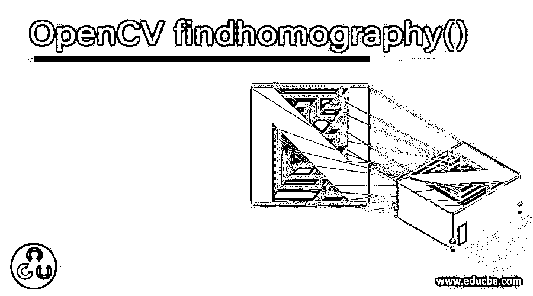

# OpenCV 查找单应性()

> 原文：<https://www.educba.com/opencv-findhomography/>

## OpenCV 查找单应性介绍()

OpenCV findhomography()是 OpenCV 公共库中的一个函数，包含各种命令，有助于与计算机视觉和图像检测相关的编程。OpenCV findhomography 帮助转换以 3×3 矩阵形式呈现的图像，并将该图像中呈现的特定点映射到已提供的另一图像中呈现的对应点。这有助于实时场景中的对象检测和面部检测，特别是在与使用人工智能的相机视觉检测条目检测相关的应用中使用。

**使用 OpenCV findhomography()的语法**

<small>网页开发、编程语言、软件测试&其他</small>

为了利用 OpenCV findhomography 函数来检测由用户提供的相关图像中的对象，必须使用以下语法:

`cv2.findHomography()`

### OpenCV 查找单应性是如何执行的？

为了使函数运行并计算两个不同图像之间存在的单应性，用户需要知道两个图像(用户输入的初始图像；以及必须在其中找到初始图像对应点的图像)。开放民用图书馆能够有效地给出对于对应点最合适的单应性的估计。通常观察到，通过在图像内实现各种特征(如 SURF 或 SIFT)的匹配，自动找到对应点。

**评估参数:**

*   **导入数据(此处为图像)–**系统能够读取用户传递的图像
*   **特征匹配-**特征匹配的参数集中在对应于两组数据的特征上，这两组数据类似地基于 OpenCV 库中使用的两个命令的搜索维度的距离[例如:cv2.flann()和 cv2.sift ()]，这使得系统能够相对于被分析的图像来匹配特征。

### OpenCV findhomography()的使用示例

下面的例子有助于我们理解如何在 Python 编程语言中使用 OpenCV findhomography 命令

`# Program which has been coded in the Python programming language in order to explain the use of find function
# command used to import the OpenCV library to utilize OpenCV erosion function
import cv2
import numpy as np1
# path defined for selecting the image
path1 = r'C:\Users\Priyanka Banerjee\Desktop\EduCBA_Image sample.png'
# the image is being read as a gray scaled image
img1 = cv2.imread(path1, cv2.IMREAD_GRAYSCALE)
# the webcam attached with system is being intialized
cap1 = cv2.VideoCapture(0)
# creating an algorithm using the sift command
sift1 = cv2.xfeatures2d.SIFT_create()
# finding the keypoints and the descriptors using the sift command
kp_image1, desc_image1 =sift1.detectAndCompute(img1, None)
* * * *
# The dictionary is being initialized
* index_params1 *  *  * = *  *  * dict * (* algorithm * = * 0 *, *  *  *  * trees * = * 5 *) *
* search_params1 *  *  * = *  *  * dict(*)
# Using the flann command
flann1 = cv2.FlannBasedMatcher(index_params1, search_params1)
# the frame is being read by the system
_, * * *frame1 * * *= * * *cap.read(*)
# conversion of applied frame into grayscale image
grayframe1 = cv2.cvtColor(frame1, cv2.COLOR_BGR2GRAY)
# finding the keypoints and the descriptors using the SIFT command
kp_grayframe1, * ** ** *desc_grayframe1* ** *=* ** *sift.detect* *And* *Compute(grayframe1, None)
# finding the nearest match using the KNN* ** *algorithm
matches1= flann.knnMatch* * (* *desc* *_* *image1, * ** ** *desc* *_* *grayframe1, * ** ** *k* *=* *2* *)
# initializing the list for keeping track of the points that are of acceptable threshold
good* ** *_* *points* *=* * [* *] for m1, n1 in matches:
#appending the points in accordance with the distance observed for the descriptors
if(m1.distance1 < 0.6*n1.distance1):
good* *_* *points.append1(m1)
# index descriptors list maintained
query* *_* *pts1* ** *=* ** *np1.float32([kp_image1[m1.queryIdx] .pt1 for m1 in good* *_* *points]).reshape(-10, 10, 20)
train_pts1* ** *=* ** *np1.float32([kp_grayframe1[m1.trainIdx] .pt1 for m1 in good* *_* *points]).reshape(-10, 10, 20)
# find the perspective transformation
matrix1, mask1 = cv2.findHomography(query_pts1, train_pts1, cv2.RANSAC, 5.0)
matches_mask1* ** *=* ** *mask1.ravel(* *).tolist(* *)
# initialize the height & width for image
h1, w1 = img1* *.* *shape
# save all the points in variable pts1
pts1 = np1.float32([[0,0],[0,h1],[w1,h1],[w1,0]]).reshape(-10, 10, 20)
dst1 = cv2.perspectiveTransform(pts1, matrix1)
# drawing frame
homography1 = cv2.polylines(frame1, [np1.int32(dst)], True, (255,0,0),3)
# Displaying the output image
cv2.imshow("output", homography1)
cv2.waitKey(0)
cv2.destroyAllWindows`

**输出:**

提供原始图像

给出各种图像的最终输出

**注意:**对于给定的例子，已经执行的法院被视为维护包含描述符的索引号以及列车描述符的列表。此外，可以看到代码使用了 cv2。查找单应性()命令，用于获取正在发生的变换的透视。命令掩码。ravel()用于获取一个已展平的传染性数组。我们进一步利用命令 cv2.polylines()在用户共享的图像周围画一个框。最后，函数 imshow()用于显示结果。

### 结论

OpenCV findhomography()这是一个基本函数，专门用在程序中，目的是参照已提供的图像跟踪视频中出现的各种对象。类似地，该系统还能够跟踪使用用户提供的参考图像提供的图像内的特定对象。这有助于实时场景中的对象检测和面部检测，特别是在与使用人工智能的相机视觉检测条目检测相关的应用中使用。

### 推荐文章

这是 OpenCV findhomography()的指南。这里我们讨论定义、语法和参数，OpenCV findhomography 是如何执行的？代码实现示例。您也可以看看以下文章，了解更多信息–

1.  [OpenCV inRange](https://www.educba.com/opencv-inrange/)
2.  [OpenCV 背景减法](https://www.educba.com/opencv-background-substration/)
3.  [OpenCV imwrite](https://www.educba.com/opencv-imwrite/)
4.  [OpenCV Mat](https://www.educba.com/opencv-mat/)

