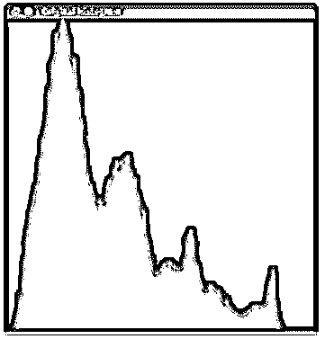
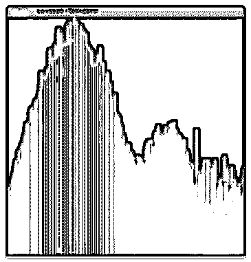

# OpenCV 直方图均衡化

> 原文：<https://www.educba.com/opencv-histogram-equalization/>

## OpenCV 直方图均衡简介

以下文章提供了 OpenCV 直方图均衡化的概述。这是一个内置函数，它基于通过使用用户提供的直方图未命中进行的对比度调整来提供图像处理。这种方法通过增加图像中存在的整体全局对比度来起作用，本质上是当已经被提供来处理的图像用收缩的值来表示时。

通过进行这种调整，记录在图像中的数据强度以更好的方式分布在直方图中。因此，这提供了由局部具有较低对比度的区域获得的容许对比度。这是通过有效地扩展直方图中频繁出现的高强度值来实现的。这对于前景和背景都很亮或都很亮的图像非常有用。

<small>网页开发、编程语言、软件测试&其他</small>

**语法:**

以下是用于实现 OpenCV 直方图均衡器功能的语法:

`equalizeHistsrc, dst)`

**参数:**

OpenCV 直方图均衡器函数接受以下参数:

*   **src:** 该参数表示代表输入图像或源图像的类 mat 的对象。
*   **dst:** 该参数代表与 mat 类相关的对象，mat 类代表输出图像——在处理灰度图像后使用 OpenCV 均衡功能处理的图像。

### OpenCV 直方图均衡是如何执行的？

通过直方图均衡化过程的应用，系统开始通过在输出图像中增强来计算源图像中像素的直方图，该输出图像是单通道的或者用更简单的术语来说是灰度的。您会注意到在下图中，直方图呈现出各种峰值，这表明在这些桶中有许多像素，它们代表了一幅好的图像。使用直方图均衡化，用户的目标是分散这些像素束或像素桶，使得没有很多像素与它们绑定。

用数学术语来说，这意味着用户试图将线性趋势应用于正在应用于图像的累积分布曲线函数。均衡过程完成后，您可能会注意到图像的对比度显著提高，但这也是以增加输入图像中的噪声为代价的。这可以通过应用自适应直方图均衡化方法来纠正。在这种应用中，用户将待处理的输入图像分成 X x Y 网格。在图像被分类到网格中之后，均衡被应用到由网格捕获的每个单元，这导致输出图像具有高得多的质量。

要应用直方图均衡化的输入图像:

#### 示例:

下面是 Python 代码，演示了 OpenCV 直方图均衡函数的实现。

**代码:**

`# command used to import the OpenCV library to utilize the histogram equalizer function
import cv2
# command used to import the Numpy library for utilization of the function in the below code
import numpy as np1
# command imread is used in order to read the image which is being sourced by the user
img_1 = cv2.imread(\C:\\My Computer\Desktop\EDU CBA LOGO 1.png\', 0)
# the process to create a Histograms Equalization of the source image cv2.equalizeHist()
equ1 = cv2.equalizeHist(img_1)
# the images are being stacked parallel to each other
res1 = np.hstack((img_1, equ1))
# the resultant image is displayed which are showed together show the difference in the images
cv2.imshow(\'image\', res1)
cv2.waitKey(0)
cv2.destroyAllWindows()`

**应用功能后输出图像:**

(图 1:灰度缩放后对源图像应用灰度缩放后生成的直方图)

(图 2:应用 OpenCV 直方图均衡器功能后生成的处理过的直方图灰度图像)

在所呈现的两幅直方图中，您可以观察到第一幅灰度图像具有递减的对比度直方图，它表示图像中呈现的对比度变化较小。在 OpenCV 直方图均衡器功能的帮助下对图像进行处理后，第二张图清楚地表示了在输出图像中可以观察到的更加多样化的对比度。

### 结论–OpenCV 直方图均衡化

OpenCV 直方图均衡器函数负责读取图像，并由用户将其加载到系统中，然后根据用户的指示将其加载到系统中。该功能还将用户提供的原始图像转换成同一图像的灰度版本，并最终在系统处理器呈现的输出窗口中替换原始图像或源图像，并信任均衡图像。均衡过程完成后，您可能会注意到图像的对比度显著提高，但这也是以增加输入图像中的噪声为代价的。这可以通过应用自适应直方图均衡化方法来纠正。这在图像处理和图像检测应用中被大量使用，并且减少了这种分配区域中的冗长性。

### 推荐文章

这是 OpenCV 直方图均衡化指南。在这里，我们讨论 OpenCV 直方图均衡化的介绍和如何执行？您也可以看看以下文章，了解更多信息–

1.  [OpenCV kmeans](https://www.educba.com/opencv-kmeans/)
2.  [Python 断言错误](https://www.educba.com/python-assertionerror/)
3.  [Python 数组长度](https://www.educba.com/python-array-length/)
4.  [Python 索引错误](https://www.educba.com/python-indexerror/)

