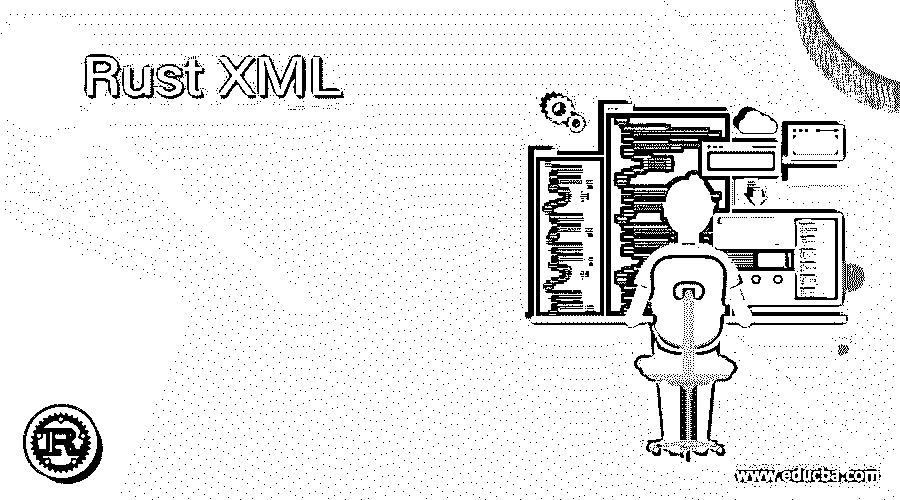

# Rust XML

> 原文：<https://www.educba.com/rust-xml/>

## Rust XML 的定义

XML 与 JSON 非常不同，如果我们仔细观察，就会发现它非常难以处理。XML 是一种完整的可扩展标记语言，其主要目的是传输数据、存储数据等。要创建 XML 文件，我们必须遵循他们定义一些标准，否则会给我们带来错误。在 XML 中，我们创建标签来存储文件中的数据。在 rust 中，我们有这么多不同的库来处理 XML，但没有内置的支持，为了在我们的程序中使用 XML，我们在配置文件中包含了依赖关系以使其工作。在接下来的部分，我们将更详细地讨论不同的库，如何在 rust 编程语言中使用和实现 XML 以便更好地理解，以及它对初学者的用法。

**语法:**

<small>网页开发、编程语言、软件测试&其他</small>

正如我们所知，rust 没有任何内置的 XML 库，我们必须使用外部库来完成这项工作。我们可以读取一个 XML 文件，也可以使用这个库创建 XML 内容，为了更好地理解，让我们举一个例子。

1)阅读:

`let variable_name = EventReader::new(your_XMl_file);`

正如你在上面的语法行中看到的，我们试图从 XML 文件中读取 XML 内容，为此，我们必须使用来自 crate 库的 EventReader，它需要包含在我们的配置文件中。让我们来练习一下语法，让初学者更好地理解它，见下文；

**例如:**

`let demo = EventReader::new(demo.xml);`

在本教程的下一节，我们将更详细地讨论 XML 的内部工作原理，以及用 rust 编程语言配置它需要遵循的步骤。

### XML 在 Rust 中是如何工作的？

到目前为止，我们已经知道 XML 也像 JSON 一样用于存储、表示和传输数据，但是 XML 比 Json 复杂得多。在 XML 文件中，我们不能存储每种类型的数据，因为在某些时候它不能解析它。在 rust 中，我们有很多不同的库可以用来处理 rust 中的 XML。让我们详细地讨论它们中的每一个，以便更好地理解它。

这个库提供了在 rust 中处理 XML 数据的支持，通过使用它我们可以解析我们的数据，创建 XML 数据，等等。通过使用这个库来解析 XML 数据，我们有一个优势，它为我们提供了一个通用接口来帮助我们解析它。用户可以为他们的 XML 数据定义解析和序列化。

2) Crate simple XML builder: 我们还有一个非常容易使用和实现的库，叫做 Crate simple XML builder。通过使用它，我们可以很容易地创建 XML 文件并在其中添加它的属性。要创建 XML 标签，我们必须使用一个简单 XML 构建器库中名为 XMLElement 的类。在本节中，我们将看到它的语法，如何在 rust 编程中使用它，以便更好地理解，见下文；

按照以下步骤创建它:

1)首先我们必须在程序中包含这个库以便使用它，否则程序将无法编译和运行。

**例如:**

`use std::fs::File;
use simple_xml_builder::XMLElement;`

这两个导入是必要的，第一个用于处理文件操作，第二个来自负责处理 rust 中 xml 的 simple_xml_builder 库。

2)因此，在第二步中，我们将创建一个文件来存储 XML 数据。为了处理文件操作，我们已经从 rust 本身读取了 include 文件，所以为了创建它，我们必须遵循下面的代码行，见下文；

**例如:**

`let mut variable_name = File::create("youfile.xml")?;`

正如你在上面几行代码中看到的，我们试图在这里创建一个文件，在这个文件中，你可以用。xml 扩展。

3)在这一步中，我们可以创建 XMLElement，它将我们的数据表示到我们已经创建的 XML 文件中。为此，我们将使用 simple_xml_builder 库中的 XMLElement，请记住，您已经在正确的位置导入了它，以避免错误。下面查看创建它的代码行；

**例如:**

`let mut variabel_name = XMLElement::new("element_name");
practise example : let mut emp = XMLElement::new("employee");`

正如您在上面几行代码中看到的，我们正在尝试创建一个名为“employee”的 XML 元素。这将保存雇员对象的数据。之后，我们可以使用 XMLElement 的 attribute 属性添加它的值。

4)返回 XMLElement 后，我们现在可以为它添加属性，XMLElement 支持各种方法，这些方法可以在 XMLElement 上使用，以添加它们各自的值。为了更好地理解，请参见下面的代码行；

**例如:**

`xmlelement.add_attribute("key", "value");
practise line of code :employee.add_attribute("roll", "001");`

正如您在上述代码行中看到的，我们正在向 employee 元素 her 添加值，为此，我们使用 XMLElement 的 add_attribute()方法，在该方法中，我们可以以键-值对的形式传递属性值。在我们的例子中，我们有雇员元素的 cerate roll。

5)这样我们可以创建几个 XMLElement，并为每个 XML element 添加属性。对此没有限制。

6)最后，我们将把 XMLElement 内容写入我们在代码行的第一步中创建的文件中。下面的代码行可以做到这一点；

例如。

`xmlelement.write(file_object)?;`

正如你在上面几行代码中看到的，我们正在尝试写入文件对象。为此，我们必须遵循语法，在文件中写入时，我们将调用 XMLElement 对象中可用的 write()方法，在该方法中，我们可以传递我们真正想要写入的文件对象，但请记住该文件应该是。xml 扩展，以避免错误。

### 例子

1)在本例中，我们创建了一个 XML 文件，其中包含一些员工数据。此示例将在指定位置创建文件，并将 XML 内容写入其中。我将附上文件以及输出的片段以供参考。这是一个示例，便于初学者理解它的实现。

**举例:**

**代码:**

`use std::fs::File;
use simple_xml_builder::XMLElement;
let mut demoXMlFile = File::create("C:\project\article\demo.xml")?; // please mentioned your file path here ..
let mut employee = XMLElement::new("employee");
employee.add_attribute("roll", "001");
let mut city = XMLElement::new("city");
city.add_text("Mumbai");
employee.add_child(city);
let mut age = XMLElement::new("salary");
salary.add_text("10000");
employee.add_child(salary);
let department = XMLElement::new("department");
department.add_text("IT");
employee.add_child(department);
let technology = XMLElement::new("technology");
technology.add_text("JAVA");
employee.add_child(technology);
let experience = XMLElement::new("experience");
experience.add_text("10");
employee.add_child(experience);
employee.write(demoXMlFile)?;`

**输出:**

### 结论

要在 rust 中使用和删除 XML，我们必须使用一个内部库，我们有很多选择。XML 比 JSON 稍微难一点，但是通过使用这个库，我们可以很容易地在 rust 程序中处理这个问题。XML 更常用于数据的传输和存储。

### 推荐文章

这是一个信任 XML 的指南。这里我们讨论定义，语法，XML 在 Rust 中是如何工作的？以及代码实现的例子。您也可以看看以下文章，了解更多信息–

1.  [什么是 Rust 编程？](https://www.educba.com/what-is-rust-programming/)
2.  [AWS 开发者工具](https://www.educba.com/aws-developer-tools/)
3.  [AWS 中的 IAM 角色](https://www.educba.com/iam-roles-in-aws/)
4.  [AWS 深度学习](https://www.educba.com/aws-deep-learning/)

