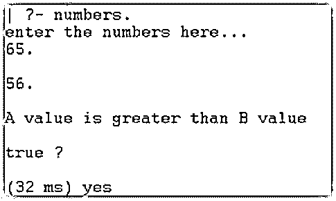
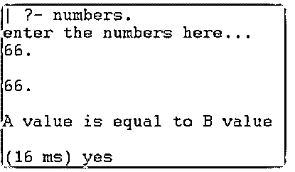

# 序言 if

> 原文：<https://www.educba.com/prolog-if/>

## Prolog if 介绍

“prolog if”是支持应用程序数据及其操作的条件的语句。这是一个条件函数，用于显示 prolog 编程语言所需的条件。它是一种使用编程语言来证明给定数据或值的真假条件和操作的功能。这是一个条件语句，用于指定数据的条件，并使用 prolog 语言显示所需的条件语句。它是一个布尔表达式，用于执行给定的条件并操作“IF”语句中可用的代码块。它执行应用程序的条件，并显示“IF”函数中可用的条件语句。

### 句法

这个函数需要 pl 文件中的一些方法、对象和值。

<small>网页开发、编程语言、软件测试&其他</small>

语法如下所示。

`numbers:- write('enter the numbers here...'), nl,
read(A), nl, read(B), nl,
condition(A,B).`

**说明:**

*   “数字”是为条件插入数字的方法。
*   “A”和“B”是属性。
*   “read”方法允许在控制台中写入所需的值。
*   “condition”方法包含函数的属性。

语法如下所示。

`condition(A,B):- A>B, write('A value is greater than B value').`

或者

`condition(A,B):- A>B, write('A value is greater than B value'); A<B, write('A value is less than B value').`

**说明:**

*   “condition”方法包含函数的属性。
*   “A”和“B”是条件的属性。
*   它写了“A”和“B”属性的条件。
*   它对值使用“大于”和“小于”等条件。
*   “write”方法返回真实条件及其语句。

控制台中的语法如下所示。

`|?- numbers.`

**说明:**

*   prolog 控制台编写“pl”文件方法。
*   您可以输入属性的值。

### Prolog 中的语句是如何工作的？

Prolog 注释在“pl”文件中有效。

创建一个扩展名为“pl”的文件。

**示例:main.pl**

将数据插入到序言文件中。

将带有值的对象保存到 pl 文件中。

以下命令可用于列表中的数据。

*   初始化对象并编写值的读取方法。
*   “条件”方法与条件和值相互连接。

`number:- write('enter the numbers here...'), nl,
read(A1), nl, read(B1), nl,
conditions(A1,B1).`

*   “condition”方法包含“number”方法属性。
*   在变量上写下所需的条件。
*   使用“write”方法返回所需的语句。
*   编写条件语句作为输出。

`conditions(A1,B1):- A1>B1, write('A value is greater than B value').`

Prolog 注释在控制台中有效。

*   打开 prolog 控制台或解释器。
*   设置“pl”文件的目录路径。
*   使用给定的 prolog 文件。

`[main].`

*   您可以直接使用 prolog 控制台进行编程。
*   使用 prolog 控制台中的语法。

`| ?- numbers.`

*   写出函数的第一个值。

`65.`

*   写出函数的第二个值。

`56.`

结合职能的工作程序。

*   使用“main.pl”文件。

`numbers:- write('enter the numbers here...'), nl,
read(A1), nl, read(B1), nl,
conditions(A1, B1).
conditions(A1,B1):- A1 > B1, write('A value is greater than B value').`

*   使用带有所需目录路径的给定控制台。

**【主】。**

*   使用 prolog 控制台中的语法。

`| ?- numbers.`

*   写出函数的第一个值。

`65.`

*   写出函数的第二个值。

`56.`

*   控制台将条件语句作为输出返回。

### Prolog if 示例

下面是提到的例子:

#### 示例#1

真实条件下的基本示例和输出如下所示。

使用“main.pl”文件。

`numbers:- write('enter the numbers here...'), nl,
read(A1), nl, read(B1), nl,
conditions(A1, B1).
conditions(A1,B1):- A1 > B1, write('A value is greater than B value').`

使用带有所需目录路径的给定控制台。

`[main].`

使用控制台。

`| ?- numbers.`

写入第一个值。

`65.`

写入第二个值。

`56.`

**输出:**

**说明:**

*   该方法允许将值作为输入数据写入。
*   它满足了条件。
*   输出显示条件语句。

#### 实施例 2

带有 false 条件的基本示例和输出如下所示。

使用“main.pl”文件。

`numbers:- write('enter the numbers here...'), nl,
read(A1), nl, read(B1), nl,
conditions(A1, B1).
conditions(A1,B1):- A1 > B1, write('A value is greater than B value').`

使用带有所需目录路径的给定控制台。

`[main].`

使用控制台。

`| ?- numbers.`

写入第一个值。

`56.`

写入第二个值。

`65.`

**说明:**

*   该方法允许将值作为输入数据写入。
*   该函数不满足条件。
*   方法将错误作为输出返回。

#### 实施例 3

带有“等于”条件的基本示例和输出如下所示。

使用“main.pl”文件。

`numbers:- write('enter the numbers here...'), nl,
read(A1), nl, read(B1), nl,
conditions(A1, B1).
conditions(A1,B1):- A1 == B1, write('A value is equal to B value').`

使用带有所需目录路径的给定控制台。

`[main].`

使用 prolog 控制台。

`| ?- numbers.`

写入第一个值。

`66.`

写入第二个值。

`66.`

**输出:**

**说明:**

*   该方法允许将值作为输入数据写入。
*   它的功能满足条件。
*   输出显示条件语句。

### 结论

该功能使用所需的条件控制应用程序数据。它创建了优雅的、用户友好的、可操作的应用程序。条件语句限制和控制用户应用程序的数据库。该功能根据需要管理和操作编程数据或值。

### 推荐文章

这是一个 Prolog if 的指南。这里我们讨论一下入门，Prolog 中的语句是如何工作的？以及更好理解的例子。您也可以看看以下文章，了解更多信息–

1.  [Prolog 编程](https://www.educba.com/prolog-programming/)
2.  [Prolog 运算符](https://www.educba.com/prolog-operator/)
3.  [人工智能如何工作？](https://www.educba.com/how-artificial-intelligence-works/)
4.  [网络编程语言](https://www.educba.com/web-programming-languages/)

