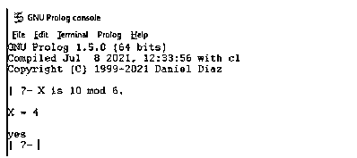
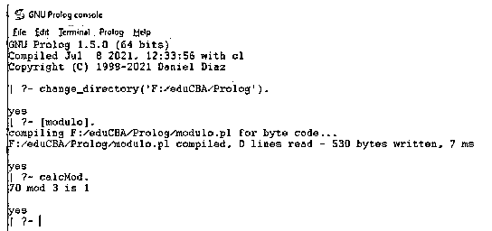

# 勇敢的先驱者

> 原文：<https://www.educba.com/prolog-mod/>

## Prolog mod 简介

Prolog mod 是一个算术工具，用来求两个数的模。Prolog 有许多用于整数操作的基本算术函数。大多数 prolog 实现都提供了处理整数或浮点数的工具。在 Prolog 算术工具中，任何变量必须总是有界的，并且这些变量的值应该总是数字的。基本上，算术工具的值限制了第一个参数，如果没有，它将生成一个错误消息作为结果。在 Prolog 算术中，符号是一种特定类型的中缀运算符。

**语法:**

<small>网页开发、编程语言、软件测试&其他</small>

`X mod Y.`

x 和 Y 是整数。

或者

`mod(X,Y).`

按照语法，我们有两种类型，X mod Y 或 mod(X，Y)。

在 prolog 中，还有其他算术运算，如加、减、乘、除、商、幂等。Prolog mod，也称为 modulo，用于获取整数的余数。运算符的优先级与其他算术运算相同。如果整数是浮点数，那么我们可以使用 round/1 向上舍入到下一个可能的整数，而 float/1 可以用于将整数转换为浮点值。

### Prolog mod 示例

下面是提到的例子:

#### 示例#1

简单的方式。

**代码:**

`?- X is 10 mod 6.`

**输出:**

这里你可以看到 X=4 是 10 和 6 的模数值。

#### 实施例 2

目标存储在。pl 文件。

**步骤 1:** 创建一个文件，并用。pl 扩展。

**第二步:**添加以下模数运算所需的规则。

*   **calcMod:** W 是 70 mod 3，write('70 mod 3 是')，write(W)，nl。

这意味着 W 是模数 70 和 3 的合力。这里“nl”将转到下一行，write(W)将把结果打印到 gnu 编译器上。

**第三步:**在 GNU 编译器上，首先我们需要去文件所在的路径，用下面的命令。

**代码:**

`?- change_directory('F:/XYZ/abc').`

XYZ 和 abc 是相同的文件夹名称。

**步骤 4:** 然后，使用下面的命令访问所需的文件。

**代码:**

`?- [modulo].`

这里，modulo 是文件名。

**步骤 5:** 由于 modulo 有一个 calcMod 函数要执行，这个函数将在 gnu 编译器中被调用来执行取模结果。按照下面的命令执行 calcMod 函数。

**代码:**

`?- calcMod.`

**步骤 6:** 执行函数，结果打印在编译器上。

**输出:**

所以在这里，我们把执行 for 70 和 3 的命令放到一个文件中。pl 扩展名存储在 prolog 文件夹下，prolog 文件夹又存储在 eduCBA 文件夹下。调用 calcMod 函数执行了 Mod，结果值显示为 1。

#### 实施例 3

对于负整数。

**代码:**

`?- X is -4 mod 3.`

`?- X is 4 mod -3.`

`?- X is -4 mod -3.`

**输出:**

所以在这里，对于每个负整数，结果如上不同。如果两个整数都是负的，那么结果值仍然是负的。

#### 实施例 4

算术表达式错误。

**代码:**

`?- X is 5 mod 0.`

**输出:**

它给出以下错误作为“未捕获的异常:错误(evaluation_error(zero_divisor)，(is)/2)”。

#### 实施例 5

另一种实现方式。

**代码:**

`?- X is mod(5,3).`

**输出:**

所以这里我们使用 mod(X，Y)的实现方式。5 和 3 作为参数传递给 mod 函数，X 值打印在控制台上。

基本上，当一个数被另一个数除时，模运算将返回除法的余数或有符号余数，称为运算模数。该运算符通过符号 mod 来区分，该符号代表它所运算的模数。

### 结论

我们已经看到了什么是 Prolog mod，以及它在 Prolog 中是如何定义的。它是 Prolog 中的算术运算符之一，用于检查两个数的可除性的余数值，也称为两个数的模。根据两个整数值，余数可以是有符号整数或无符号整数。我们还从两个方面看到了 Prolog mod 的语法，并实现了这两种方法，如上面的例子所示。我们还使用一个. pl 扩展文件来实现，该文件中包含了所需的模数规则。我们还解释了实现模的步骤。pl 文件。

### 推荐文章

这是一个 Prolog mod 的指南。为了更好地理解，我们在这里讨论 Prolog mod 的介绍和适当的例子。您也可以看看以下文章，了解更多信息–

1.  [Prolog 编程](https://www.educba.com/prolog-programming/)
2.  [Prolog 运算符](https://www.educba.com/prolog-operator/)
3.  [Prolog findall](https://www.educba.com/prolog-findall/)
4.  [网络编程语言](https://www.educba.com/web-programming-languages/)

