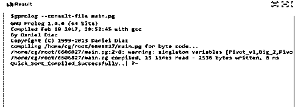
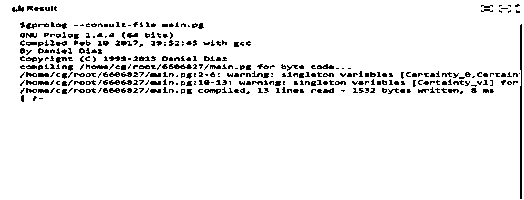

# 序言或

> 原文：<https://www.educba.com/prolog-or/>

## Prolog 或的定义

Prolog 是一种在逻辑运算方面很流行的编程语言。它是一种逻辑编程语言，主要支持所有最新的技术，如人工智能或任何计算语言相关的语言。Prolog 的第一个逻辑来源于某种形式语言。Prolog 适合逻辑运算符，这些运算符通过执行几个查询来帮助解决复杂的逻辑问题。Prolog 或也被认为是一种具有优先地位的语言，它的一些规则也称为；/逻辑或也称为析取函数。

**语法**

<small>网页开发、编程语言、软件测试&其他</small>

语法流以这样的方式进行，Flower_0 将用于析取逻辑或运算符，其中它将用于使其新鲜，或者如果它变成绿色，则第一个流的方法如下所示。

`Flower_0 (Y) :- fresh(Y) .
Flower_0(Y) :- green(Y) .`

逻辑 prolog or 的另一个语法流如下所示:

`Flower_1(X) :- fresh(X) ; green(X) .`

推荐另一种语法表示，它将用于通过使 prolog 遵循它自己的优先规则和它的相应规则来使区别更有吸引力和增强。

### 在 Prolog 中 or 是如何工作的？

*   Prolog 是一种逻辑编程语言，它由两种类型的谓词组成，其中 Prolog 或 is 被称为析取运算符，它将被用于建立实体之间的关系，这些实体在 Prolog 中以某种方式关联和依赖。
*   作为元数据的 prolog 主要用于逻辑和操作方法，这是由于它利用了声明和过程方式，其中声明方式甚至在 Prolog 中的 or 操作符方面将在它将用于维护属性之间的关系的意义上起作用，而逻辑编程声明的声明类型意味着来自 Prolog 系统的输出的确定将如何发生。
*   因为析取被理解为 or 运算符，所以它将被用于满足与它相关的所有条件，在这种意义上，与这些类型的运算符一起使用的优先级被用于与最强 then 或 not then 绑定，这意味着当它出现在 prolog 中或作为矛盾的原因时的一些复杂性或任何其他东西。
*   在整个 Prolog 编程语言中，有一种 Prolog or 的特殊表示法，用于实现和其他开发方面。因此，它以分号分隔的形式表示，给出 or 值。
*   基本上，工作变得成功，其中它主要由带有两个参数的中缀运算符组成，这两个参数具有目标，如目标 1 和目标 2，条件是如果目标 1 成功，则只有目标 2 将具有成功因素。
*   在大多数情况下，建议在带有逻辑的条件周围使用括号()，因为它清楚地区分了用于操作的连接词和析取词的交互作用。
*   如果在一个场景中，括号从整个括号中丢失，那么 prolog 有其自己的逻辑规则，该规则可能与所需的不同，并且需要转换。因此，括号内的所有内容都比括号外的其他属性更重要。这使得整个解析和增强视图或观察。
*   除非谓词和假设最终为真，否则所有与其相关的属性或值都将变得模糊不清，没有任何意义。因此，非常需要持续使用这些运算符，因为它们有助于轻松地对大多数谓词和逻辑问题进行排序。
*   中缀运算符起着重要的作用，这使得它在运行和编译时有一些约束和修正，这对任何运行时编译都是非常重要的。

### 例子

让我们讨论 Prolog 或。

#### 示例#1

这个程序演示了使用 prolog 的快速排序算法实现，或者使用分区函数和所有这些属性进行编译和操作，如下面的输出所示。

`partition_0([], _, [], []).
partition_0([X|Xs], Pivot_vl, Small_vl, Big_vl) :-
( X @< Pivot_v1 ->
Small_vl = [X|Rest_0],
partition (Xs, Pivot_vl, Rest_0, Big_vl)
; Big_2 = [X|Rest_0],
partition (Xs, Pivot_v2, Small_0, Rest_2)
).
quicksort_0([]) --> [].
quicksort_0([X|Xs]) -->
{partition_0(Xs, X, Smaller_0, Bigger_2) },
quicksort_0(Smaller_0), [X], quicksort_0(Bigger_2).
: - initialization(main).
main :- write('Quick_Sort_Compiled_Successfully..').`

**输出:**

**说明:**

在 prolog 语言中，加载代码被称为咨询，其中 prolog 主要用于查询，以使 prolog 提示在提示出现时反映所需的结果。如果出现多个查询的情况，那么就要使用分号；来区分。在这个例子中，通过利用适当的规则和分配来编译更小和更大的元素，执行快速排序以使分区和实现在层次结构中正确实现。

#### 实施例 2

这个程序演示了析取操作符，其中 prolog 语言使用中缀操作符以便于阅读和修改，因此，在分离和输出中表示的一些与域相关的细节方面，使整体操作得到了增强。

`solve_prb (true, 1) :- !.
solve_prb ((Sub_goal_1, Sub_goal_2), Certainty_0) :-
!,
solve_prb (Sub_goal_1, Certainty_1),
solve_prb (Sub_goal_2, Certainty_2),
Certainty_vl is min (Certainty_1, Certainty_2).
solve_prb (Goal_0, 1) :-
builtin(Goal_0), !,
Goal_0.
solve_prb(Head, Certainty_0) :-
clause_cf(Head, Body, Certainty_0),
solve_prb(Body, Certainty_2),
Certainty_vl is Certainty_0 * Certainty_2.’`

**输出:**

**说明:**

在这个程序中，有一个属性的符号，或者说从它传递来的参数，比如 clause_cf 包含 Head、body 和 confidential _ 0，用于许多元解释器对不确定性进行推理，中间有许多转换，但仍然在内部使用许多其他功能，属性的行为也一样。主要的格言是让子目标与依赖减轻和行为完美地相关联。

### 结论

当涉及到与逻辑相关的任何编程实现时，Prolog 或 gel 都很好。它使得谓词和其他函数也发生变异并正常运行。当涉及到执行与人工智能或遗传算法相关的操作和操纵时，它给了开发人员一个优势，其中主要是逻辑编程。

### 推荐文章

这是一本 Prolog 或。在这里，我们讨论介绍，或如何在 Prolog 中工作，代码实现的例子。您也可以看看以下文章，了解更多信息–

1.  [Prolog findall](https://www.educba.com/prolog-findall/)
2.  [Prolog 运算符](https://www.educba.com/prolog-operator/)
3.  [Prolog 编程](https://www.educba.com/prolog-programming/)
4.  [反向链接](https://www.educba.com/backward-chaining/)

