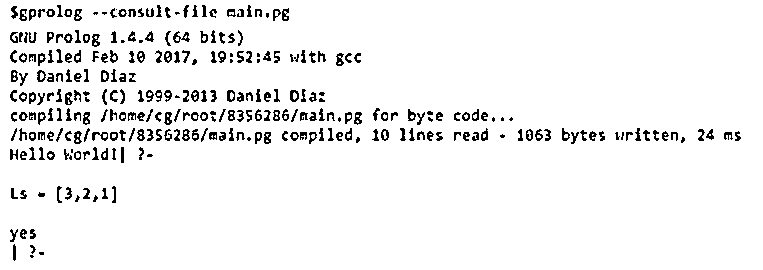

# 序言反向列表

> 原文：<https://www.educba.com/prolog-reverse-list/>

## Prolog 反向列表介绍

Prolog reverse list 被定义为给定列表的反转，它意味着这个操作用于通过使用 Prolog 编程语言找到给定列表的反转，prolog 是一种逻辑和声明性编程语言，假设有一个 list L=[a，b，c，d，e，f ]，并且想要反转 list 的元素，所以输出将是[f，e，d，c，b，a]，要执行上述操作需要创建一个子句，即' list_reverse(List，ReversedList)'， 如果列表是空的，那么输出/结果列表也将是空的，我们也可以将名称放入[Head|Tail]，递归地反转尾部项并与头部连接。

### Prolog 反向列表的语法

反向列表的语法是:

<small>网页开发、编程语言、软件测试&其他</small>

`list_reverse(List, ReversedList).`

其中，List 是输入列表，ReversedList 是输出列表。

*   **列表:**列表是在非数字编程的不同情况下使用的数据结构，列表用于存储多个项目，列表可以是空的或非空的，列表的写法如[ ]中所示，列表有两部分，一部分称为头，列表的其余部分称为尾。
    假设，L= [a，b，c]是链表，如果我们取[b，c]=Tail 那么这个链表将是 L=[a|Tail]，头尾用竖线(|)隔开。
*   **ReversedList:** 这是我们对列表进行反向操作后得到的反向列表，如果列表为空，那么结果列表也将为空，我们可以通过语法给出输入。

`?- reverse([a,b,c,d], Result).`

输出将采用以下格式:

**结果= [d，c，b，a]**

还有其他一些语法:

`reverse_worker(Xs,[],Ys).`

当累加器作为空列表植入时，将使用此输入来源中使用的员工。

`reverse_worker([] ,R,R).`

当列表为空且累加器包含反转列表时，将使用这种类型的输入源。

### Prolog 中如何反转列表？

*   为了说明列表的反转，我们将以定义一个谓词为例，该谓词将一个列表([a，b，c，d])作为输入，并以相反的顺序返回一个包含相同元素的列表，即([d，c，b，a])。反向谓词是一个强大的谓词。prolog 中的列表很容易从前面和后面访问。
*   例如，要取出列表 L 的头部，我们可以执行 unification [H|_]=L，这导致 H 正在进行到 L 的头部，取出一个顺序的最后一个元素并不容易，因此我们不能使用简单的 unification 来完成它。如果我们有一个颠倒列表的谓词，那么我们可以首先颠倒输入列表，我们将不得不取出颠倒列表的头部，然后我们将得到列表的最后一个元素。所以“反转”谓词是一个有用的工具，我们可以通过使用更有效的“反转”谓词来反转大型列表。
*   我们有两种类型的反向谓词，一种是简单谓词，它是在‘append’的帮助下定义的，另一种是通过使用更有效、更自然的累加器来定义的。“Append”是一个有用的谓词，但对我们来说同样重要的是，我们不能一直使用它，因为它可能是低效率的来源。它的效率很低，因为它没有在一个简单的动作中连接两个列表，这是“append”的弱点，而是需要沿着它的第一个参数向下，直到它找到列表的结尾，然后它才执行连接。这不会引起任何问题，让我们举一个例子，如果我们有两个列表，我们只是想把它们连接起来，因为 prolog 将需要处理第一个列表长度，但是如果列表不太长，那么使用 append 很容易，但是在列表中有两个给定的变量，那么首先列表被分割，然后开始工作。
*   所以使用“accumulator”进行反转是一种更好的反转列表的方式，这意味着 Accumulator 本身就是一个列表，当我们开始时它将是空的。假设我们想要反转[a，b，c，d]，首先 accumulator 是空的[ ]，所以我们简单地取我们试图反转的列表的头，然后我们将它添加为 accumulator 的头。然后我们开始反转尾部，然后我们的任务是反转[b，c，d],因为我们把[a]作为一个累加器，然后我们再次取列表的头，并把它作为累加器的头，现在[b，a]是新的累加器，我们开始反转[c，d]。通过重复这个过程，我们得到一个新的累加器[c，b，a]，然后反转[d]，然后在下一步我们得到累加器[d，c，b，a]，这样我们得到了反转列表。

### Prolog 反向列表的示例

下面是提到的例子:

#### 示例#1

**代码:**

`:- initialization(main).
main :- write('Hello World!').
list_reverse([],[]).
list_reverse([_First|_Rest],_Reversed):-
list_reverse(rest,_ReversedRest).
concatenation(_ReversedRest,[_First],_Reversed).
concatenation([],L,L).
concatenation([X1|L1],L2,[X1|L3]):-concatenation(L1,L2,L3).
Input:
reverse([a,b,c,d],Results).`

**输出:**

在上面的示例中，我们通过将输入作为列表[a，b，c，d]来反转输出中所示的列表，通过执行反转操作，我们得到了输出图中所示的反转列表。在程序中，首先，我们取，然后用 L1，L2，L3 把它们连接起来，我们得到结果。

#### 实施例 2

**代码:**

`:- initialization(main).
main :- write('Hello World!').
% reverseList([1,2,3], ReversedList).
reverseList([H|T], ReversedList):-
reverseListHelper(T,[H], ReversedList).
reverseListHelper([], Acc, Acc).
reverseListHelper([H|T], Acc, ReversedList):-
reverseListHelper(T, [H|Acc], ReversedList).
Input:
reverseList([1,2,3], Ls).`

**输出:**

这是另一个使用累加器的例子，我们使用累加器，通过它的语法完成反转，然后通过输入得到输出。

### 结论

在上面的文章中，我们得出结论，prolog 包含自己的列表程序库，在反转列表方面，所有参数都从第一个开始反转，然后它返回 true 或 false，正如我们已经看到的，Prolog 有一个反转函数，其语法有参数头和尾。

### 推荐文章

这是一个 Prolog 反向列表的指南。这里我们讨论一下入门，Prolog 中如何逆向列表？和示例。您也可以看看以下文章，了解更多信息–

1.  [XPath 节点](https://www.educba.com/xpath-nodes/)
2.  [人工智能如何工作？](https://www.educba.com/how-artificial-intelligence-works/)
3.  [网络编程语言](https://www.educba.com/web-programming-languages/)
4.  [sprintf Python](https://www.educba.com/sprintf-python/)

