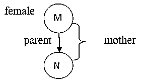
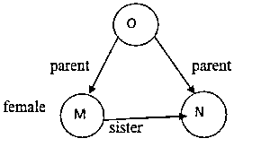
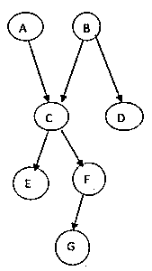
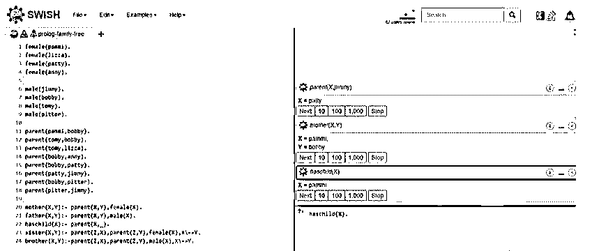
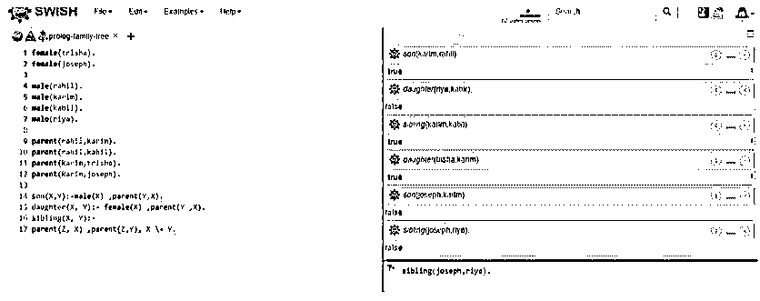

# Prolog 家族树

> 原文：<https://www.educba.com/prolog-family-tree/>

## Prolog 家谱简介

prolog 家族树，定义为 prolog，是一种具有符号和非数字数据处理的逻辑编程语言。它特别适合于解决需要对象和对象间关系的问题。它是一种用户友好的编程语言，因为它在编程中使用了逻辑，prolog 家族树可以通过使用事实、规则和查询来构建，事实和规则的集合称为知识库，它描述了它们的对象之间的关系。prolog 编程完全是关于知识库的，并且通过提出查询意味着通过向 prolog 询问关于知识库中存储的信息的问题。

### Prolog 家族树的语法

母子关系的序言语法如下所示:

<small>网页开发、编程语言、软件测试&其他</small>

母亲关系

姐妹关系

*   **母(M，N):** 父(M，N)，母(M)。
*   **姐妹(M，N):** 父母(O，M)，父母(O，N)，女性(M)，M\= =N。

我们还可以定义:

*   **父亲(M，N):** 父母(M，N)，女性(M)。
*   **haschild(M):** parent(M，_)。
*   **兄弟(M，N):** 父母(O，M)，父母(O，N)，男性(M)，M\==N。

其中 _(下划线)表示它是一个匿名变量。

我们还可以为其他一些关系编写如下语法:

*   **祖父母(M，N):** 父母(M，O)，父母(O，N)。
*   **祖母(M，O):** 母亲(M，N)，父母(N，O)。
*   **祖父(M，O):** 父亲(M，N)，父母(N，O)。
*   **妻子(M，N):** 父母(M，O)，父母(N，O)，女性(M)，男性(N)。
*   **叔叔(M，O):** 兄弟(M，N)，父母(N，O)。

### 如何在 Prolog 中创建家谱？

prolog 中的程序规定了对象之间的关系和对象的属性；家谱告诉我们如何建立一个家庭数据库。数据库还包含事实和规则；让我们考虑一下“Sumit 有一辆车”这个例子。我们可以声明两个对象之间的原始关系，其中一个对象是 Sumit。另一个对象是汽车；如果我们说，“Sumit 有车吗？”关系有很多种；它们中的一些是通过在程序中使用规则来规定的，我们可以找到所使用的对象之间的关系，并且它不被定义为事实。树形图在表达方面非常好，信息被清楚地提及，因此，用户可以很容易地理解，我们在 prolog 中的程序是子句集。

**兄弟关系:**

*   如果他们都是男性。
*   如果他们有相同的父母。

假设我们有一些子句来说明这种关系:

*   父母(somit，komal)。
*   父母(somit，manish)。
*   男(komal)。
*   男(曼尼希)。
*   兄弟(X，Y):父母(Z，X)，父母(Z，Y)，男性(X)，男性(Y)

从上述子句中，我们可以得出结论，b 和 c 是兄弟，但我们可以创建 3 个真实的组合，组合是(komal，komal)，(komal，manish)，(manish，manish)，但实际上(komal，komal)和(manish，manish)不是真正的兄弟，因为他们是相同的兄弟。

让我们通过考虑一个可以从 prolog 系谱树形成的例子来看系谱树的工作。我们想做一个家谱，根据我们的定义，可以映射到事实和规则，这样我们就可以对它们进行一些查询，

样本家谱如下所示:

这里我们有一个家谱，所以从上面的家谱样本来看，它们之间有一些关系；从上面的系谱图中，我们可以说‘C’是 A 和 B 的孩子，这意味着 A 是 C 的父母，B 也是 C 的父母，B 也有一个孩子 D，C 有一个兄弟 D，他的父母也是 A 和 B，所以我们可以用谓词来调用家族，如下所示，C 有两个孩子 E 和 F，F 也有一个孩子 G，按照上面的系谱图，我们在下面写了一些子句，每个子句都必须以句号(。).

*   父母(A，C)。
*   父(B，C)。
*   父(B，D)。
*   父(C，E)。
*   父(C，F)。
*   父代(F，G)。

从上面的例子中，我们可以说明一些要点，即我们可以根据给定的系谱树信息，通过取 n 个对象来定义父关系，以便用户可以容易地向 prolog 系统提出关于在程序中定义的关系的查询，prolog 程序由子句终止并由子句组成，关系的自变量是常量类型或与任何通用对象相关，正如我们上面给出的，对象是原子或变量类型。

### Prolog 家谱示例

下面提到了不同的例子:

#### 示例#1

知识库

**代码:**

`female(pammi).
female(lizza).
female(patty).
female(anny).
male(jimmy).
male(bobby).
male(tomy).
male(pitter).
parent(pammi,bobby).
parent(tomy,bobby).
parent(tomy,lizza).
parent(bobby,anny).
parent(bobby,patty).
parent(patty,jimmy).
parent(bobby,pitter).
parent(pitter,jimmy).
mother(X,Y):- parent(X,Y),female(X).
father(X,Y):- parent(X,Y),male(X).
haschild(X):- parent(X,_).
sister(X,Y):- parent(Z,X),parent(Z,Y),female(X),X\==Y.
brother(X,Y):-parent(Z,X),parent(Z,Y),male(X),X\==Y.
Input:
parent(X,jimmy).
mother(X,Y).
haschild(X).
sister(X,Y).`

**输出:**

以上是示例 prolog 程序；prolog 程序有三个部分，主要是域，第二个是谓词，第三个是子句，可以在域下声明，所以在谓词部分我们可以声明所有的谓词，子句将在这些谓词中定义，所以我们在上面的程序中给定了名称，我们也声明了一些知识库，子句是 prolog 程序中的事实，我们取了一些事实， 并且一些规则将各自子句的成员来显示父、母和关于 has 子之间的关系，这是一个知识库家谱树，输出如屏幕截图所示。

#### 实施例 2

**代码:**

`female(trisha).
female(joseph).
male(rahil).
male(karim).
male(kabil).
male(riya).
parent(rahil,karim).
parent(rahil,kabil).
parent(karim,trisha).
parent(karim,joseph).
son(X,Y):-male(X) ,parent(Y,X).
daughter(X, Y):- female(X) ,parent(Y ,X).
sibling(X, Y):-
parent(Z, X) ,parent(Z,Y), X \= Y.
Input:
son(karim,rahil).
son(joseph,karim).
daughter(trisha,kabil).
daughter(riya,kabir).
sibling(karim,kabil).`

**输出:**

在上面的程序中，我们已经用事实和规则的形式图解了家谱；我们编写了获取儿子、女儿和兄弟姐妹的规则，以便描述对象之间的关系。

### 结论

在上面的文章中，我们得出结论，在 prolog 关系中，规范是在对象和对象的属性之间，正如我们在本文中看到的，我们可以通过制作系谱树和说明它们来容易地建立关系，在 prolog 程序中，可以通过采用事实、规则和提出查询来说明系谱树。

### 推荐文章

这是一本关于 Prolog 家谱的指南。这里我们讨论一下入门，如何在 Prolog 中创建家谱？和示例。您也可以看看以下文章，了解更多信息–

1.  [人工智能如何工作？](https://www.educba.com/how-artificial-intelligence-works/)
2.  [网络编程语言](https://www.educba.com/web-programming-languages/)
3.  [sprintf Python](https://www.educba.com/sprintf-python/)
4.  [Prolog 编程](https://www.educba.com/prolog-programming/)

