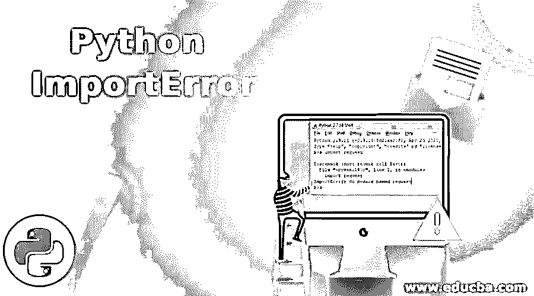
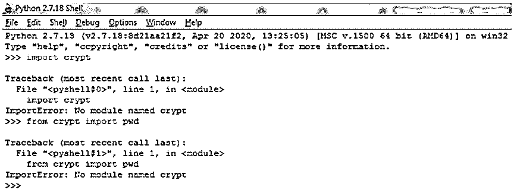
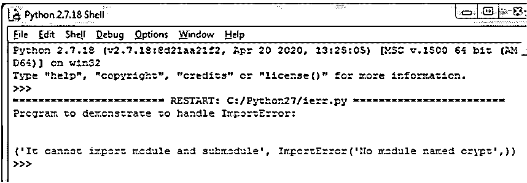

# Python 导入错误

> 原文：<https://www.educba.com/python-importerror/>




## Python ImportError 简介

在 Python 中，当我们想要导入 Python 程序中的任何特定模块时，我们使用“import”。在 Python 中，为了让程序可以使用模块内容，我们使用 import 语句。因此，当导入任何模块时，如果在将模块导入程序时出现任何问题，就有可能出现导入错误。在本文中，我们将讨论这种错误，这种错误通常发生在模块导入的 import 语句声明无效的情况下，这种问题在 Python 的最新版本(如 3.6 和更新版本)中也称为 ModuleNotFoundError。

### python 中的 importerror 示例

在 Python 中，当我们想要在程序中包含模块内容时，我们必须在程序中导入这些特定的模块。为此，我们使用“import”关键字，比如带有模块名的 import 语句。编写该语句时，如果指定的模块没有正确编写，或者在 Python 库中没有找到导入的模块，则 Python 解释器会抛出一个错误，称为 ImportError。

<small>网页开发、编程语言、软件测试&其他</small>

有两种情况会引发 ImportError。他们是

*   如果模块不存在。
*   如果我们试图从模块中导入子模块

现在让我们在下面的程序中演示如何抛出一个导入错误。

#### 示例#1

现在假设我们正在尝试导入模块“request ”,该模块不存在或者没有保存在我们需要下载它的 Python 驱动器中。下面让我们看一个小例子:

```
import request
```

**输出:**


在上面的示例代码中，我们可以看到我们正在导入一个名为“request”的模块，这个模块在下载的 Python 库中并不存在。因此，它抛出一个 ImportError，给出消息说没有名为“request”的模块。由于每个模块在下载或内置时都有自己的私有符号表，所有定义的模块都通过创建单独的命名空间保存在该表中。因此，如果模块存在，则不会出现这种错误。

在 Python 中，有另一种在程序中导入模块的方法，如果这个语句也失败，那么也会出现 ImportError。让我们看看下面的例子:

#### 实施例 2

```
from crypt import pwd
```

**输出:**




在上面的程序中，我们可以看到导入模块的另一种方式。如果模块不在私有 Python 库中，这也会抛出 ImportError。

如果模块不存在，上面两种在程序中导入模块的方法会抛出一个错误。因此，在异常处理概念中捕捉此类错误，它提供了一个 ImportError 异常，该异常具有 Python 异常层次结构 Baseexception、Exception，然后是 ImportError。在 Python 中，甚至 moduleNotFoundError 也与 ImportError 异常相同。下面让我们来看看如何在 Python 程序中使用异常处理的 try 和 except 块来处理这样的错误。

#### 实施例 3

```
print("Program to demonstrate to handle ImportError:")
print("\n")
try:
from crypt import pwd
except ImportError as ie:
print("It cannot import module and submodule", ie)
```

**输出:**




在上面的程序中，我们可以看到当我们试图导入“crypt”模块时，我们使用异常处理的 try 和 except 块来处理这个 ImportError。这是避免打印错误信息的一种方法。

为了避免这样的 ImportError 异常，我们在上面看到了异常处理的使用。但是，它仍然会在输出屏幕上显示错误消息。当 Python 私有表中没有模块时，会出现这种错误。为了避免这种情况，我们可以直接从网上下载这个模块到 Python IDE。让我们看看如何才能避免这个导入错误。我们需要下载模块，我们不会得到这个错误，这样做如下:

```
pip install module_name
```

如果安装了 pip，我们可以直接运行它来安装模块。否则，我们首先需要安装 pip，然后安装其他软件包。

下载模块的另一种方法是通过下载模块直接通过互联网下载包，然后解压缩文件夹并保存保存 Python 软件的文件夹。

### 结论–Python 导入错误

在本文中，我们得出结论，ImportError 是 Python 层次结构中 Baseexception，Exception 下的一个异常，然后就出现了这个异常。在 Python 中，当 Python 程序试图导入私有表中不存在的模块时，会出现 ImportError。通过使用 try 和 except 块进行异常处理，可以避免此异常。我们还看到了 ImportError 如何发生以及如何处理的示例。

### 推荐文章

这是 Python 导入错误的指南。在这里，我们还将讨论 python 中导入错误的引入和工作方式，以及不同的例子和代码实现。您也可以看看以下文章，了解更多信息–

1.  [Python 中的 Lambda](https://www.educba.com/lambda-in-python/)
2.  [终于在 Python 中](https://www.educba.com/finally-in-python/)
3.  [Python 空列表](https://www.educba.com/python-empty-list/)
4.  [Python 迭代器字典](https://www.educba.com/python-iterator-dictionary/)


