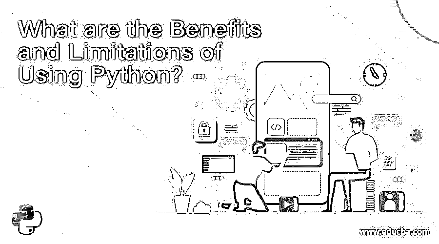

# 使用 Python 的好处和局限性？

> 原文：<https://www.educba.com/benefits-and-limitations-of-using-python/>

## 使用 Python 的优势和局限性介绍

Python 被认为很容易学习，几乎可以在任何地方运行。它对许多应用都很有用，包括教育、数据分析和 web 开发。世界上一些最大的公司广泛依赖 Python，包括 Instagram 和 Google。

它是一种动态的、面向对象的(OO)编程语言，可与微软的同类产品相媲美。NET 语言或 Java，作为几种软件开发类型的通用底层。它为多种技术的集成提供了强有力的支持，并在整个开发生命周期中提供了更高的编程效率。它特别适合于需求不断变化的大型复杂项目。

<small>网页开发、编程语言、软件测试&其他</small>

Python 也是发展最快的开源编程语言之一，被用于全球最大的证券交易所的关键任务应用程序中。它也是各种高端出版物网站的基础，在数百万部手机上运行，并用于空中交通管制、长篇电影动画和造船等行业。

让我们从积极的方面开始，讨论这种多产编程语言的优势。

### 使用 Python 的优点

以下是下面给出的优点。

#### #1.易于使用和阅读

大多数 Python 程序员都会同意，Python 最大的优点是易于掌握。易用性和易读性不仅仅是一种便利。它也能让你的程序的用户受益。易用性帮助你在编写程序和其他需要增强或维护程序的人的时候思路更清晰。

专家和初学者可以很容易地理解代码，并且您可以很快地用这种语言变得富有成效，因为它比其他流行语言(如 Perl)有更少的“方言”。因为它的源代码类似于伪代码，所以学习起来也很简单。一旦你开始学习，你几乎可以立即开始有效地编码。

总的来说，用 Python 写程序比用 Java 或 C++等其他语言要省力。这在学术界也很受欢迎，因此人才库很大。它被认为是一种非常高效的编写代码的方式，其中一些来自于它的可读性和简单的语法。有些来自它设计良好、丰富的内置功能和标准库，以及一些第三方开源模块和库的可用性。

既然容易理解，也容易维护。这种语言还具有动态灵活性和类型化，代码不像其他语言那样冗长。但是这种动态类型也是一个缺点，我们将在后面讨论。

#### #2.简单快捷

Python 社区为用户提供了快速有效的支持，成千上万的开发人员努力寻找和修复错误，并为该语言开发新的补丁和增强。还以多种方式提供快速反馈。首先，程序员可以跳过必须用其他语言完成的各种任务。这降低了每个程序的时间和成本以及程序所需的维护。它还允许快速修改代码。这种语言可以被称为现成的，只需要执行简单的代码。使用该语言，试验和测试代码变得更加简单，它还提供了一种自底向上的开发风格，在开始编写顶层代码之前，通过在解释器中测试关键函数，可以轻松地构造应用程序。

这个解释器很容易扩展，允许你用一个简单的编译好的扩展模块嵌入 C 代码。它也通过包和模块激发了程序的可重用性。标准库已经提供了许多模块，这对 Python 发行版来说是必不可少的。您可以通过将不同的程序分成几个模块来共享它们的功能。

这种语言可以在多种系统上运行，但保留了其相似的界面，并且由于它是用可移植的 ANSI C 编写的，所以它的设计不会因每个操作系统而有很大变化。这意味着你可以很容易地在 Mac 上编写 Python，在 Linux 系统上测试它，并上传到 Windows 计算机上。

#### #3.物联网的可用性

[物联网或 IoT](https://www.educba.com/iot-applications/) 开启了巨大的机遇，它可以在你利用这些机遇的过程中发挥关键作用。这种语言正在成为物联网的一种流行选择，像[树莓派](https://www.educba.com/raspberry-pi-with-a-mix-of-python/)这样的新平台就是基于它。Raspberry P 的文档表明该语言易于使用且功能强大。

#### #4.异步编码

事实证明，它对于编写异步代码非常有效，异步代码利用单个事件循环在小单元中完成工作，而不是编写使用情况。这是因为它更容易编写和维护，没有任何混乱的研究争用或死锁或其他问题。这些生成器对于交错运行几个处理循环非常有用。

#### #5.限制较少的编程方法

与 Java 相比，它使用更少限制的多范例编程方法。例如，你不必用 Python 创建一个单独的 OO 类来打印“Hello World ”,但你必须用 Java 来做。它是多范例的，支持函数式、过程式和面向对象的编程风格。在 Python 中，任何事物都可以是对象。您可以使用几种编程范式用这种语言编写应用程序，并且您仍然可以编写清晰、明确和可理解的 OO 代码。

#### #6.企业应用集成

对于包含企业应用集成(EAI)的编程语言来说，这是一个很好的选择。它使开发 web 开发服务变得更加容易，调用 CORBA 或 COM 组件，直接调用 Java、C++或 C 代码。它提供了重要的过程控制功能，实现了常见的互联网数据格式和协议，处理 XL 等标记语言，在现代操作系统上以相同的字节代码运行，并可作为脚本语言嵌入。

#### #7.它在 web 开发中的应用

它可以广泛用于 web 开发，从高端 web 应用程序开发到简单的 CGI 脚本编写，再到大规模框架，如 TurboGears 和 Django。Python 在 web 开发中使用的其他例子包括 Quixote web 应用框架、Plone 内容管理系统和 Zope 应用服务器。您可以基于 Python 易用且丰富的标准库轻松创建自己的解决方案。Python 为大多数数据库提供了接口，可以与其他 web 开发技术很好地协作，并且具有强大的文档和文本处理功能。

#### #8.它在科学和数字应用中的用途

您可以使用 Python 的图像库、玛雅维和 VTK 3D 可视化工具包以及其他工具(如 ScientificPython 和 Numeric Python)来开发数值和科学应用程序。Enthought Python 发行版也支持其中的许多应用程序。

#### #9.应用程序脚本和软件测试

Python 与 Java、C 和 C++的强大集成使得它对于应用程序脚本编写非常有用。它从一开始就被设计成可嵌入的，是定制或扩展大型应用程序的脚本语言的最佳选择。由于其强大的文本处理和集成能力，它还可以用于广泛的软件测试。事实上，它甚至有自己的单元测试框架。它也可以用于开发高端 GUI 桌面应用程序。您可以使用开放技术在大多数操作系统上部署您的应用程序。还支持其他 GUI 框架，如 Motif、X11、Delphi、Carbon 和 MFC。

#### #10.Python 在原型开发中的应用和开源优势

Python 中的原型制作相当简单快捷，在几种情况下会导致最终系统的开发。由于 Python 相当敏捷，您可以轻松地重构代码，以便从第一个原型快速开发到最终产品。Python 的开源性也是一个巨大的优势。由于其本质，它是设计良好的、可伸缩的、可移植的、健壮的和快速的。它的语法很容易掌握，并且具有整洁和完善的高级语言特性。在许多方面，它超过了其他商业上可获得的类似解决方案的特征和能力。

Python 的[开源许可](https://www.educba.com/what-is-open-source-license/)也允许无限制地修改、重新发布和使用该语言和基于它的应用程序。完整的源代码是可用的，并且不涉及许可成本，这是一个巨大的成本节约。支持可通过在线资源免费获得。

#### #11.服务器端脚本

它被认为是一种强大的服务器端脚本语言。它的代码类似于其他脚本语言的伪代码，几乎没有任何丰富或复杂的语法。它的构建使得您可以更少地关注您想要使用什么命令，而是关注您的应用程序的业务规则。

#### #12.便携性和交互性

Python 的另一个巨大好处是它的可移植性和交互性，这使得它更容易学习。它提供了动态语义和快速原型能力。它通常被认为是一种粘合语言，连接不同的现有组件。它在应用程序中是高度可嵌入的，甚至是那些使用其他编程语言的应用程序。这使得您可以为 Python 添加新模块，并扩展其核心词汇。

### 使用 Python 的缺点

正如你所看到的，Python 有巨大的好处。但是它也有其合理的限制。以下是对它们的观察:

#### #1.速度

速度，或缺乏速度，可能是一个主要问题。由于是一种解释型语言，Python 可能比其他编译型语言要慢。然而，这又把我们带回了语言与运行时的分离。Python 的一些基准测试运行速度比 C 或其他编码语言的同类产品更快。Python 的执行速度慢在过去受到了批评，但在过去几年中，通过优化包，这一问题在一定程度上得到了解决。尽管如此，Python 在某些方面还是比 C++和 C 以及 Go 等新语言慢。

#### #2.缺少移动计算和浏览器

它在桌面和服务器平台上很强，但在移动平台上很弱。使用 Python 开发的智能手机应用程序屈指可数，而且这种语言很少出现在 web 开发应用程序的客户端。

web 开发浏览器中也没有这种语言。这种情况的主要原因是很难保证安全。这种语言仍然缺乏一个好的安全的沙箱，一些程序员认为这对于标准的实现 Python 来说是困难的甚至是不可能的。

#### #3.设计限制

即使是 Python 的最大粉丝也会同意这种语言的某些设计限制，因为它是动态类型的。这需要更多的测试，并且只有在运行时才会出现错误。该语言的全局解释器锁意味着任何时候只有一个线程可以访问 Python 内部。

#### #4.软件包成熟度和可用性

有几个 Matlab 工具箱缺少 Python 的对应物。这些工具箱、模块和软件包中的许多在开发方面还不成熟，并且支持和记录都很差。这是意料之中的，因为它主要是由志愿者社区驱动的，他们可能没有时间记录和支持每个模块。如果您计划为 Python 获取一个模块或包，那么在开发依赖于它的应用程序之前，查看该模块是否被有效地维护总是一个好主意。否则，您将不得不为代码开发自己的补丁和变通方法。

我们简要讨论了 Python 在工程和科学工作中的应用。在这些模块中，matplotlib、SciPy 和 NumPy 是最重要的。虽然 matplotlib 和 NumPy 有很好的文档，但是 SciPy 可能表现得不清楚或者缺少文档。例如，scipy . interpolate . lsqunivariatespline 用于为数据添加平滑分割，但是文档没有解释该方法返回的系数的含义。这可能会有问题，因为该方法返回的系数比预期的少。

#### #5.matplotlib 中的问题

matplotlib 也有一定的挑战，它是一个非常强大的非交互式绘图包。首先，各种方法和功能的接口缺乏统一性。例如，当您使用 pyplot.annotate 函数或 axes 对象的 annotated 方法生成文本框时；您可以使用 xycoords 关键字来指定是否将文本位置指定为数据坐标、图形分数坐标或轴分数坐标。但是 pyplot.text 函数缺少这个关键字，并且只能使用数据坐标来指定文本位置，这通常不是程序员想要的。

### 推荐文章

这是使用 Python 的好处和局限性的指南。在这里，我们已经讨论了基本概念，并以描述性的方式讨论了优点和局限性。您可以阅读以下文章了解更多信息——

1.  [Python 面试问题](https://www.educba.com/python-interview-questions/)
2.  [Python 职业生涯](https://www.educba.com/careers-in-python/)
3.  用于 Web 开发的 Python 和 Django
4.  [Python vs Ruby 性能](https://www.educba.com/python-vs-ruby-performance/)

