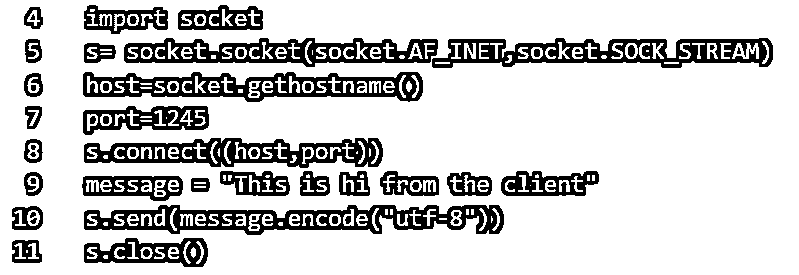
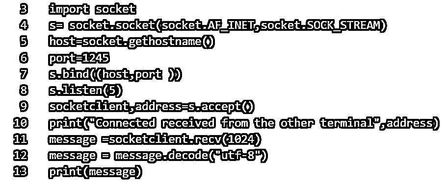

# Python 中的套接字编程

> 原文：<https://www.educba.com/socket-programming-in-python/>

## Python 套接字编程简介

套接字编程通过使用代码逻辑来实现套接字端点之间发送和接收数据的通信。套接字可以是节点，例如服务器和单个或多个客户端系统。在 Python 中，套接字编程可以在套接字库函数的帮助下投入运行，传输控制协议(TCP)是默认情况下应用于该函数的协议。

### python socketserver

套接字是发送或接收数据的端点；因此，我们需要一个服务器和一个客户端套接字程序来实现这个目的。对于我们的示例程序，我们将在同一台机器上托管服务器和客户机。我们甚至可以通过服务器代码发送和接收。要注意的是，我们可以只有一个服务器程序，而我们可以有多个客户端程序。

<small>网页开发、编程语言、软件测试&其他</small>

[传输控制协议(TCP)](https://www.educba.com/what-is-tcp-protocol/) 是选择的默认协议。TCP 是可靠的，因为发送方会检测到网络中丢弃的数据包并将其发送出去。TCP 还提供按序数据传递，即发送方发送数据的顺序与应用程序读取数据的顺序相似。

#### server.py

看看下面的程序:server.py

**第 3 行:** Socket 是一个预装的库，会为其创建一个对象。这个 socket 模块被导入到 python 程序中，它将在程序的后面被用作 socket 函数。我们在这里创建一个对象，它将调用套接字函数。

**第 4 行:**插座。AF_INET 对应于 IPV4(如果希望使用 IPV6，则使用 socket。可以使用 AF_INET6。这是指插座系列。AF_INET 指定了用于通信的协议。IPV4 和 IPV6 是通过网络传输数据的不同传输控制方式或协议。

IPV4 和 IPV6 只是不同类型的 IP 地址。插座。AF_INET 对应 TCP。传输控制协议(TCP)与 IP 一起工作，并定义计算机如何相互发送数据包。

接下来，需要的是 TCP 为此，我们需要一个插座。SOCK_STREAM，这是套接字类型。TCP 是一种面向连接的协议，本质上涉及执行与服务器和客户端的三次握手连接。然后，我们提供客户端将连接的主机名。

**第 5 行:**对于主机名，“localhost”或“127.0.01”或 socket.gethostname()都可以使用。它获取服务器的 IP 地址。

以上是我们为套接字定义的两个参数。

**第 6 行:**我们的系统中通常有很多端口，所以我们需要利用一个未使用的主机端口。任何四位数字都可以使用，因为大部分低位数字都被占用。

**第 7 行:**bind()方法，将主机和端口绑定到一个套接字。

启动我们的服务器需要所有这些步骤。现在我们需要让客户。如前所述，我们可以有多个客户端。

**第 8 行:**我们有一个选项，提到可以与服务器交互的客户端的数量。这是通过 s.listen(6)实现的。它从 TCP 侦听器开始。数字代表可以交互的客户端数量。例如，如果第 7 个客户来了，那么它将被丢弃。

**第 9 行:** s.accept()会接受客户端的请求，它返回两个对象，一个是 socket-client 对象，一个是地址。IP 地址将是我们的客户所在的客户的地址。

**第 10 行:**这更像是通知服务器已经建立的连接。

最后，我们打印一个当两个程序都在终端中运行时应该显示的语句。在我们完成服务器程序之后，我们将写出客户端程序。

### Python 套接字客户端

这里我们讨论一下 python 套接字客户端:

#### client.py

这是我们的客户端程序:client.py

客户端程序也有一个类似的套接字，就像我们在服务器程序中看到的那样。通常，客户端程序从服务器程序运行。它与我们在此示例中的机器不同。我们打算通过本地联网机器甚至远程联网机器上的 Python 程序与套接字进行通信。

**第 8 行:**服务器程序中有一个 binding()方法；这里，我们将使用 connect()方法。这里的元组将接受方法中的主机和端口。我们使用与我们在 server.py 中使用的相同的端口

我们需要在不同的终端中运行 server.py 和 client.py，这就是我们将看到的连接发生的方式。

**输出:**

截图来自两个不同的终端，一个在 CMD 打开，另一个[在 Windows 的 PowerShell](https://www.educba.com/what-is-powershell/) 打开。左边的窗口打开 server.py 程序，右边的终端打开 client.py 程序。

我们看到输出打印在服务器端终端。

### 将字符串从一个文件发送到另一个文件

我们将尝试从客户端向服务器端发送消息。我们将在 client.py 程序中写一条消息。

#### 1.client.py

这是我们的客户端程序:client.py

**第 9 行和第 10 行:**我们将消息设置在一个变量中，以字节的形式发送消息，并将其转换或编码为 UTF-8 格式。(UTF 是一个 Unicode 标准，因为消息的所有内容都是字符，它们位于 Unicode 图表下)。我们应该编码并保持数据尽可能小；否则传输会在某个时候失败。

第 11 行:我们关闭连接。

在服务器程序中，我们将进行以下更改。

#### 2.server.py

这是我们的服务器程序:server.py

**第 11 行:**为了建立连接，我们使用了 socket 客户端对象。我们通过向方法添加 1024 字节(1 KB)来提到缓冲区大小，并将其保存在变量 message 中。

**第 13 行:**然后，我们正在打印方法。

**输出:**

我们再次打开两个终端，看到下面的输出。

### 结论 Python 中的套接字编程

这里已经介绍了套接字编程的基础知识，但是必须指出的是，这是一个庞大的领域，套接字编程中还需要介绍更多的内容。很好地理解基础知识将有助于处理复杂的客户机-服务器场景。

### 推荐文章

这是 Python 中套接字编程的指南。这里我们讨论 python socket 服务器和 python socket 客户端的概念以及代码实现。您也可以阅读以下文章，了解更多信息——

1.  [Python IDE for Windows](https://www.educba.com/python-ide-for-windows/)
2.  [Python 集](https://www.educba.com/python-sets/)
3.  [Linux 上的 Python IDE](https://www.educba.com/python-ide-on-linux/)
4.  [c++中的套接字编程](https://www.educba.com/socket-programming-in-c-plus-plus/)

