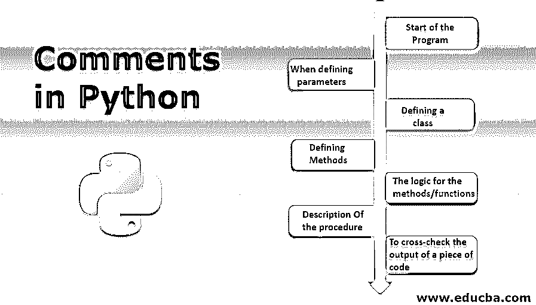

# Python 中的注释

> 原文：<https://www.educba.com/comments-in-python/>




## Python 中注释的介绍

Python 中的注释是一种系统化的技术，用于在简单、可读的文本中定义程序的功能流，这样可以很容易地指导执行程序的人，并描述可以从特定的代码片段中得到什么。非常重要的一点是不要做过多的注释，因为这很有可能会影响程序的整体大小，包括程序中的行数以及保存或执行程序所需的内存。在 Python 中，如果是单行注释，则在“#”后添加注释，如果是多行注释，则添加三重引号(")。

### Python 中的语法类型

在 Python 中，有两种类型的语法用于注释:

<small>网页开发、编程语言、软件测试&其他</small>

```
#: Is used to comment on one line.
```

```
Triple quotes("""  """): To comment more than one line.
```

在所有编程语言中，已经定义了一些语法来识别什么是什么。一个程序是由许多语法定义的，例如，在 c 语言中，我们用分号“；”来结束一行为了定义一个类或循环的开始，我们使用冒号“:”。可以看出，我们有一个不同的语法，它是代码的一部分并影响着代码。应该有一些语法可以告诉编译器离开注释部分并进入下一步，因为注释与输出没有任何关系。所以，为了不与实际程序混淆，区分注释和实际代码是非常必要的。

### 在 Python 中创建注释

程序员必须在他的程序中添加注释，使其更容易理解。现在在哪里添加注释？这是个人的选择，但这里有一些添加注释使程序更具可读性的常见地方。

*   程序的开始
*   定义参数时
*   定义类别
*   定义方法
*   方法/功能的逻辑
*   关于程序的描述
*   交叉检查一段代码的输出

以下几点已解释如下:

**1。程序的开始:**这里程序员定义问题语句是什么，程序的需求是什么。

**2。当定义参数时:**在这里程序员可以为每个参数添加注释，它代表什么，它将如何帮助程序。

**3。定义一个类:**一个程序可能包含 null/一个或多个类，所以在注释的开始定义类的用途是很重要的。有时，建议在类之间添加注释来定义类中每一行的工作。

**4。定义方法:**方法是在参数和操作它们的逻辑之间创建关系的函数。建议在注释中定义方法的工作。

**5。方法/函数的逻辑:**一般来说，一个方法可以附加许多逻辑，每个逻辑的注释描述可以帮助理解现有的逻辑，如果需要，可以根据需求进行修改。

**6。过程描述:**对于每一个程序，程序员遵循一步一步的过程，在注释中定义代码的过程/架构的步骤可以帮助提高其可读性。

7 .**。交叉检查一段代码的输出:**在很多情况下，程序员需要对现有的程序进行修改。如果一个程序有许多逻辑，为了交叉检查所有的逻辑是否工作正常，他应该有参考输出/预期输出。在逻辑之后对该逻辑的输出进行注释可以节省大量时间。

### Python 中的注释示例

下面是一些例子:

注释对输出没有任何影响，但是它们使程序更具可读性。下面是一些 python 中注释的例子。

**1。一次注释一行:**这里，我们对两个变量执行加法运算。

**代码:**

```
# Performing addition of two variables
a = 12 				# defining variable a and its value
b = 10 				# defining variable b and its value
addition = a + b 		# Addition logic definition
print(addition) 		# getting output
```

**输出:**


**2。一次注释多行:**有时需要提供一些逻辑的描述，为此需要一次注释多行。一次又一次地注释一行可能是一项累人的工作，所以我们对此使用三重引号。

**代码:**

```
"""
This lines are commented to perform addition task
We will define two variables
we will apply addition logic
we will print the output

"""
a = 12                  
b = 10                  
addition = a + b        
print(addition)
```

**输出:**


**3。同时注释一行和多行:**在大多数情况下，程序员使用这两种类型的注释来提高程序的可读性。

**代码:**

```
"""
These lines are commented to perform addition task
We will define two variables
we will apply addition logic
we will print the output

"""
a = 12                 			 # definng variable a and its value
b = 10                	 	 	# defining variable b and its value
addition = a + b	 	# Addition logic definition
print(addition)		 # getting output
```

**输出:**


这里我们已经看到了一些在程序中使用的注释的例子。在机器学习的情况下，有不同类型的模型，用于预测输出。需要对算法中使用的参数、超参数和过程进行建模。对具有不同参数的模型的不同方法进行评论可以节省重复性并且可以节省时间。

### 结论 Python 中的注释

程序中的注释对于理解它们非常有用。在 python 中，我们基本上有两种类型的注释，要么用(#)语法注释一行，要么注释多行；我们使用三重引号(")。注释不会影响代码，而只是添加对代码的描述，注释不会成为输出的一部分。

### 推荐文章

这是 Python 中注释的指南。这里我们讨论一下在 python 中创建注释所考虑的简介、例子和语法等。您也可以浏览我们推荐的其他文章，了解更多信息——

1.  [换入 Python](https://www.educba.com/swapping-in-python/)
2.  [Python 命令](https://www.educba.com/python-commands/)
3.  [用 Python 进行逆向工程](https://www.educba.com/reverse-engineering-with-python/)
4.  [终于在 Python 中](https://www.educba.com/finally-in-python/)


