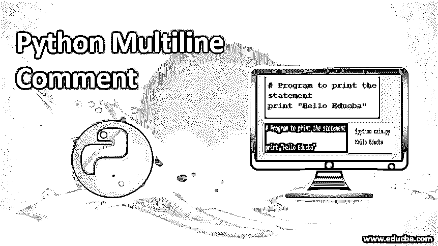

# Python 多行注释

> 原文：<https://www.educba.com/python-multiline-comment/>




## Python 多行注释简介

几十年来，开发人员一直在程序中添加注释，以提供特定代码块在执行时应该做什么的指令。python 中只接受单行注释，这可以使用' # . '来完成要进行多行注释，可以像在函数中声明变量一样声明任何符号，并调用函数在程序中需要的任何地方输入纯文本。

### Python 多行注释是如何工作的？

程序中的注释是帮助用户理解程序的英文单词，易于阅读。在 python 中，散列字符(#)用于在行首添加注释。Python 中没有多行注释，但是仍然有使用三重引号来声明多行注释的习惯。

<small>网页开发、编程语言、软件测试&其他</small>

在 Python 中看到对齐是很重要的；缩进可以代替花括号来定义函数。所以在写评论的时候，我们应该小心缩进。您可以在函数体之前但在函数内部添加一个注释，也称为 docstring，类似于没有缩进的多行注释。所以注释缩进和功能块的需要必须适当缩进。

下面的例子让我们看看如何在 Python 中表示单行注释:

**代码:**

```
# Program to print the statement
print "Hello Educba"
```

**输出:**


在上述程序的注释行中，蓝色单词以#字符开始。下面是打印该语句的程序代码。这些单行注释用于简短快速的注释，以评论对程序的理解。

### Python 中的多行注释及示例

在 Python 中使用多行注释是错误的，因为如果有任意数量的行要注释，它们应该以散列字符(#)开头，每行一个空格。让我们看看下面的例子:

#### 示例#1

**代码:**

```
# To learn how to use comments
# Python does not have any special symbol for multiline comments.
# Program to print the statement
print "Hello Educba"
```

**输出:**


说明:从上面的例子来看，有 3 个蓝色的注释行；因此，python 散列字符(#)既用于单行注释，也用于多行注释，但是在多行注释中，散列字符(#)后跟空格，用于将其声明为多行注释。

#### 实施例 2

在 Python 的一些实践中，多行注释使用三重引号(" " " " ")来表示。在 Python 中，甚至 docstring 都是用三重引号定义的，但是 docstring 通常是在类、函数、模块或方法内部作为第一条语句定义的。这个 docstring 可能显示为多行注释，因此 Python 不支持多行注释，因为多行注释和 docstring 之间存在歧义。由于 [python 编译器在执行程序时会忽略](https://www.educba.com/python-compilers/)注释，但是在 docstring 的情况下，您可以使用特殊变量 myobj.doc 来访问它们。

**代码:**

```
'''
To learn how to use comments.
Python does not have any special symbol for multiline comments.
Program to print the statement
'''
print "Hello Educba"
```

**输出:**


解释:上面的例子描述了多行注释的使用，这些注释用三重引号括起来。下面是显示多线示例的屏幕截图，它是绿色的。

#### 实施例 3

在 Python 中，由于 docstring 的原因，不支持多行注释，docstring 与多行注释是一致的，因为编译器认为它们是在函数、类或模块中描述的。Docstring 不是注释；它们是 python 字符串文档特性，允许在函数、类或模块中添加快速注释。

**代码:**

```
def docFunction():
'''
This function is an example of docstring in Python.
'''
print("Python docstrings are not multiline comments.")
print("\ndocstring value...")
print(docFunction.__doc__)
```

**输出:**


说明:上面的例子就是如何声明 docstring，类似于 multiline comment。在 Python 中，对于单行和多行使用散列字符来声明注释，多行注释通常使用三重引号来声明。因此，始终以正确的方式声明注释或 docstring，因为它们可以使程序更快地执行，并使用户更容易理解代码。

### 结论

在 Python 中，编写注释是为了让用户理解程序代码，或者用可读的代码编写。Python 不支持多行注释，因为注释和文档字符串之间存在歧义。因为 multiline 和 docstring 都在三重引号(" " " ")中声明。在 python 中，注释以散列字符(#)开始，以 EOL(行尾)结束。因此，docstring 可以在三重引号中声明，但要在函数、模块、方法或类中声明，这类似于 multiline 注释。

### 推荐文章

这是 Python 多行注释的指南。这里我们讨论了简介、python 多行注释的工作原理，以及不同的例子和代码实现。您也可以阅读以下文章，了解更多信息——

1.  [Python 命令](https://www.educba.com/python-commands/)
2.  [Linux 上的 Python IDE](https://www.educba.com/python-ide-on-linux/)
3.  [Python Docstring](https://www.educba.com/python-docstring/)
4.  [Python 字符串连接](https://www.educba.com/python-string-join/)


