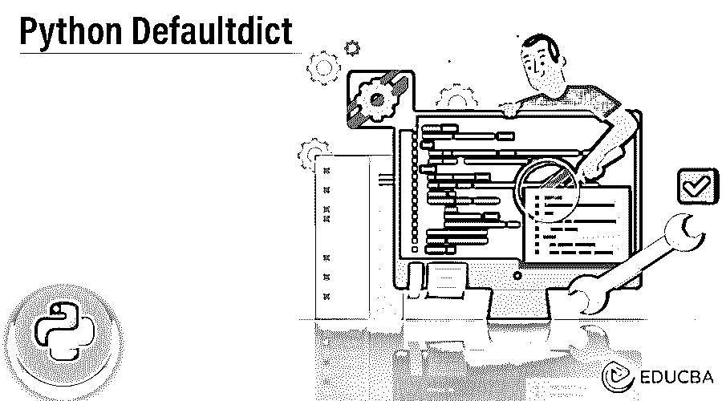
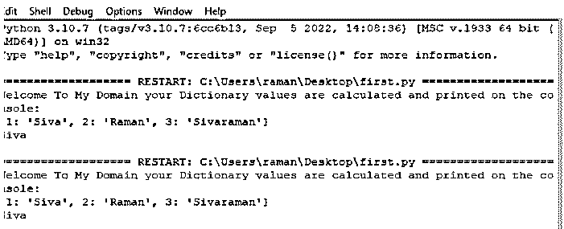
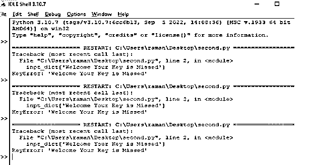

# Python Defaultdict

> 原文：<https://www.educba.com/python-defaultdict/>




## Python Defaultdict 简介

python defaultdict 就是其中一种类型，它被称为用于收集无序数据集和值的字典，其中包括地图、列表和其他数据类型的集合。它主要通过使用键-值对来保存数据；然而，密钥必须是唯一的和不可变的。python 元组可以作为键来度量，而 python 列表不能放置元素。

### 关键要点

*   这是一个普通的 python 字典，但它对访问键很有帮助。
*   它还使用默认值自动生成密钥。
*   它处理 defaultdict 字典中丢失的键。
*   默认情况下，defaultdict()方法上没有传递任何参数。
*   大多数情况下，它从不抛出 KeyError。

### 什么是 Python Defaultdict？

当我们使用键-值对格式访问数据时，如果缺少键，那么键会自动改变。此外，defaultdict 的主要目的是生成构建和默认值，但除此之外，defaultdict 在 Python 字典上的行为会更符合常规。最后，字典可以很好地处理丢失的键和结果。int 数据类型表示 n 个值，在 defaultdict 中配置。

<small>网页开发、编程语言、软件测试&其他</small>

它应该被指明，并且值应该作为列表类型返回。Defaultdict 是 dictionary 类的一个子类，它返回一个类似于对象的字典格式，并允许你用花括号和逗号等其他操作符放置一系列元素。

### 如何创建 Python Defaultdict？

在 Python 中，键值对存储在称为字典的容器中。在任务完成之前，密钥必须是唯一的且不可更改的。虽然 Python 列表不能用作键，因为它是可变的，但是 Python 元组可以在同一个过程中调用和使用。

****创建 Python 的步骤****

1.在机器上下载并安装 python。这里我已经安装好了。


2.接下来我打开 python IDLE，输入下面的 python 代码。

**代码:**

```
Dict = {1: 'Siva', 2: 'Raman', 3: 'Sivaraman'}
print("Welcome To My Domain your Dictionary values are calculated and printed on the console:")
print(Dict)
print(Dict[1])
```

3.并将其保存在。py 扩展名。


4.最后，我使用 Run 命令执行了上面的代码，如下图所示。




以上步骤是用 Python 创建 defaultdict 的基础。使用 python defaultdict，类型被设置，默认工厂被分配为 list 格式，它构建数据字典并将键映射到 list 格式。

### 使用 Python 默认字典类型

它有 n 种类型可以在 python 上使用 defaultdict。其中一些类型如下:

#### **1。使用列表作为分组项目的默认工厂**

 **创建 defaultdict 以及值的列表类型时，必须调用第一组参数中指定的类列表的默认工厂函数。当可调用对象被初始化为应传递的有效对象集时，不应使用或触发该可调用对象。因为第一组参数要么是空的，要么是可调用的，所以运算符和其他括号更经常用于类型错误。为了访问键，结果调用被转换为 list()方法，默认情况下该方法有一组空值。因此，defaultdict 将包含一组空的列表值，用于向列表添加新的键和引用。

#### **2。项目数量**

 **defaultdict 可用于计算一个序列步骤中的项目数，或者后跟数据类型。参数的集合类型通过计算作为输入传递给方法的参数来帮助查找数据字典。在默认方法中，具有不同类型参数的 int()返回值 0。包含用于声明和指定计数器方法的集合类的 Python 字典。

### Python Defaultdict 处理丢失的键

丢失的键是使用 python 字典的问题之一，处理频繁的键错误和挫败使它更复杂的代码。创建依靠大量代码来处理大量数据的字典。我们可以处理 python 字典，因为它们缺少不同方法类型的键。

#### **1\. Setdefault()**

 **它是主要配置给 python 文档并设置数据字典返回值的类型之一。

****例如:****

**代码:**

```
inpt_dict = {}
inpt_dict['Welcome Your Key is Missed']
inpt_dict.setdefault('Welcome Your Key is Missed', 'Entered default value')
inpt_dict['Welcome Your Key is Missed']
inpt_dict.setdefault('Welcome Your Key is Missed', 'Entered default value')
inpt_dict
```

**输出:**




上面的代码是 setdefault()方法识别按键的一个例子。

#### 2.get()方法用法

python 的 defaultdict get()方法是检索满足 if 和 else 等条件的数据。当条件为真时，返回值为 0，如果条件失败或为假，则抛出 KeyError。

****例如:****

**代码:**

```
inpt_dict = {}
inpt_dict.get('Welcome Your Key is Missed', 'Entered default value')
inpt_dict
```

**输出:**


#### 3.Python defaultdict 列表

在 defaultdict()函数中，列表是特性，我们也可以将它作为参数传递来执行操作。我们还可以将列表作为不带引号的参数传递，以便 defaultdict()函数将数据分组为字典和列表格式。在此之前，它显示为键-值对格式，在使用列表后，它更改为列表类型 ****。**T3】**

**举例:**

**代码:**

```
from collections import defaultdict
res= defaultdict(list)
for i in range(6):
    res[i].append(i)
print(res)
```

**输出:**


上面的例子显示了 defaultdict()方法中的列表集合，它根据条件验证用户输入。

### 常见问题解答

下面是提到的常见问题:

#### Q1。什么是 defaultdict？

**答案:**

这是一个类似 python 字典行为的方法，它自动生成键和值。

#### Q2。如何使用 defaultdict？

**答案:**

初始化时，这个函数没有参数，它有一个默认的键。它不会抛出任何 KeyError。

#### Q3。提及 defaultdict 的类型。

**答案:**

*   列表
*   线
*   元组
*   设置
*   数组
*   词典

### 结论

这是一个标准的行为，就像一个更有助于存储和检索数据的字典。当我们未初始化键时，直接的方法被用来以特定的方式允许缺省值，以便它使解释器能够通知用户在一组特定的类值下的操作中的输入。

### 推荐文章

这是 Python Defaultdict 的指南。这里我们讨论一下入门，如何创建 python defaultdict？处理丢失的密钥和常见问题。您也可以看看以下文章，了解更多信息–

1.  [Python SQL 数据库](https://www.educba.com/python-sql-database/)
2.  [Python SQL 注入](https://www.educba.com/python-sql-injection/)
3.  [Python 3 产量](https://www.educba.com/python-3-yield/)
4.  [Python 3 网络服务器](https://www.educba.com/python-3-webserver/)


******