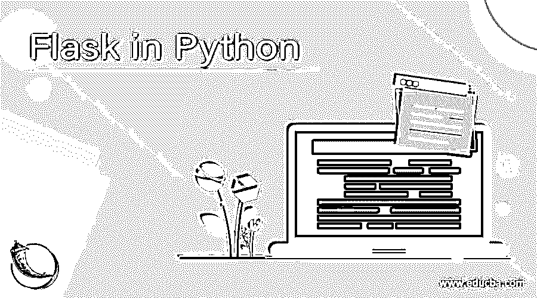
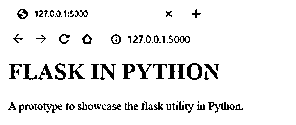

# 蟒蛇皮烧瓶

> 原文：<https://www.educba.com/flask-in-python/>




## Python 中 Flask 的定义

Python 中的 Flask 定义为开发人员用来开发 web 应用的框架，该框架的开发基线是 Werkzeug WSGI toolkit 和 Jinja2 template engine，两者都是 Pocco 项目。Pocco 是一个由阿明·罗纳彻领导的国际 Python 爱好者团体。框架就像一个由样板代码组成的库，帮助开发人员构建可伸缩、可靠且易于维护的应用程序。这里经常使用的另一个术语是 API，我们将在后面的部分看到它的定义，但我们需要记住，flask 用于创建将用于创建 API 的应用程序。

### Python 中为什么需要 Flask？

在我们讨论 python 中 Flask 的工作方式之前，我们首先需要理解为什么我们需要 Python 中的 Flask。由一群国际 python 爱好者创建的 Flask 是一个开源平台，它具有丰富的 web 开发特性，可以开发各种 web 应用程序。这里我们将讨论 python 中推动我们需要 Flask 的特性。

<small>网页开发、编程语言、软件测试&其他</small>

1.  Flask 是一个构建时考虑到 python 可扩展性的框架，这意味着所使用的框架风格侧重于提供一种增强框架和环境扩展的机制。与一些全栈框架相比，这使得该框架非常轻量级和模块化。因此换句话说，它被称为“微观框架”。
2.  有了 Flask 提供的功能，开发人员可以更容易地快速调试，从而增强和加速应用程序的开发。
3.  除了调试之外，小样本编码风格也是确保 python 中 Flask 开发 web 应用程序的需要的一个关键特征，特别是对于初学者。
4.  如果有人需要将 web 应用程序集成到 Google 中，那么不能不感谢 Flask，因为它与 Google app engine 兼容。
5.  人们需要 Flask，因为它具有高度安全的功能！

### Python 中 Flask 是如何工作的？

现在我们知道了 Flask 的必要性，让我们在本节中深入研究 Flask 在 python 中的工作。但是在我们理解核心工作之前，让我们举一个简单程序的例子，它在很多地方被用来解释 Flask。

**创建一个基本的烧瓶应用程序**

当使用 Flask 构建 web 应用程序时，我们需要首先创建一个新的目录来存储项目组件。在这个文件夹中，我们需要创建另一个包含 main.py 的文件夹。现在，我们需要在这个文件夹中创建一个 python 文件，并复制示例部分中提到的代码。

**运行应用程序**

现在，我们可以通过执行以下命令来运行应用程序了:

```
python <filename.py>
```

我们可以看到输出是什么样子的(在示例中)。现在是时候让我们谈谈 flask 在提到的那段代码中做了什么，并了解 Flask 的工作原理。Flask 首先将我们用 API 链接执行的 HTTP 请求映射到 python 函数。在映射过程中，它将使用 annotation **应用程序查找 URL。路由**，例如在我们的示例代码中是“/”。当映射发生时，它还会处理被映射的方法。API 中可用的方法是 GET 或 POST。在这个例子中，方法是 **GET。**现在，URL 路径被映射到示例中的函数 **baseFunc** 。当我们在 web 浏览器中输入 flask 服务器详细信息时，flask 将运行 URL 映射到的函数中的代码集，在本例中是 baseFunc，并在要显示的页面中返回输出。这种用函数映射 URL 的方法称为路由。

这里使用的方法是 GET，这意味着数据将从应用程序发送给用户。就像示例中的应用程序中的返回声明显示在网站上一样。另一个可用的方法是 POST，它从用户那里获取数据。使用不同的应用程序路径，可以构建多个 API，从而有助于根据需求构建网站！

### 优点和缺点

这个世界上没有什么是完美的。强大的功能带来了许多优势，但除此之外，可能会错过一些可能被证明是不利的功能。让我们在这一节详细看看 python 中 Flask 的优缺点。

**优点:**

*   **易学易懂** : Flask 开发框架提供了一个平台，对于初学者来说非常简单易懂。这种简单性允许开发人员轻松地导航、试验和开发应用程序。
*   **灵活性**:有了 Flask，开发人员就可以完全控制创造性，从而提供添加外部特性的灵活性。除此之外，只有几个部分的瓶子被限制改变或变更。
*   **易于测试**:通过集成支持、快速调试特性、内置开发服务器，它允许开发人员轻松执行单元测试。
*   **部署**:使用 Flask 进行部署非常舒适，因为 Flask 100%符合 WSGI(web 服务器遵循的惯例)1.0。
*   ORM 集成:使用 Flask，人们可以很容易地集成 ORM，将对象参数映射到 RDBMS 表。

**缺点:**

*   可伸缩性:当处理请求时，Flask 一次处理一个请求。自然，多个请求会花费更多的时间。
*   **第三方<sup>方</sup>**的参与:由于第三方<sup>方</sup>参与模块开发，如果包含恶意模块，存在安全漏洞的重大风险。
*   **开发需求【flask 是一个裸机，这在学习和灵活性方面可能是一个优点，但也可能是缺点，因为开发人员可能不得不实际构建所有东西。**

### 例子

**代码:**

```
import flask
url = flask.Flask(__name__)
url.config["DEBUG"] = True
@url.route('/', methods=['GET'])
def baseFunc():
return "<h1>FLASK IN PYTHON</h1><p>A prototype to showcase the flask utility in Python.</p>"
url.run()
```

**输出:**




### 结论

在本文中，我们深入了解了框架的实用性，并看到了它的工作原理，从而鼓励读者开发 web 应用程序。此外，它不仅仅是一个 flask 应用程序，还包括来自身份验证、跨源资源共享、广泛测试等的元素。这将是一个更好的应用程序！

### 推荐文章

这是 Python 中的 Flask 指南。这里我们讨论定义，Python 中为什么需要 Flask？，Flask 在 Python 中是如何工作的？以及优缺点。您也可以看看以下文章，了解更多信息–

1.  [Python mkdir](https://www.educba.com/python-mkdir/)
2.  [Python Virtualenv](https://www.educba.com/python-virtualenv/)
3.  [Python 中的自定义异常](https://www.educba.com/custom-exception-in-python/)
4.  [Python 断言错误](https://www.educba.com/python-assertionerror/)


