# Python 中的指针

> 原文：<https://www.educba.com/pointers-in-python/>

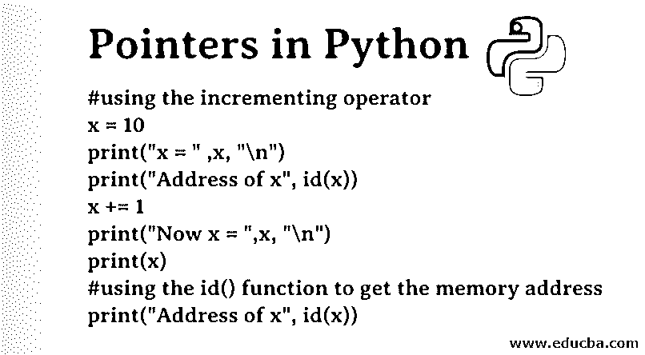


## Python 中的指针是什么？

用于存储其他变量的地址的特殊目的的变量，指向提供地址的变量的地址，获得存储在该位置的值被称为解引用，就像驱使读者找到所需内容的书的索引中的页码，像遍历数据结构的重复操作的性能被显著提高，特别是在时间和空间约束方面，有效地支持复制和访问操作，并且作为 Python 编程语言的概念被间接支持，在 Python 中被称为指针。

**Python 中指针的语法**

<small>网页开发、编程语言、软件测试&其他</small>

```
>>> variable name = value;
```

**示例–1**

```
>> a = 2
>>> a
>> 2
```

**示例–2**

```
>>> b = “Bob”
>>> b
>>> Bob
```

### 如何在 Python 中创建指针？

下面是一个用 isinstance()函数创建指针来证明它是一个对象类型的例子。我们将通过 isinstance()函数看到 Python 中所有可能的数据类型；这样，您也将学习如何用 python 声明所有数据类型。

#### 示例#1

**代码:**

```
// assigning an integer value
a = 2
print(a)
// checking if integer is an object or not
print(isinstance(a, object))
// assigning a string value
b = "Bob"
print(b)
// checking if string is an object or not
print(isinstance(b, object))
// assigning a list value
inputList = [1,2,3]
print(inputList)
// checking if list is an object or not
print(isinstance(inputList, object))
//assigning a set value
inputSet = {10,20,30}
print(inputSet)
// checking if set is an object or not
print(isinstance(inputSet, object))
// assigning a tuple value
inputTuple = (100, 200, 300)
print(inputTuple)
//checking if tuple object or not
print(isinstance(inputTuple, object))
// assigning a dictionary value
inputDict =   {
"0": 1922,
"1": "BMW",
"2": 100
}
print(inputDict)
//checking if  dictionary is an object or not
print(isinstance(inputDict, object))
```

**输出:**

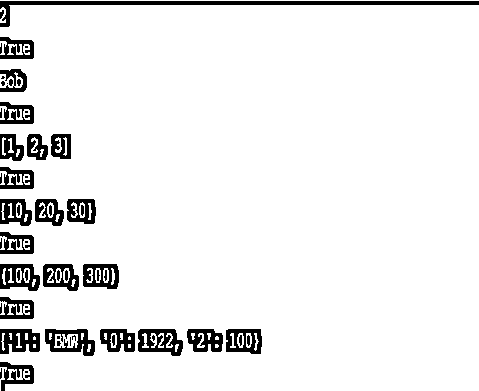


现在我们知道每个声明的变量都是一个对象，因为每个 isinstance()函数都返回 True，这意味着它是一个对象。现在我们可以说在 Python 中一切都是对象。让我们从所有对象中了解可变对象。请记住，列表、集合、[和字典是可变的](https://www.educba.com/dictionary-in-python/)。Rest 不是可变对象。可变对象可以改变，而不可变对象不能改变。

#### 实施例 2

在一个不可变的对象上，比如一个字符串，我们可以像下面提到的那样做一个附加:

**代码:**

```
str = "Python Programming "
print(str)
print(id(str))
str += "Language"
print(str)
print(id(str))
```

**输出:**

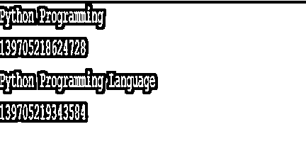


这是可行的，但是现在如果我们尝试添加其他东西，比如

**代码:**

```
str = "Python Programming "
print(str)
str[5] = “S”
print(id(str))
str += "Language"
print(str)
print(id(str))
```

**输出:**

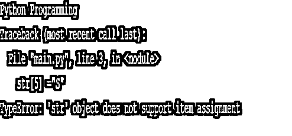


字符串抛出错误，因为它是不可变的；要修改，我们必须使用 append()函数。

#### Python 中指针的使用

指针[在 C 和 C++](https://www.educba.com/c-vs-c-plus-plus/) 中被广泛使用。使用指针，动态内存分配是可能的。指针可以被声明为保存另一个变量的内存地址的变量。

### 指针算术运算

指针有四个算术运算符。

*   增量运算符:++
*   减量运算符:—
*   加法运算符:+
*   减法运算符:–

使用算术运算符的[执行算术运算。在下面的程序中，我们使用了 id()函数，它返回对象的内存地址。](https://www.educba.com/arithmetic-operators-in-javascript/)

#### 递增运算符:它将值递增 1

**代码:**

```
#using the incrementing operator
x = 10
print("x = " ,x, "\n")
print("Address of x", id(x))
x += 1
print("Now x = ",x, "\n")
print(x)
#using the id() function to get the memory address
print("Address of x", id(x))
```

**输出:**

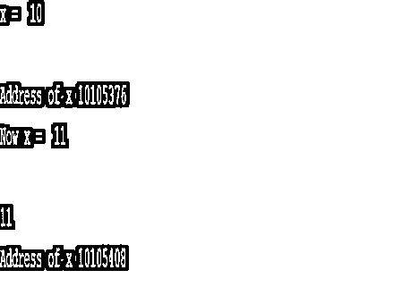


#### 递减运算符:将值递减 1

```
#using the decrementing operator
x = 10
print("x = " ,x, "\n")
print(id(x))
x -= 1
print("Now x = ",x, "\n")
print(x)
#using the id() function to get the memory address
print("Address of x", id(x))
```

**输出:**

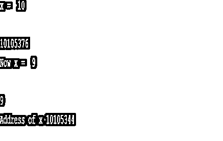


#### 加法运算符:它执行两个操作数的加法

```
#using the addition operator
#using the addition operator
x = 10
y = 20
print("x = " ,x, "\n")
print("y = " ,y, "\n")
print("Address of x", id(x))
x = y + 3
print("x = y + 3 \n")
print("Now x = ",x, "\n")
# using the id() function to get the memory address
print("Address of x", id(x))
```

**输出:**

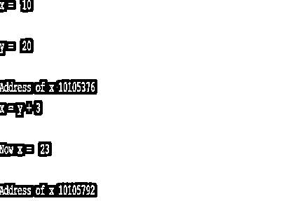


#### 减法运算符:它执行两个操作数的减法运算

**代码:**

```
#using the subtraction operator
x = 10
y = 5
print("x = " ,x, "\n")
print("y = " ,y, "\n")
print("Address of x", id(x))
x = y - 3
print("x = y - 3 \n")
print("Now x = ", x, "\n")
print("Address of x", id(x))
```

**输出:**

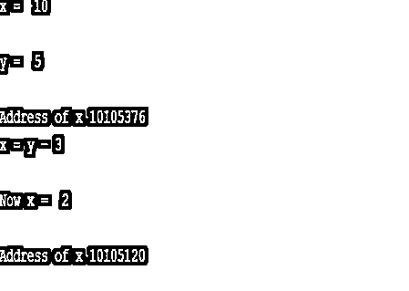


现在让我们看一个使用“ **is** 的例子，如果两个对象的对象有相同的内存地址，那么返回 true。

**1。示例**

**代码:**

在这个例子中，我们声明了两个变量，x 和 y，其中 y 等于 x，x 现在指向与 x 相同的内存地址。

```
x = 100
print("x =", x)
print("address of x", id(x))
y = x
print("y =", y)
print("address of y ", id(y))
```

**输出:**

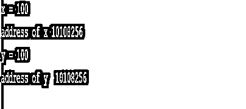


**2。示例**

在这个例子中，我们声明了两个变量 x 和 y，其中 y 等于 x，这是正确的，但是当我们将 y 的值增加 1 时，输出变为 false。

```
x = 100
y = x
print(y is x)
y = y + 1
print(y is x)
```

**输出:**

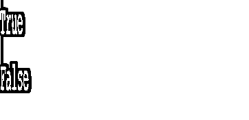


在上面两个例子中，我们已经看到。

### 指针对指针

**1。示例**

```
def fun(a, b, c, d):
print(a,b,c,d)
x = (101, 102, 103, 104)
fun(*x)
```

**输出:**


**2。示例**

```
def fun (a,b,c,d):
print(a,b,c,d)
y = {'a':'I', 'b':'like','c':'python','d':'programming'}
fun(**y)
```

**输出:**


**3。示例**

将示例一和示例二放在一起

```
def fun (a,b,c,d):
print(a)
print(b)
print(c)
print(d)
x = (100,200,300,400)
fun(*x)
y = {'a':'I', 'b':'like','c':'python','d':'programming'}
fun(**y)
```

**输出:**

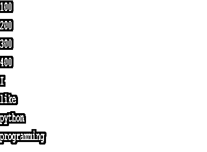


### 结论

我希望这篇文章能让你更好地理解这个话题。此外，这篇文章是不言自明的理解，因为所有的关键要素已经解释了最好的方式。

### 推荐文章

这是 Python 中指针的指南。这里我们讨论一下 Python 中什么是指针？不同类型的指针和算术运算，以及例子。您也可以浏览我们推荐的其他文章，了解更多信息——

1.  [Python 比较运算符](https://www.educba.com/introduction-to-python/)
2.  [Python 中的布尔运算符](https://www.educba.com/star-patterns-in-python/)
3.  [Python 的优势](https://www.educba.com/advantages-of-python/)
4.  [Python 中的星形模式](https://www.educba.com/star-patterns-in-python/)
5.  [c++中的指针介绍](https://www.educba.com/pointers-in-c-plus-plus/)
6.  [c#中的指针概述](https://www.educba.com/pointers-in-c-sharp/)
7.  [与元组相关的不同操作](https://www.educba.com/tuples-in-python/)
8.  [在 PowerShell 中实现比较运算符的示例](https://www.educba.com/comparison-operators-in-powershell/)
9.  [数据结构指针指南](https://www.educba.com/pointers-in-data-structure/)


