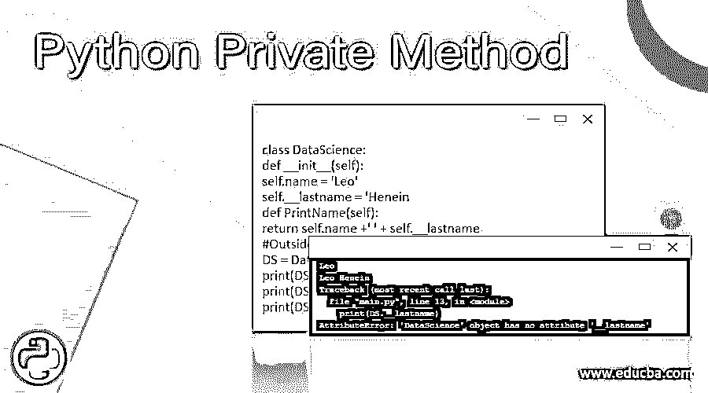

# Python 私有方法

> 原文：<https://www.educba.com/python-private-method/>




## Python 私有方法简介

在 Python 中，类中使用了三种类型的 Python 私有方法:

1.  私人的
2.  保护
3.  公共

类的私有成员在该类之外是不可访问的。受保护的成员可以在类内部访问，也可以访问它的子类。然而，公共成员很可能在类外被访问。

<small>网页开发、编程语言、软件测试&其他</small>

### 注意事项

1.  要定义私有方法，在变量或函数前使用“__”(双下划线)。因此，他们无法接触到班级的外部环境。

私有方法的示例:

```
class Detail:
def __init__(self,FN,LN):
self.__firstname = FN
self.__lastname = LN
print("Done!")
d1=Detail("Rea","Messi")
print(d1._firstname)
print(d1._lastname)
```


2.  要定义受保护的方法，在变量或函数前使用“_”(单下划线)。因此，他们无法接触到班级的外部环境。受保护方法的示例:

```
class Detail:
def __init__(self,FN,LN):
self._firstname = FN
self._lastname = LN
print("Done!")
d1=Detail("Rea","Messi")
print(d1._firstname)
print(d1._lastname)
```


3.  这可以从任何地方直接访问。

公共方法的示例:

```
class Detail:
def __init__(self,FN,LN):
self.firstname = FN
self.lastname = LN
print("Done!")
d1=Detail("Leo","Messi")
print(d1.firstname)
print(d1.lastname)
```


在 Python 中，默认情况下所有成员都被认为是公共的。

***让我们通过一些例子来看看私有变量和方法:**

```
class DataScience:
def __init__(self):
self.name = 'Leo'
self.__lastname = 'Henein
def PrintName(self):
return self.name +' ' + self.__lastname
#Outside class
DS = DataScience()
print(DS.name)
print(DS.PrintName())
print(DS.__lastname)
```

**输出:**


这里，__init__ 是一个保留的方法，称为构造函数。当一个类的对象被实例化时，它会自动运行。

可以注意到，当我们试图访问类外的公共变量时，我们能够。然而，当我们试图访问私有变量时，我们失败了。

这里需要注意的另一个优点是，“打印(DS。PrintName())"成功。我们在类外调用公共函数，但是公共函数是私有函数所属的同一个类的一部分。因此，私有变量可以由属于同一个类的任何函数在类内访问。

让我们再看一个例子，这次没有构造函数“__init__ ”:

**代码:**

```
class DataScience:
def PrintMe(self):
return 'Printed'
def __PrintMeNot(self):
return 'Not Printed'
#Outside class
DS = DataScience()
print(DS.PrintMe())
print(DS.__PrintMeNot())
```

**输出:**


如果注意到，我们可以成功地访问“PrintMe”函数，但不能访问“__PrintMeNot”函数。那是因为“__PrintMeNot”是“DataScience”类的私有成员函数。

但是仍然有一种方法可以在类外访问类的私有成员。那就是通过“打印(DS。_DataScience__PrintMeNot())”而不是“打印(DS。__PrintMeNot())"。

下面这段代码:

```
class DataScience:
def PrintMe(self):
return 'Printed'
def __PrintMeNot(self):
return 'Not Printed'
#Outside class
DS = DataScience()
print(DS.PrintMe())
print(DS._DataScience__PrintMeNot() )
```


所以要访问类外的私有成员，语法应该是:

`"__<className>_<attributeName>"`

所以，我们可以说对私有变量和方法的保护仍然不多。

### 优势

*   私有方法用于帮助用户使用“封装”服务。这意味着方法只能在类内部访问，而不能在类外部访问。
*   封装是 OOP(面向对象编程)的概念。它基本上将数据和方法包装成一个单元。这有助于对数据和方法进行限制，从而避免意外修改。
*   在现实生活中，当数据至关重要时，封装就变得显而易见了。

### 私人方法的规则和规定

以下是一些与私有方法相关的规则:

1.  根据规则，私有变量在类外部是不可访问的。但是，按照惯例，以一个下划线为前缀的方法或名称被视为非公共的。因此，通过使私有成员成为非公共的 like _ class name _ _ private variable，可以在类外部访问私有成员。这叫“名芒令”。
2.  简而言之，我们可以说 Python 没有真正支持私有的基础。
3.  总而言之，公共和私有变量以及方法:

| 公共变量 | 从任何地方都可以访问 |
| 公共方法 | 从任何地方都可以访问 |
| 私有变量 | 它以两个下划线开头。它可以在类中访问。 |
| 私有方法 | 这也由开头的两个下划线表示。它可以在类中访问。 |

### 结论

正如我们在上面看到的，私有变量和方法在 Python 中扮演着重要的角色。它支持封装，因此给你更多的控制权来处理现实生活中的数据问题。它通过在 private、protected 和 public 模式等修饰符下保护一些数据，使数据的可访问性更加灵活。通过使用公共、受保护和私有的概念，可以很好地解决意外的访问和修改。然而，要很好地使用这种可访问性，需要了解它的规则和规定，并阅读 PEP8 文档，这有时可能会导致致命错误或内存泄漏。

### 推荐文章

这是一个 Python 私有方法的指南。这里我们讨论 Python 私有方法的优点以及规则和规范。您也可以看看以下文章，了解更多信息–

1.  [Python 结束于](https://www.educba.com/python-endswith/)
2.  [Python StopIteration](https://www.educba.com/python-stopiteration/)
3.  [Python 操作系统模块](https://www.educba.com/python-os-module/)
4.  [Python 转储](https://www.educba.com/python-dump/)


