# Python 中的随机森林

> 原文：<https://www.educba.com/random-forest-in-python/>


## Python 中的随机森林简介

Python 中的随机森林提供了一种使用数据子集预测结果的精确方法，该数据子集从全局数据集分离，使用多种条件，使用手头的可用数据流经多个决策树，并为分类或回归情况提供了一个完美的无监督数据模型平台；它无需对初始数据进行任何预处理或转换即可处理高维数据，并允许并行处理以获得更快的结果。

**Python 中的随机森林简介:**

<small>网页开发、编程语言、软件测试&其他</small>

随机森林的独特之处在于监督学习。这意味着数据根据条件被分成多个单元，并形成多个决策树。这些决策树具有最小的随机性(低熵)，为结构化数据搜索和验证进行了整齐的分类和标记。几乎不需要培训就能使数据模型在各种决策树中活跃起来。

### 随机森林是如何工作的？

随机森林的成功取决于数据集的大小。越多越开心。大量的数据导致对搜索结果和验证的准确预测。大量的数据必须使用完全覆盖数据所有属性的条件在逻辑上分割成数据子集。

决策树将不得不使用这些子集的数据和条件建立。这些树应该具有足够的深度，以使节点具有最小或零随机性，并且它们的熵应该达到零。节点应该有清晰的标签，运行节点和验证任何数据应该是一件容易的事情。

我们需要建立尽可能多的决策树，有明确定义的条件，真或假的路径流。任何决策树中的末端节点都应该产生一个唯一的值。每一个决策树都被训练并得到结果。随机森林因其强大的数据模型和子集方法而闻名，即使在丢失数据的情况下也能返回准确的结果。

任何搜索或验证都应该覆盖所有决策树，并对结果进行汇总。如果任何数据丢失，则假设该条件的真实路径，并且搜索流程继续，直到所有节点都被消耗掉。在分类方法的情况下，假设结果的多数值，在回归方法的情况下，取平均值作为结果。

### 例子

为了解释随机森林的概念，使用 Python Panda 数据框架创建了一个关于蔬菜的全局数据集。这个数据集具有高熵，这意味着高随机性和不可预测性。

创建数据集的代码是:

```
# Python code to generate a new data set
import pandas as pd
vegdata = {'Name': ['Carrot','Brinjal','Spinach','Spinach','Carrot','Tamato','Tamato','Carrot','Brinjal','Spinach','Tamato','Carrot','Carrot','Brinjal','Brinjal'], 'Colour': ['Red','Green','Green','Green','Red','Red','Red','Red','Green','Green','Red','Red','Red','Green','Green'],'Weather':['Cold','Hot','Cold','Cold','Cold','Hot','Hot','Cold','Hot','Cold','Hot','Cold','Cold','Hot','Hot'],'Weight':[20,20,30,30,20,20,20,20,20,30,20,20,20,20,20] }
df = pd.DataFrame(vegdata, columns = ['Name','Colour','Weather','Weight'])
print (df)
```

结果是(全局数据集)

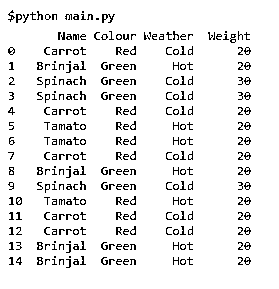


数据集需要根据条件进行拆分。在权重= 30 时分割数据集将导致熵= 0 的数据集，并且不需要进一步分割。

**数据集 1 代码为:**

```
print (df.where (df['Weight']==30))
```

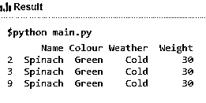


**数据集 2 代码:**

```
print (df.where (df['Weight']!=30))
```

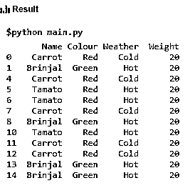


它可以基于颜色被进一步分割，并且新的数据集具有零熵，并且它不需要被进一步分割

**数据集 3 代码:**

```
print (df[(df.Weight == 20) & (df.Colour =='Green')])
```

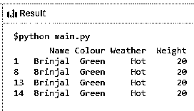


另一组数据是

**数据组 4 代码:**

```
print (df[(df.Weight == 20) & (df.Colour =='Red')])
```

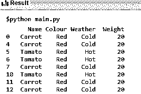


它可以在天气上被进一步分割，并且它将产生熵=0 的两个数据集

**数据集 5 代码:**

```
print (df[(df.Weight == 20) & (df.Colour =='Red') & (df.Weather =='Cold')])
```

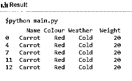


**数据集 6 代码:**

```
print (df[(df.Weight == 20) & (df.Colour =='Red') & (df.Weather =='Hot')])
```

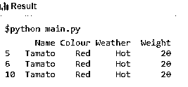


因此，可以使用上述条件(绿色-正确路径，红色-错误路径)形成决策树(1 号)


另一个决策树(2 号)可以基于以下条件形成

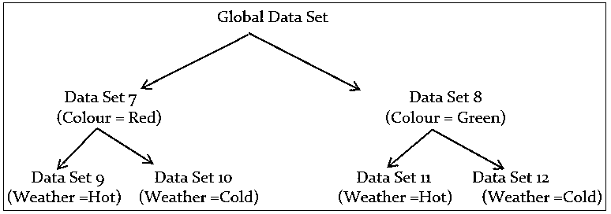


**数据集 7 代码:**

```
print (df[(df.Colour=='Red')])
```

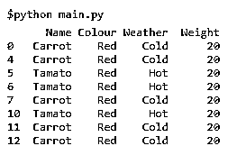


**数据组 8 代码:**

```
print (df[(df.Colour=='Green')])
```

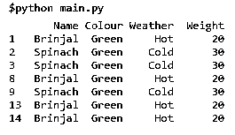


**数据组 9 代码:**

```
print (df[(df.Colour =='Red') & (df.Weather =='Hot')])
```


**数据组 10 代码:**

```
print (df[(df.Colour =='Red') & (df.Weather =='Cold')])
```

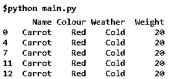


**数据集 11 代码:**

```
print (df[(df.Colour =='Green') & (df.Weather =='Hot')])
```

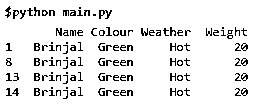


**数据组 12 代码:**

```
print (df[(df.Colour =='Green') & (df.Weather =='Cold')])
```


又一个决策树(No-3)可以基于以下条件形成。

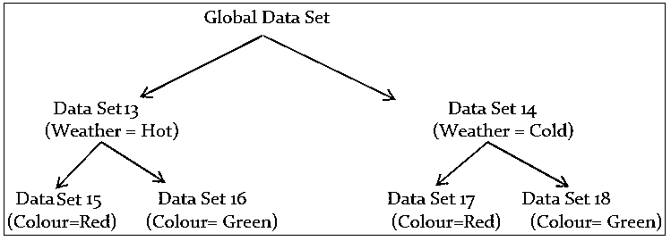


**数据组 13 代码:**

```
print (df[(df.Weather =='Hot')])
```

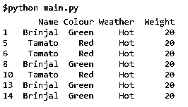


**数据组 14 代码:**

```
print (df[(df.Weather =='Cold')])
```

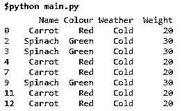


**数据组 15 代码:**

```
print (df[(df.Weather =='Hot') & (df.Colour =='Red')])
```


**数据组 16 代码:**

```
print (df[(df.Weather =='Hot') & (df.Colour =='Green')])
```

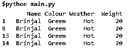


**数据组 17 代码:**

```
print (df[(df.Weather =='Cold') & (df.Colour =='Red')])
```

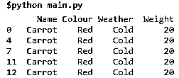


**数据组 18 代码:**

```
print (df[(df.Weather =='Cold') & (df.Colour =='Green')])
```


我们可以使用三个单独的决策树创建一个随机森林。

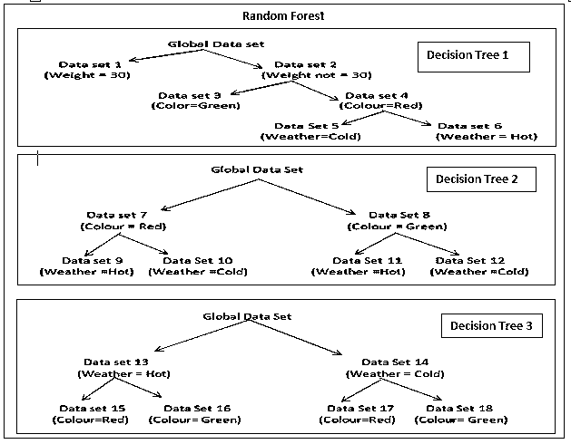


### 如何使用随机森林？

如果一张照片或任何其他带有少量可用数据点的图像可以用所有 3 个决策树进行验证，并得出可能的结果。

例如，给出了一个蔬菜的照片以进行验证，数据为重量= 18 克，颜色=红色，没有其他数据。


### 搜索操作的步骤

1.  在根节点中的第一个决策树中，由于它的权重是 18 克，所以它不满足条件(如果权重= 30 ),采用错误的路径(数据集-2 ),并且由于颜色数据的存在，它跳到数据集 4。它采用默认的真实路径(在寒冷天气下生长),并得到值“胡萝卜”。
2.  在根节点的第二个决策树中，由于数据集 7 是红色的，所以它采用数据集 7，并采用默认的真实路径(在炎热天气下生长)数据集 9，并将 vale 作为“番茄”。
3.  在第三个决策中，树在根节点采用默认真实路径(在寒冷天气中生长)并到达数据集 14。在该节点，由于颜色数据的可用性，它采用数据集 17。数据集 17 导致“胡萝卜”
4.  大部分值是胡萝卜，因此最终结果取决于分类方法。
5.  在回归方法中使用平均法，该方法也将结果预测为“胡萝卜”

**为了更好的结果**

1.  在全局集中有更多的数据。大数据总能产生准确的结果。
2.  创建更多决策树，涵盖所有条件
3.  使用 python 提供的包来创建决策树和搜索操作

### 结论

随机森林具有非常高的可预测性，只需很少的时间即可部署完毕，并在尽可能短的时间内提供准确的结果。

### 推荐文章

这是用 python 写的随机森林指南。在这里，我们讨论随机森林是如何工作的，并给出了例子和代码。您也可以看看以下文章，了解更多信息–

1.  [Python 中的回溯](https://www.educba.com/traceback-in-python/)
2.  [背包问题 Python](https://www.educba.com/knapsack-problem-python/)
3.  [sprintf Python](https://www.educba.com/sprintf-python/)
4.  [Python 中的插入排序](https://www.educba.com/insertion-sort-in-python/)


