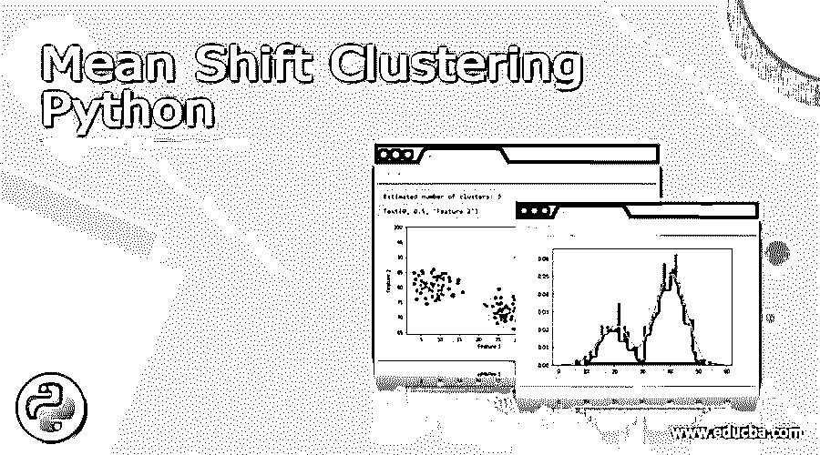
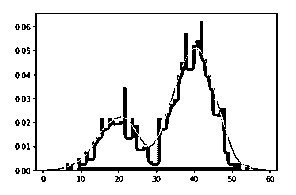
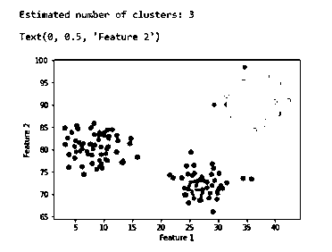

# 均值漂移聚类 Python

> 原文：<https://www.educba.com/mean-shift-clustering-python/>




## 均值漂移聚类 Python 的定义

python 中的均值漂移聚类被定义为数据科学领域中的一种无监督学习算法，用于对样本空间中的数据点进行分组。无监督学习机器学习算法的一类，处理识别数据中自身没有任何标签的模式。顾名思义，在没有任何监督的情况下，算法能够识别模式。该算法的要点是通过向模式移动点来保持迭代地分配数据点。众数是离散数据分布中的一部分，其中区域中数据点的密度最大，并且通常是最大值点。该算法是一种非参数技术，用于分析和识别模式或最大值，通常被称为模式搜索算法。

**语法:**

<small>网页开发、编程语言、软件测试&其他</small>

`Importing the meanshift library in Python:
from sklearn.cluster import MeanShift
Importing the estimate bandwidth:
from sklearn.cluster import estimate_bandwidth`

该库有助于确定径向基核中使用的带宽。这是根据聚类中点之间的平均距离计算的，并且是成对计算的。

实例化导入的 meanshift 模块的对象:

`<variable name> = MeanShift(bandwidth=None, seeds=None, bin_seeding=False, min_bin_freq=1, cluster_all=True, n_jobs=None, max_iter=300)`

不同参数的解释是:

*   带宽:按照上面的语法中的解释，为 RBF 核计算。
*   种子:该参数用于初始化内核。如果没有设置，默认情况下使用 clustering.get_bin_seeds 计算种子，带宽用作网格大小。
*   bin_seeding:这是一个布尔参数，如果为真，初始内核位置是分箱点的离散化版本的位置，粗糙度取决于带宽。
*   min_bin_freq:该参数被设置为只接受那些具有该参数中提供的最小种子的容器
*   cluster_all:这也是一个布尔参数，当它为 true 时，确保所有的数据点都是聚集的。在任何异常值(没有聚类的异常值)的情况下，它们被分配到最近的聚类。另一方面，当参数设置为 false 时，离群值被指定为-1 作为标签
*   n_jobs:该参数表示用于计算的作业数量。
*   max_iter:这表示在作业终止之前发生的最大迭代次数，除非作业在此之前没有收敛。

拟合声明的 meanshift 模块的对象变量:

`<variable name>.fit(<data set>)`

### python 中的均值漂移聚类是如何工作的？

首先，在全面进入核心工作之前，让我们对算法有一个直观的了解。均值漂移聚类工作背后的直觉是基于分层聚类的路线，其中最初每个数据点被分配其自己的聚类。从那时起，使用指定的参数，聚类在每次迭代时对不同的数据点进行分组，直到该组停止包括任何其他数据点。这样，我们就得到了集群。

现在，更深入一点，均值漂移算法建立在核密度估计或 KDE 的概念上。KDE 是一种估计数据集基础分布的方法。在这种方法中，内核被放置在每个数据点上。对于那些不熟悉内核概念的人来说，它是一个简单的加权函数，用于任何图像处理行，以突出或抑制一个像素值(取决于用例)。当所有这些核以分层方式加在一起时，最终生成概率分布。




在上图中，最初，所有直方图都是一个分布，当相邻分布相加时，达到比以前更高的峰值，直到我们看到不再有峰值，这样，在上述分布图中，当 30 范围附近没有更高的峰值时，我们不将本地最大值峰值与其他最大值相加，因此得到 2 个最大值峰值！

同样，在数据分布中执行均值漂移时，所有的数据点都被赋予自己的分布。从现在开始，按时间顺序的步骤发生，以便到达最终的集群。

1.我们取一个数据点，然后执行下一步。对空间中的所有数据点执行这些步骤。
2。使用带宽(我们在语法一节中讨论过的一个参数)，我们在数据点周围画一个区域，并取该区域内所有的点。
3。一旦我们有了许多其他数据点，我们就找到所有这些数据点的平均值，并将这些数据点的平均值指定为新的平均值(这就是我们进行平均值移动的地方)。
4。重复上述过程，直到聚类中不再包括额外的数据点。
5。一旦对所有数据点重复该过程，我们最终到达聚类的数据点，就好像样本空间中的所有点都到达其对应的局部最大值。

### 例子

让我们讨论均值漂移聚类 Python 的例子。

#### 使用 sklearn 模块的均值漂移聚类:

**语法:**

```
import numpy as np
import pandas as pd
from sklearn.cluster import MeanShift,estimate_bandwidth
from sklearn.datasets import make_blobs
from matplotlib import pyplot as plt
from mpl_toolkits.mplot3d import Axes3D
%matplotlib inline

clusters = [[27, 72, 91], [36, 90, 99], [9, 81, 99]]

#Making the random data set
X, _ = make_blobs(n_samples = 180, centers = clusters,
                                   cluster_std = 2.79)

# Estimating the bandwith (or the radius which needs to be taken as part of step 2)
bandwidth = estimate_bandwidth(X, quantile=0.2, n_samples=500)
meanshift = MeanShift(bandwidth=bandwidth)
meanshift.fit(X)
labels = meanshift.labels_
labels_unique = np.unique(labels)
n_clusters_ = len(labels_unique)

print('Estimated number of clusters: ' + str(n_clusters_))

y_pred  = meanshift.predict(X)
plt.scatter(X[:, 0], X[:, 1], c=y_pred, cmap="viridis")
plt.xlabel("Feature 1")
plt.ylabel("Feature 2") 
```

**输出:**




这里，我们观察到，对于生成的随机数据集，有 3 个局部最小值是可能的，并且数据点完美地聚集在所有这 3 个点中！

### 结论

在这篇文章的帮助下，我们已经对均值漂移聚类和启用均值漂移聚类的模块有了初步了解。建议在不使用该模块的情况下，尝试基本的均值漂移聚类作为练习的一部分，以便我们了解算法(尽管不需要完全优化)。

### 推荐文章

这是均值漂移聚类 Python 的指南。这里我们讨论 python 中均值漂移聚类的定义、语法和工作原理。带有示例和代码实现。您也可以看看以下文章，了解更多信息–

1.  [OpenCV Python](https://www.educba.com/opencv-python/)
2.  [BFS 算法 Python](https://www.educba.com/bfs-algorithm-python/)
3.  [树遍历 Python](https://www.educba.com/tree-traversal-python/)
4.  [Python 中的下划线](https://www.educba.com/underscore-in-python/)


