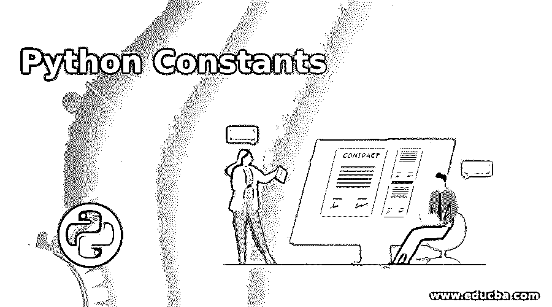
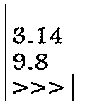
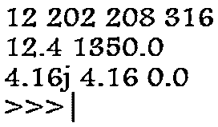
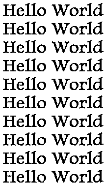
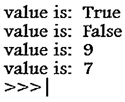

# Python 常量

> 原文：<https://www.educba.com/python-constants/>




## Python 常量的定义

Python 常量基本上是那些在程序实现过程中其值不会改变的变量。

*   Python 基本上是一种编程语言，使复杂的程序更容易理解和实现；它用于商业应用。
*   这些常量基本上是分配给一个文档的。
*   文档由变量和函数组成，因此记录在主文件中。
*   因此，常量以大写字母写在主文件中，并通过隔离单词来加下划线。

### 分配和声明 Python 常量

*   声明 Python 常量时要记住的第一件也是最重要的事情是常量值应该总是用大写字母声明。
*   声明的值不应该是名称的缩写，而且必须完整地声明。

**举例:**

<small>网页开发、编程语言、软件测试&其他</small>

*   第一步是创建一个名为 constant.py 的新 python 文件并输入值。我们应该永远记住，常量值应该是固定的，不能改变。此外，如快照所示，两个常量都以大写字母命名。

`PI = 3.14
GRAVITY = 9.8`

*   下一步是创建另一个名为 mainzz.py 的文件并添加代码，这意味着我们将常量值导入到主文件中，稍后打印常量。

`import constant
print(constant.PI)
print (constant. GRAVITY)`

*   最后，当我们运行代码时，它会显示这些常量的值，这些值是不可互换的。




### Python 常量和文字及其示例

文字在 Python 中也是常量值，是固定的。因此，python 主要支持两种类型的文字，

*   数字文字
*   字符串文字

#### 1.数字文字

这些是保持不变的数值。有三种类型的数字文字，

*   整数
*   浮动
*   情结

当我们谈到这三类内置文字时，我们假设可以使用任何数值，但事实并非如此。我们需要为每个字面值选择固定值。

**举例:**

```
lit_1 = 0b1100
lit_2 = 202
lit_3 = 0o320
lit_4 = 0x13c
fllit_1 = 12.4
fllit_2 = 13.5e2
a = 4.16j
print(lit_1,lit_2,lit_3,lit_4)
print(fllit_1,fllit_2)
print(a,a.imag,a.real) 
```

**输出:**




*   这里我们创建一个名为 lit.py 的新文件来表示文字。所以，lit_1 代表二进制文字，lit_2 代表十进制文字，lit_3 代表八进制文字，lit_4 代表十六进制文字。
*   一旦我们打印了这些值，就会得到如上面代码的第一行所示的输出。
*   类似地，我们为浮点文字创建值，这些值是十进制值，当我们表示 13.5e2 时，它意味着 13.5*10^2，因此我们得到了如上面代码的第 2 行所示的期望输出。
*   最后，我们添加一个复杂的文字。当复杂文字被赋给变量 a 并打印出来时，Python 执行的操作是 a.real 和 a.imaginary，它给出两个值，如上面的代码所示。

#### 2.字符串文字

字符串是用一对引号括起来的一系列关键字。

*   串联字符串——串联是多个语句的组合。我们用转义字符连接。

**举例:**

```
message = “Hello World”
print((message+”\n”)*10) 
```

**输出:**




在这里，\n 用于产生消息是一个新行。

##### 多行字符串

可以添加到多行中的字符串文字。多行字符串文字的表示应该始终用三个双引号( **"** )括起来。

**举例:**

```
print(“””Python helps me learn. Python helps me learn.
Python helps me learn. Python helps me learn.
”””) 
```

**输出:**


##### 布尔文字

这些文字只有两个值，即 **"** 真 **"** 和 **"** 假 **"** 。

**举例:**

```
bool_1 = (1 == True)
bool_2 = (1 == False)
bool_3 = True + 8
bool_4 = False + 7
print(“value is:”,bool_1)
print(“value is:”,bool_2)
print(“value is:”,bool_3)
print(“value is:”,bool_4) 
```

**输出:**




在布尔常量/文字中，数字 1 总是表示真，数字 0 总是表示假。因此，在上面的程序中，由于 1 =真，所以它将 8 和 1 相加产生输出 9，并且由于数字 1 不等于假，所以程序不识别 7 并将其与 1 相加，因此它保持不变。

##### 其他文字

还有各种其他类型的文字，如列表和元组。

*   列表基本上是将方括号中的值相加，并将它们赋给一个变量。这些列表可以是字符串，也可以是整数，可以是固定的；也就是说，它们是恒定的。

**举例:**

```
veggies = [“tomato”,”potato”,”onion”]
nums = [3,4,5,6]
print(veggies)
print(nums) 
```

**输出:**


### 结论

因此，我们讨论了各种 python 常量和内置的 python 常量，它们将帮助我们在不同的游戏、网站、软件开发等方面进行设计和编程。它还帮助我们提高编程技能。这些 Python 基础帮助我们很好地掌握了用于执行各种数学运算的语言，并在命令中实现了这些 Python 常量和变量。与其他编程语言相比，语法有很大的不同，也更简单。

### 推荐文章

这是一个 Python 常量的指南。在这里，我们还将通过例子讨论如何分配和声明 python 常量以及 python 常量和文字。您也可以看看以下文章，了解更多信息–

1.  [Python 计数器](https://www.educba.com/python-counter/)
2.  [Python 排序数组](https://www.educba.com/python-sort-array/)
3.  [Python 的幂函数](https://www.educba.com/python-power-function/)
4.  [Python 并发](https://www.educba.com/python-concurrency/)


