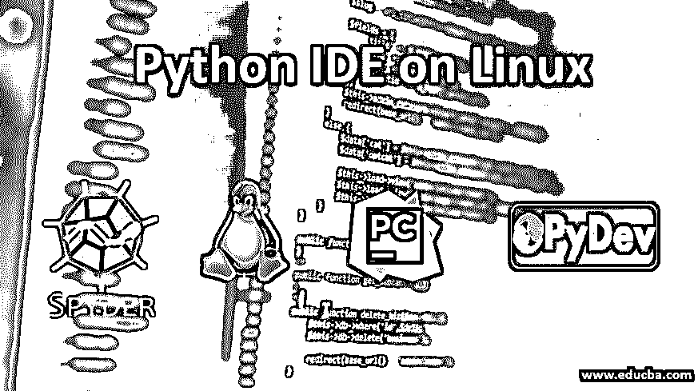

# Linux 上的 Python IDE

> 原文：<https://www.educba.com/python-ide-on-linux/>

## Linux 上的 Python IDE 简介

Python 是最流行、最通用的编程语言。Linux 上有很多 Python IDEs。ide 被称为集成开发环境；它是主板数据路径和磁盘存储之间的接口，包含解释器、调试器、代码编辑器和 GUI 访问。意思是 [IDE 是使用](https://www.educba.com/what-is-ide/)[楼宇自动化工具](https://www.educba.com/automation-testing-tools/)的程序进行软件开发的软件。

因此，要开始编写 Python 程序或代码，您需要有一些 IDE。Linux 上有很多 Python IDEs 可用，比如 Pycharm、PyDev、Spyder 等。大多数 Python IDEs 都带有代码编译、调试器、GUI 生成器等。

<small>网页开发、编程语言、软件测试&其他</small>

### 最佳 Python IDE 列表

Linux 上有很多 Python IDEs 这里我们只讨论最好的 ide:

#### 1.Spyder IDE

Spyder 是一个开源的跨平台 IDE。它通常用于科学编程、数据分析等。它被集成到一个称为 Anaconda 发行版的跨平台中。它的主要特点是代码编辑、数据分析和科学包的可视化能力。

**特性:**

*   这是一个基于布局的用户界面，为初学者提供易于使用和易于导航。
*   它提供了一些内置的科学库，如 NumPy、SciPy、Matplotlib 等。并且可以很容易地用插件进行扩展。
*   它使用正则表达式在多个文件中搜索模式，并且它有一个功能类浏览器。
*   它有一个文档浏览器，变量浏览器，一个文件浏览器和一个交互式控制台。

#### 2.皮查姆

PyCharm 是一个 Python IDE，它是一个更强大、高度可定制和可插拔的 IDE，在一个地方集成了所有的开发工具。

**特性:**

*   PyCharm 的主要和重要特性是它具有智能编码检查和代码编译。
*   它为自动代码生成提供了非常强大的导航功能。
*   它还提供了处理错误和大致显示错误的能力。
*   它还支持像 Django、web2py 和 flask 框架这样的 web 框架。

#### 3.Wing Python IDE

这也是最好的 Python IDE 之一，它也是高度可定制的，具有强大的调试器，还具有用于 Python 编程的智能编辑器。Wing IDE 是一个用户友好的 IDE，可以更容易地访问 Python IDE 和其他 IDE。Wing IDE 有三个版本，像专业使用的 wing pro，普通使用的 wing personal 和新用户或初学者使用的 wing 101。

**特性:**

*   这些是源代码浏览器；自动编辑和自动编译是 Wing IDE 的一大特色。
*   它还为新用户提供了有效的远程调试和高效的代码导航。
*   主要特点是这个 IDE 执行程序非常准确，速度更快。
*   它有更高的框架集合，如 flask、Django、App engine 等。
*   它适用于 Bazaar、Subversion、Git 等项目管理活动。

#### 4.皮德夫 IDE

PyDev 是用于 Python、Jython 和 IronPython 开发的 IDE，PyDev 是用于 Eclipse 的 Python IDE。这个 IDE 将在 eclipse 中编写和调试 python 代码，这意味着它使 Eclipse 能够被用作 Python IDE。

**特性:**

*   它是用户友好的，有一个可定制的界面，与 Eclipse 集成在一起。
*   它还支持自动导入和 Django 集成的代码编译。
*   它还在键入代码时提供了提示，并且在编译的同时还提供了代码分析。
*   它的主要特点是单元测试集成、远程调试器；它在系统中还有一个交互式控制台和令牌浏览器。

#### 5.闲置的

IDLE 是 Linux 系统中使用最多的 Python IDE 之一，因为它是 Python 编程语言最好的 Python 编辑器之一，尤其是对于初学者。

**特性:**

*   它非常容易使用，有一个用户友好的控制台。
*   它有一个智能缩进，一个多窗口文本编辑器的自动编译，一个集成的调试器等等。
*   它用语法、错误、代码输入和输出以及缩进为编码 python 程序提供了不同的颜色。
*   它支持使用最流行的库来构建 GUI，比如 Tkinter 和 Twidgets。

#### 6.埃里克

Eric 也是一个 Python 编辑器和 IDE，它开源，跨平台。Eric 很简单，有一个高度可定制的 GUI，支持插件，可以有很多扩展。

**特性:**

*   这个 IDE 还包括代码编译、错误通知、集成调试器；它还提供了一些高级搜索技术；在用正确的语法编码时，它也给出了提示。
*   集成的源代码文档对于 Eric 来说是独一无二的。
*   该 IDE 还支持 web 浏览器和类浏览器，这在许多其他 IDE 中是找不到的。
*   它提供了源代码提示和源代码折叠等功能。

#### 7.托尼

也是 Python IDE，相对于其他 IDE 来说比较简单的 IDE，专门为想学 Python 的初学者设计的。

**特性:**

*   它非常容易使用，其中包括程序结构的步骤。
*   它提供了没有断点的语句单步执行，还提供了不同的应用函数调用的窗口。
*   它为新窗口提供分离的局部变量和函数表示。

### 结论

Python 编程语言有很多集成开发环境(ide)，这在写代码之前非常重要。基本上，IDE 是用来编辑代码、编译、错误处理和调试的。Python 有很多最好的 ide，就像上面讨论的；还有其他的 ide 像 PyZo，PyScripter，KDevelop，VS code 等等。还有很多。通常，ide 用于编辑或编写易于使用的 Python 程序，甚至可以突出显示编码时出现的错误。在这些 IDE 中，使用最广泛和最好的是 Spyder 和 IDLE Python IDE。

### 推荐文章

这是一个 Linux 上的 Python IDE 指南。在这里，我们讨论 Linux 上用于各种集成的一些最好的 Python IDE，比如编辑代码、编译、错误处理和调试。您也可以浏览我们推荐的其他文章，了解更多信息——

1.  [Python 编辑器](https://www.educba.com/python-editors/)
2.  [什么是 Linux？](https://www.educba.com/what-is-linux/)
3.  [Python 的优势](https://www.educba.com/advantages-of-python/)
4.  [终于在 Python 中](https://www.educba.com/finally-in-python/)

