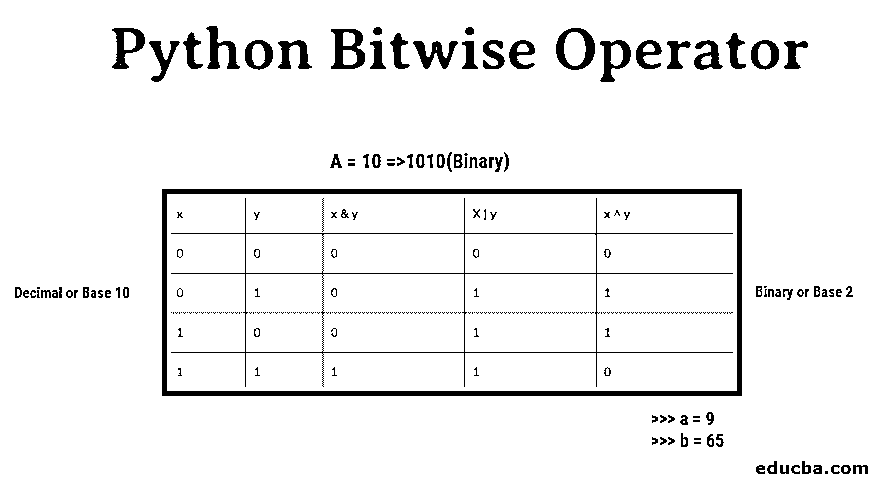

# Python 按位运算符

> 原文：<https://www.educba.com/python-bitwise-operator/>




## Python 按位运算符简介

在考虑“Python 按位操作符”之前，我们还需要做一些相关的事情。这也将是一个更好的方法；否则，事情会变得更加可疑。

**按位**——计算机编程，我们都知道是‘程序’，辅助执行一些算术和逻辑运算。因此，这些程序在一个或多个位模式的水平上工作。这种需要被用于操纵值以进行比较和计算。

<small>网页开发、编程语言、软件测试&其他</small>

**操作符**–指任何一种表示要执行的操作的符号。

### 解释(不同的 Python 按位运算符)

既然我们已经研究了基础部分，让我们转到 python 方法，并尝试找到 Python 按位运算符的真正含义。按位运算符是一组运算符，用于逐位而不是一次对操作数进行操作或执行运算。

这些操作是在整数上执行的，整数随后被转换成二进制格式，在二进制格式中，操作是逐位执行的。

***Note: **one crucial thing to note regarding these operators is that they work only on integers and return the output in decimal format.*

让我们了解什么是十进制或基数 10 的数字和二进制或基数 2 的数字，然后我们将继续与运营商的解释。

*   **十进制或十进制**–十进制是我们给程序输入的数字，以便执行操作。这些是人类可以理解的。你也可以认为小数是我们在日常生活中使用的数字(如 0 到 9)。它也被称为以 10 为基数，因为在 0 到 9 之间有 10 个数字。
*   **二进制或基数 2**–0 和 1 构成二进制数；这些是计算机可以理解的。所以所有的二进制数都是由这些数字组成的，即 0 和 1，因此被称为基数为 2 的数。

让我们取 X = 9，Y = 65，进行计算。所以二进制值将是 X = 0110，Y = 1000。

让我们看看真值表

| **x** | **y** | **x & y** | **X &#124; y** | **x ^ y** |
| Zero | Zero | Zero | Zero | Zero |
| Zero | One | Zero | One | One |
| One | Zero | Zero | One | One |
| One | One | One | One | Zero |

所以在这里，我们考虑到所有的[位操作符](https://www.educba.com/bitwise-operators-in-c-plus-plus/)提供了命令。

```
>>> a = 9
>>> b = 65
>>> print("Bitwise AND Operator On 9 and 65 is = ", a & b)
>>> print("Bitwise OR Operator On 9 and 65 is = ", a | b)
>>> print("Bitwise EXCLUSIVE OR Operator On 9 and 65 is = ", a ^ b)
>>> print("Bitwise NOT Operator On 9 is = ", ~a)
>>> print("Bitwise LEFT SHIFT Operator On 9 is = ", a << 1)
>>> print("Bitwise RIGHT SHIFT Operator On 65 is = ", b >> 1)
```

输出将是这样的——

`>>> a = 9
>>> b = 65
>>>print(“Bitwise AND operator on 9 and 65 is = “,a & b)
Bitwise AND operator on 9 and 65 = 1
>>>print(“Bitwise OR operator on 9 and 65 is = “,a | b)
Bitwise OR operator on 9 and 65 = 73
>>>print(“Bitwise EXCLUSIVE OR operator on 9 and 65 is = “,a ^ b)
Bitwise EXCLUSIVE OR operator on 9 and 65 = 72
>>>print(“Bitwise NOT operator on 9 is = “, ~a)
Bitwise NOT operator on 9 is = -10
>>>print(“Bitwise LEFT SIFT operator on 9 is =”, a<<1)
Bitwise LEFT SHIFT operator on 9 is = 18
>>>print(“Bitwise RIGHT SHIFT operator on 65 is =”, b>>1)
Bitwise RIGHT SHIFT operator on 65 is = 32`

**语法**

到目前为止，我们已经对 Python 中的位操作符有了一个简单的了解。为了了解这些操作符的应用语法，让我们首先突出它们的类型，然后是它们的语法。

按位运算符的类型–

1.  补充–参考示例
2.  和–4 & 8(4 = 0100，8 = 1000；所以，AND 值将是 0000，也就是 0)。因此输出。
3.  或者——(0l 0 = 0；0I1 = 11i 0 = 1；1I1 =1)
4.  异或-(0^0 = 0；0^1 = 1;1^0 = 1;1^1 = 0)
5.  左移–参考示例
6.  右移–参考示例

### 例子

让我们看一些例子来加深我们的理解

1.  **按位 AND 运算符–**如果两个比较位都是 1，则按位 AND 将返回 1，否则返回 0。
2.  **按位 OR 运算符–**如果两个比较位都是 1，它将返回 1，或者如果两个位都是 0，它将返回值 0。
3.  **逐位 XOR 运算符–**如果任何一位为 0 或 1，XOR 运算符将返回值 1。但是如果两个机器人都是 0 或 1，那么它将返回 0。
4.  **按位一的补码运算符—**A 的按位一运算符将是—(A+1)。
5.  **按位左移运算符–**在按位左移运算符中，二进制数的末尾附加了符合要求的 0。
6.  **按位右移运算符–**在按位右移运算符中，右侧的位被移除。

*   **和**

```
A = 10 =>1010(Binary)
B = 7 => 111(Binary)
A&B = 1010 & 0111
= 0010
= 2 (Decimal)
```

*   **或**

```
A = 10 =>1010(Binary)
B = 7 => 111(Binary)
A I B = 1010 I 0111
= 1111
= 15 (Decimal)
```

*   **异或**

```
A = 10 =>1010(Binary)
B = 7 => 111(Binary)
A ^ B = 1010 ^ 0111
= 1101
= 13 (Decimal)
```

*   **按位一进制补码**

```
A = 10 =>1010(Binary)
~A = ~1010
= -(1010+1)
= -(1011)
= -11(Decimal)
```

*   **按位左移**

```
A = 10 =>1010(Binary)
A<<2 = 1010<<2
= 101000
= 40(Decimal)
```

*   **按位右移**

```
A = 10 =>1010(Binary)
A>>2 = 1010>>2
=10
= 2(Decimal)
```

### 结论

按位运算符只是 Python 向用户提供的大量学习曲线的一小部分。关于位运算符的另一个问题是，它们在现实编程中并不常用。只有当你从事与加密、压缩和字节操作相关的工作时，你才会接触到这些操作符的概念。

### 推荐文章

这是 Python 按位运算符示例的指南。在这里，我们用例子和语法讨论不同 Python 位操作符的解释。您也可以阅读以下文章，了解更多信息——

1.  [Python 字符串函数](https://www.educba.com/python-string-functions/)
2.  [JavaScript 中的 Switch 语句](https://www.educba.com/switch-statement-in-javascript/)
3.  [JavaScript 中的按位运算符](https://www.educba.com/bitwise-operators-in-javascript/)
4.  [c#中的按位运算符](https://www.educba.com/bitwise-operators-in-c-sharp/)


