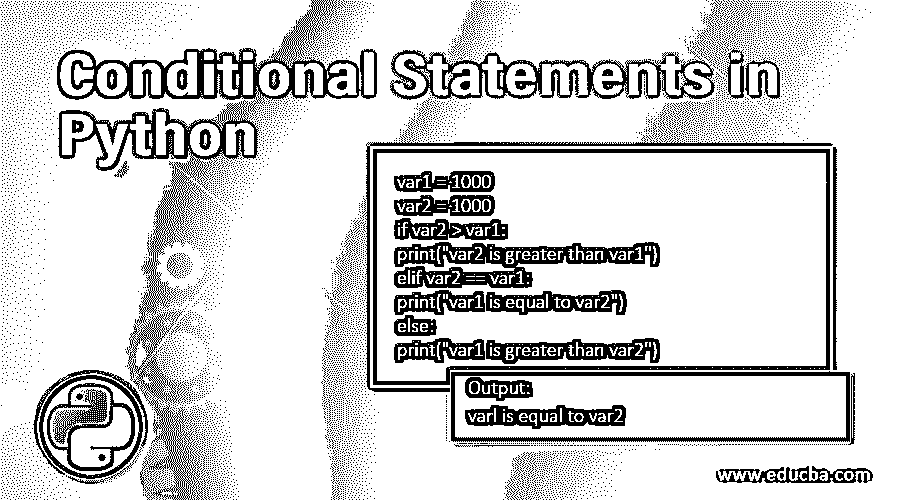

# Python 中的条件语句

> 原文：<https://www.educba.com/conditional-statements-in-python/>




## Python 中条件语句的介绍

我们通常需要根据条件执行特定的代码，而不是顺序执行，这就是“Python 中使用条件语句的地方”它也有助于 Python 中的决策，尤其是当我们希望仅在满足某些条件的情况下执行一段代码时。简而言之，条件语句指导作为其一部分的语句的执行顺序。Python 中有不同类型的[控制语句。让我们一个接一个地讨论它们，以及语法和它们是如何工作的。](https://www.educba.com/control-statements-in-python/)

### 理解 Python 中的 if 条件语句

我们将从 if 条件语句的最基本版本开始。基本语法如下所述:

<small>网页开发、编程语言、软件测试&其他</small>

**语法:**

```
if <conditional>:
      <Statement to be executed if the conditional evaluates to be True>
```

*   这里<conditional>可以是基于一个或多个变量组合的任何条件。</conditional>
*   该条件的输出是一个布尔表达式，其值为 0 或 1，并且基于该条件下提到的同一语句或语句集执行
*   如果该条件评估为真，则执行该语句，否则跳过
*   <conditional>后面的冒号(:)是必需的，否则 python 会抛出一个错误。</conditional>

### Python 中条件语句的示例

让我们看一下下面的例子，以便理解相同的内容。

#### 示例#1

**代码:**

```
#Python program to understand if statement
var1 = 1
var2 = 200
if var2 > var1:
    print("var2 is greater than var1")
```

**输出:**


当条件语句被证明为真时，上面的语句被执行。

#### 实施例 2

如果条件不为真会发生什么？让我们通过下面的例子来理解这个问题。

**代码:**

```
#Python program to understand  if statement
var1 = 1000
var2 = 200
if var2 > var1:
    print("var2 is greater than var1")
```

这个程序不会提供任何输出。原因是，条件被评估为假，因此[打印语句被跳过](https://www.educba.com/print-statement-in-python/)，因为它依赖于条件。

#### 实施例 3

理解带有 if 条件语句的 else 子句的用法。

**语法:**

```
if <conditional>:
     <Statement 1 to be executed if the conditional evaluates to be True>
else:
     <Statement 2 to be executed if the conditional evaluates to be False>
```

*   在这种情况下，如果条件评估为真，则执行语句 1，否则，如果条件评估为假，则执行语句 2。
*   这就是 else 子句与 if 条件一起工作的方式。

让我们通过下面的例子来理解这个问题。

****代号:****

```
var1 = 1000
var2 = 200
if var2 > var1:
    print("var2 is greater than var1")
else:
    print("var1 is greater than var2")
```

**输出:**


在这种情况下，条件被评估为假，因此语句 1 被跳过，由于同样的原因，语句 2 被执行。如果我们要验证不止一个条件，并且基于这些条件，我们希望执行一组不同的代码，该怎么办呢？在这种情况下，可以使用 Elif 子句来检查后续条件，最后，如果没有结果为真，可以使用 else 语句来执行一组语句。

#### 实施例 4

用 if 条件语句理解 elif 子句的用法。

**语法:**

```
if <conditional 1>:
     <Statement 1 to be executed if the conditional 1 evaluates to be True>
elif <conditional 2>:
     <Statement 2 to be executed if the conditional 2 evaluates to be True and conditional 1 evaluates to be false>
else:
     <Statement 3 to be executed if the conditional evaluates to be conditional 1 and 2 evaluates to be false>
```

*   在这种情况下，条件 1 评估为真，则执行语句 1，否则如果条件 2 评估为真，则执行语句 2，否则执行语句 2。
*   这就是 elif 子句与 if 条件 if 一起工作的方式，以防我们想要测试多个条件。

让我们通过下面的例子来理解这个问题。

****代号:****

```
var1 = 1000
var2 = 1000
if var2 > var1:
    print("var2 is greater than var1")
elif var2 == var1:
    print("var1 is equal to var2")
else:
    print("var1 is greater than var2")
```

**输出:**


*   在这种情况下，条件 1 被评估为假，因此语句 1 被跳过。
*   条件 2 被评估为真，因此语句 2 被执行。
*   最后，如果任何一个条件的计算结果为真，那么后续条件的其余部分甚至不会被检查。

python 中的 if 条件也有一个替代语法，它也在一行中。选择哪一个是用户自己的选择。

**语法:**

```
if <conditional 1>: <Statement 1 to be executed if the conditional 1 evaluates to be True>
```

完全允许在一行中编写语句，此外，可以有多个语句与单个条件对齐，如下所述:

```
if <conditional 1>: <Statement 1 to be executed if the conditional 1 evaluates to be True>; <Statement 2 to be executed if the conditional 1 evaluates to be True> ; <Statement 3 to be executed if the conditional 1 evaluates to be True>
```

这些语句需要用分号(；)虽然。

### 结论

Python 条件语句在程序中根据条件值决定运行某段代码时非常有用。我们有许多可以和 Python 条件语句一起使用的操作符，比如 and、or、not 等。来评估这些条件句。要运行的语句必须用制表符缩进，否则 python 会抛出错误。

### 推荐文章

这是 Python 中条件语句的指南。这里我们讨论 Python 中条件语句的介绍，以及例子和代码实现。您也可以看看以下文章，了解更多信息–

1.  [Python 余数运算符](https://www.educba.com/python-remainder-operator/)
2.  [Python 修剪字符串](https://www.educba.com/python-trim-string/)
3.  [Python 中的缩进](https://www.educba.com/indentation-in-python/)
4.  [Python 输入字符串](https://www.educba.com/python-input-string/)


