# Python 无限循环

> 原文：<https://www.educba.com/python-infinite-loop/>

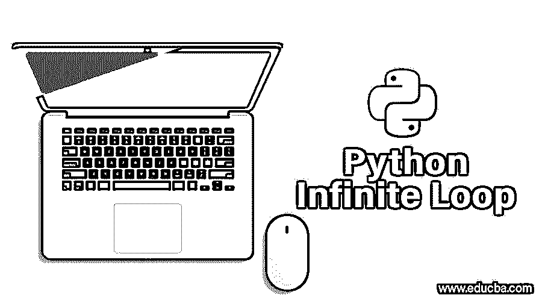


## Python 无限循环简介

Python 中的无限循环是一个连续重复的条件循环，它会一直执行，直到外部因素干扰了执行流程，比如 CPU 内存不足、停止执行的失败特性/错误代码，或者其他遗留系统中需要代码集成的新特性。Python 中几种类型的无限循环包括 While 语句、If 语句、Continue 语句和 Break 语句。

### 什么时候需要无限循环？

无限循环在客户机/服务器编程中可能很有用，在这种编程中，服务器需要连续运行，以便客户机程序可以在必要时与服务器程序通信。如果需要创建新的连接，这也可能是有帮助的。在游戏应用程序或我们进入某种主事件循环的应用程序中，while 循环是有用的，它会继续运行，直到用户选择一个动作来打破这个无限循环。此外，如果一个人不得不玩游戏并希望游戏在每次会话后重置。迭代是做一个重复任务的过程，计算机程序一直掌握着这门艺术。

<small>网页开发、编程语言、软件测试&其他</small>

### 我们怎么会错误地运行一个无限循环呢？

这是一个非常简单的程序，但 noobs 肯定会错过这些基本步骤，并在他们的程序中运行一个无限循环。

**代码:**

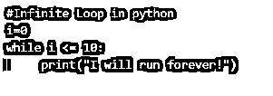


因为没有代码来增加整数的值，所以它将继续打印，直到我们终止程序。

**输出:**

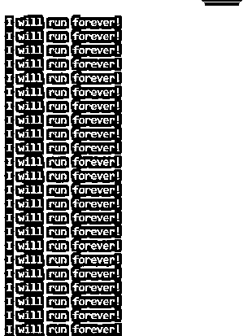


因此，为了避免无意的循环，我们在代码中添加了下面一行。

**代码:**

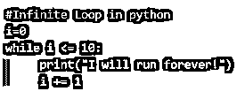


然后，输出中打印出如下所示的确定行数。

**代码:**

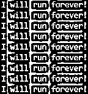


### Python 无限循环中的语句类型

以下是 Python Infinity 循环中不同类型的语句:

#### 1.Python 无限循环中的 While 语句

循环非常强大，而且确实非常必要，但是无限循环是唯一的陷阱。Python 只有两种循环类型‘While loop’和‘For loop’。While 循环的工作方式与 IF 语句完全一样，但是在 IF 语句中，我们只运行一次代码块，而在 while 循环中，我们从代码开始的地方跳回同一点。如此重复，直到满足一个条件。众所周知，循环是无限的或者有条件的。 [Python while 循环](https://www.educba.com/while-loop-in-python/)不断重复内部定义的代码块，直到满足特定的需求。while 循环有一个布尔表达式，只要布尔表达式为真，循环中的代码就会继续运行。

**While 语句的语法** **:**

```
while(expression)
statement(s)
```

**代码:**

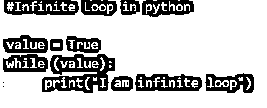


**输出:**

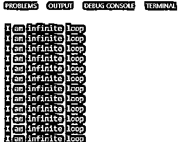


正如我们在上面看到的，while 循环将继续运行，直到布尔表达式为真。需要注意的是，在 while 循环之后执行的语句可以是单行，甚至是包含多行的代码块。有一件事必须弄清楚。while 循环是入口控制的，这意味着如果初始测试为假，它将永远不会运行。

**代码:**

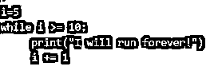


上面的表达式是假的；因此，输出中不会执行任何内容。

#### 2.在 While 循环中使用 IF 语句

我们可以在 while 循环中加入另一条语句，然后退出循环。我们可以使用 Python 控制语句，比如‘Break’和‘Continue’。break 用作 python 控制语句，一旦遇到它，就会跳过整个块的执行。我们可以使用 [if-else 语句](https://www.educba.com/if-else-statement-in-python/)，甚至在完成 while 循环的条件之前使用 break 关键字来退出 while 循环。

#### 3.使用 Break 语句

以下是说明上述内容的一个示例:

**代码:**


**输出:**


因此，我们在这里看到，在完成第 10 次<sup>到</sup>迭代之前，程序流跳出了循环，同时循环被终止并打印在控制台中。

#### 4.使用 Continue 语句

continue[用作控制语句](https://www.educba.com/control-statements-in-c/)。一旦遇到 continue，当前迭代就会被跳过。

**代码:**

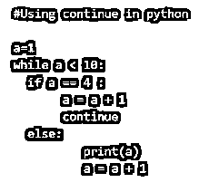


**输出:**


我们在输出中看到，数字是从 1 到 9 打印的，除了 4，因为它是一个需要在程序中跳过的条件。所以这个迭代被跳过，我们看到程序继续运行，直到 while 条件继续。

### 正面或反面游戏

下面是一个用 Python 写的掷硬币游戏的例子，它是在 WHILE 循环的帮助下创建的。下面是一个基于文本的游戏或者另一个如何使用 while 循环的例子。我们在这里导入了 random 类，并利用 input()函数让用户读取输入。这只是一个简单的硬币翻转模拟。我们会要求用户输入“正面”或“反面”。这里将应用一个简单的游戏统计，对出现的正面和反面的数量进行求和。

**代码:**

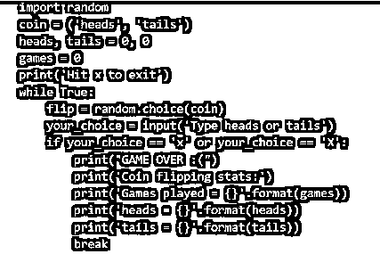


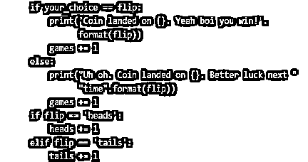


**输出:**


输入值后，即“正面”或“反面”，我们得到的最终输出如下:

**代码:**

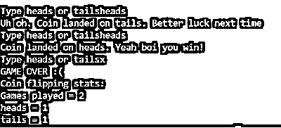


在代码片段中，我们看到 random 类生成随机值“head”或“tail ”,正如我们在上面给出的选项一样，并将它们存储在 flip 变量中。因此，当用户的输入与 flip 中的值匹配时，则一方获胜；否则其中一个会失败，while 循环会一直运行到那个时候。一个退出条件是只有当“X”或“X”作为输入给出时。在这种情况下，迭代的计算值被打印出来。这只是使用 while 循环制作的基于文本的游戏的一个简单示例。

### 结论

当人类发现重复的任务令人厌烦时，这使得这些任务很容易出现人为错误。因此，迭代程序有其实用性，在许多需要循环无限运行直到被中断的应用程序中，它提供了很大的帮助。使用 while 循环可以创建许多简单的基于文本的游戏。

### 推荐文章

这是 Python 无限循环的指南。这里我们讨论介绍和不同类型的语句以及代码实现。您也可以浏览我们推荐的其他文章，了解更多信息——

1.  [Python Break 语句](https://www.educba.com/break-statement-in-python/)
2.  [Python 嵌套循环](https://www.educba.com/python-nested-loops/)
3.  [Python 集](https://www.educba.com/python-sets/)
4.  [Python 特性](https://www.educba.com/python-features/)


