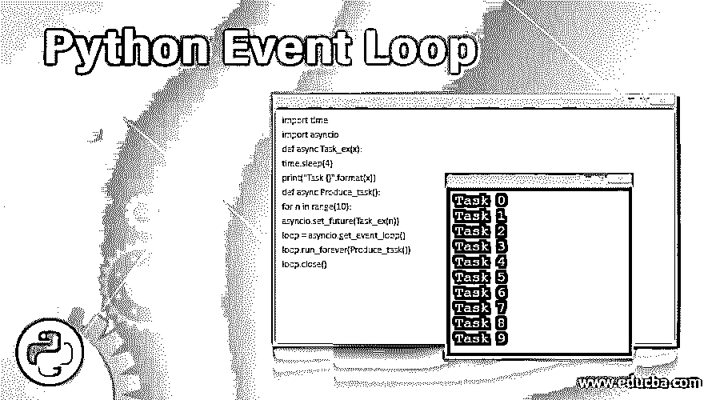
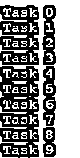

# Python 事件循环

> 原文：<https://www.educba.com/python-event-loop/>




## Python 事件循环简介

*   Python 事件循环是每个 asyncio 应用程序的中心。时机循环，运行异常分配和回调，执行安排 IO 活动，以及运行子进程。
*   Python 事件循环对于处理计算代码中的所有情况非常有用。它在整个程序的执行过程中绕过路线，并监视时机的接近和执行。Asyncio 模块允许每个程序有一个单独的场合圈。
*   Asyncio 模块提供了基类，您可以将这些基类划分为子类来执行您的系统约定。那些类与传输相关地被利用；约定解析接近信息并请求主动信息的组成，而车辆负责实际的 I/O 和缓冲。

**语法:**

`Get_event_loop(loop)
Set_event_loop(loop)`

<small>网页开发、编程语言、软件测试&其他</small>

### Python 中的事件循环是如何工作的？

现在我们看到了如何使用 get_event_loop 实现不同功能的各种例子。在实现 get_event_loop 时，有一些重要的函数我们需要知道。get_event_loop 设置了一个回调函数或时间延迟函数，这有助于它以特定的方式调度函数。回调函数最早一次被调用就返回到 get_event_loop，这有助于重新安排时间延迟，因为它在 get_event_loop 时钟中显示了当前时间。因此，asyncio 函数通过设置 get_event_loop 函数并最终实现它，然后返回实现另一个 get_event_loop 函数，来帮助 main 类的其他子类中的 get _ event _ loop 函数。因此，get_event_loop 围绕一个循环来调度自己。Stop 函数，帮助它在任何想运行的时候运行代码或命令，最终实现用户的命令。

### 实现 Python 事件循环的示例

下面是提到的例子:

#### 示例#1

使用 get_event_loop 实现一个简单的操作。

**代码:**

```
import time
import asyncio

def hi_everyone(loop):
   print('Hi Everyone')
   loop.stop()
loop.call_soon(hi_everyone, loop)

loop = asyncio.get_event_loop()

loop.run_forever()
loop.close() 
```

**输出:**


**说明:**在上面的例子中，我们首先导入 python 中的 asyncio 模块，这是一个内置模块。这里，我们使用 get_event_loop 给当前设置一个循环。我们首先定义需要打印的语句，并将其分配给循环。稍后，我们使用 get_event_loop 回调这个定义的上下文，并最终产生输出。

#### 实施例 2

使用 get_event_loop 在 Python 中实现 future 类

**代码:**

```
import time
import ayncio

def async Mygoal(future_class):
   await asyncio.sleep(3)
   future.set_result('Future Class Implemented')
future = asyncio.Future()
loop = asyncio.get_event_loop()
asyncio.result_future(Mygoal(future_class))
try:
   loop.run_until_complete(future_class)
   print(future.get_result())
finally:
   loop.close() 
```

**输出:**


**说明:**在上面的程序中，我们首先导入 asyncio 模块。然后我们定义未来类，通过 set_result 函数实现结果。然后我们使用 try 和 finally 循环以及 get_event_loop 来实现 Python 中的 future 类。

#### 实施例 3

使用 get_event_loop，我们实现了协程。

**代码:**

```
import time
import asyncio

def async Mygoal():
   print("Coroutines Implemented")

loop = asyncio.get_event_loop()
try:
   loop.run_until_complete(Mygoal())

finally:
   loop.close() 
```

**输出:**


**解释:**在这里，我们先了解一下协程是什么意思。Asyncio 中协程的思想就像字符串模块下标准线程对象的思想。这是子程序思想的推测。协程可以在执行过程中被挂起，因此它可以紧抓外部处理，并在外部准备完成时从停止的地方返回。我们首先在这里初始化 async def()函数来打印协程，最后添加 get_event_loop 来实现这些协程。

#### 实施例 4

使用 get_event_loop 实现不同的任务

**代码:**

```
import time
import asyncio
def async Task_ex(x):
   time.sleep(4)
   print("Task {}".format(x))
def async Produce_task():
   for n in range(10):
      asyncio.set_future(Task_ex(n))

loop = asyncio.get_event_loop()
loop.run_forever(Produce_task())
loop.close() 
```

**输出:**




**解释:**在上面的程序中，Asyncio 模块的子类以同样的方式负责事件循环中协程的执行。在这里，我们导入 time 和 asyncio 模块，然后分配时间。睡眠功能实现 1 到 10 的所有任务。因此，程序服从命令，python 模块考虑范围“I”中的所有任务或进程，并打印从 0 到 9 的所有任务，然后返回回调函数。这些任务由 get_event_loop 处理和实现。

### 结论

应用程序工程师应该定期使用提升的 asyncio 功能，如 asyncio.run()，并且应该很少需要引用循环文章或调用其技术。这个区域通常是为低级代码、库和系统的创建者设计的，他们需要更好的能力来控制循环行为。

万一在当前操作系统字符串中没有设置最近的开发循环，操作系统字符串是主要的，并且 set_event_loop()还没有被调用，asyncio 将制作另一个机会循环并将其设置为当前循环。

由于这种能力具有相当复杂的行为(特别是当使用定制的场合循环策略时)，利用 get_running_loop(，)工作类似于在协程和回调中使用 get_event_loop()。考虑另外利用 asyncio.run()工作，而不是利用较低级别的容量来物理地创建和关闭事件循环。

### 推荐文章

这是一个 Python 事件循环的指南。在这里，我们讨论了 Python 事件循环的适当语法介绍，以及它是如何工作的例子。您也可以浏览我们的其他相关文章，了解更多信息——

1.  [Python 计数器](https://www.educba.com/python-counter/)
2.  [Python 字符串函数](https://www.educba.com/python-string-functions/?source=leftnav)
3.  [Python 中的三角函数](https://www.educba.com/trigonometric-functions-in-python/?source=leftnav)
4.  [Python 正则表达式](https://www.educba.com/python-regex/?source=leftnav)


