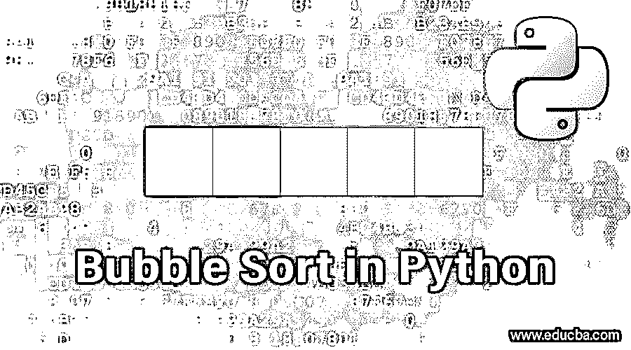
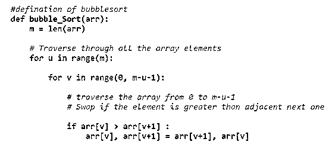
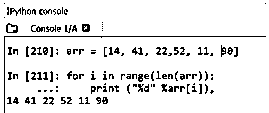

# Python 中的冒泡排序

> 原文：<https://www.educba.com/bubble-sort-in-python/>




## Python 中的冒泡排序简介

python 是一种众所周知的面向对象编程语言，用于开发基于 web 的应用程序或网站。冒泡排序是数据结构化算法概念中的一种，它可以被合并到 python 程序中，以便以一种轻松、合理和循环的交换队列结构中的数据/元素顺序的方式对数据/元素进行排序。然而，这种类型的排序数据结构方法由于其较低的效率而通常不是优选的，因为排序过程被重复直到达到无错的顺序。

### Python 中的冒泡排序示例

我们通过一个例子来看:

<small>网页开发、编程语言、软件测试&其他</small>

**第一次运行**

(**6****1**4 3)->(**1****6**4 2):这里 1 <sup>st</sup> 如果顺序不对，两个元素就会交换。

(1**6 4**2)->(1**4 6**2):在这里，如果顺序不正确，接下来的两个元素将被交换。

(1**4**6 2**)->(1 4**2****6**):这里，如果顺序不正确，接下来的两个元素将被交换。**

 ****第二次运行**

(**1****4**2 6)->(**1****4**2 6):这里 1 <sup>st</sup> 两个元素进行比较，但不交换，因为顺序是正确的。

(1**4 2**6)->(1**2 4**6):这里，下两个元素被交换，因为顺序不对。

(1**2**4****6**)->(1 2**4****6**):这里最后两个元素进行了比较，但没有按顺序交换**

 **现在我们知道数组看起来已经排序了；然而，需要运行一次，而不与算法进行任何交换，以了解排序是否完成。

**第三次运行**

(**1****2**4 6)->(**1****2**4 6):不互换 in1 <sup>st</sup> 两个元素。

(1**2 4**6)->(1**2 4**6):下两个元素不交换。

(1 2 **4 6** ) - > (1 2 **4 6** ):最后两个元素不交换。

由于在任何阶段都没有发生交换，现在算法认为排序是完美的。

[气泡排序](https://www.educba.com/bubble-sort-in-data-structure/)之所以得名，是因为元素按照正确的顺序向上移动，就像气泡浮出水面一样。

### Python 语言中的冒泡排序

现在让我们通过 python 来看看冒泡排序的逻辑实现。Python 是目前使用非常广泛的语言。通过 python 理解它肯定会让你有信心用任何其他语言编写它。

**Python 代码:**

```
ddef bubble_Sort(arr):
    m = len(arr)
    # Traverse through all the array elements
    for u in range(m): 
        for v in range(0, m-u-1): 
            # traverse the array from 0 to m-u-1
            # Swap if the element is greater than adjacent next one
            if arr[v] > arr[v+1] :
                arr[v], arr[v+1] = arr[v+1], arr[v]
```

要在冒泡排序后打印数组，需要遵循代码:

```
for i in range(len(arr)):
    print("%d" %arr[i]),
Here arr will be your array.
```

**Python 代码解释:**

这里“m”是数组的长度。两个 for 循环保存实际的接地逻辑，其中“u”表示第一个元素，而“v”表示第二个元素，如果两者之间的排序顺序不正确，则第一个元素必须与第二个元素进行比较以进行交换。

“arr[v] > arr[v+1]”表示连续元素的比较，如果第一个元素大于第二个元素，交换操作将由以下表达式执行:

即“arr[v]，arr[v+1] = arr[v+1]，arr[v]”。

这种交换操作称为交换。好的方面是这种交换操作不需要临时内存。

“u”代表每次运行的循环，“v”代表每个阶段的阶段。可以参考上一节的例子。

在[执行冒泡排序后，](https://www.educba.com/bubble-sort-in-c-sharp/)可以看到排序后的数组，代码如下:

```
for i in range(len(arr)): 
    print ("%d" %arr[i]),
```

让我们看看这个[在 Python IDE](https://www.educba.com/python-ide-on-linux/) 中的表现，以便更深入地理解:




**输出:**




关于冒泡排序有几个事实，每个人在实现它之前都应该知道:

1.  [冒泡排序通常被认为](https://www.educba.com/bubble-sort-algorithm/)是一种效率不高的排序方法。因为它必须交换物品，直到知道其最终位置。这都导致操作的浪费，因此成本很高。该算法遍历每个元素，无论是否需要排序。一旦运行通过而没有任何交换，冒泡排序就被认为完成了。
2.  这是所有数据结构中最简单的；对于任何初学者来说，这给了很好的信心。很容易构建和理解。
3.  它使用大量的时间和内存。
4.  这被认为是一种稳定的算法，因为它保留了元素的相对顺序。
5.  对于小型数组/列表来说，这是一个不错的选择。但是，用在长的就不好了。

### 结论

通过以上的 bubble sort 内容，可以对 python 专用的[这种排序算法](https://www.educba.com/sorting-algorithms-in-python/)有一个非常清晰的了解。一旦熟悉了冒泡排序的逻辑，理解另一组数据结构就变得容易了。逻辑方法是在数据结构领域出类拔萃的唯一途径。首先理解每个阶段的数据结构算法的逻辑，然后通过 Python 或任何其他语言编写代码。

### 推荐文章

这是 Python 中的冒泡排序指南。这里我们讨论 python 代码中冒泡排序的逻辑实现，并给出解释。您也可以阅读以下文章，了解更多信息——

1.  [Python 中的循环](https://www.educba.com/loops-in-python/)
2.  [Python 文件操作](https://www.educba.com/python-file-operations/)
3.  [Python 中的回文](https://www.educba.com/palindrome-in-python/)
4.  [Python 中的 3d 数组](https://www.educba.com/3d-arrays-in-python/)


****