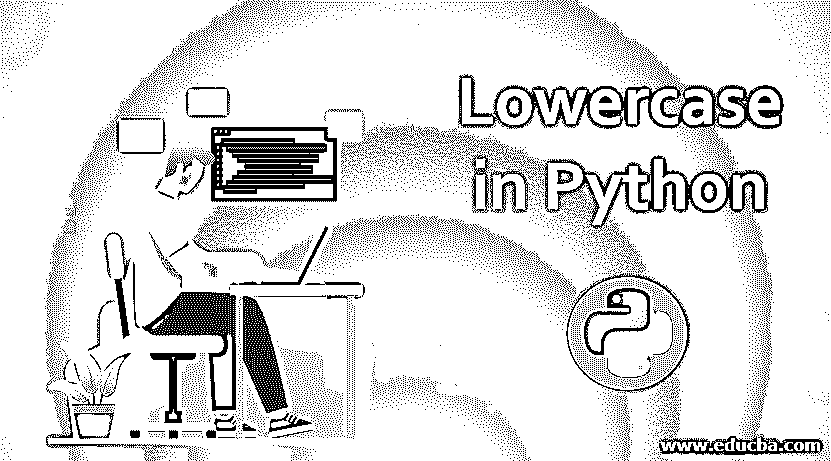

# Python 中的小写

> 原文：<https://www.educba.com/lowercase-in-python/>




## Python 中的小写介绍

小写是指小写字母，大写是指大写字母或字母表。在 Python 中，使用 Python 内置函数或方法将任何大写字符串转换为小写字符串称为 lower()。如果字符串是大写的，这个方法或函数 lower()返回小写的字符串；否则，它将返回相同的原始字符串本身。与此方法相反，upper()函数执行与 lower()函数完全相反的操作；它从给定的字符串中返回大写字母，该字符串是小写的，并将其转换为大写。lower()函数没有任何参数或自变量。Python 中的这些函数用于将字符串转换为大写或小写字符或字母。

### Python 中小写函数的使用

这篇文章是关于如何将大写的字符串转换成小写的。在 Python 中，正如我们所讨论的，我们有一个 lower()函数来完成这个任务。lower()函数仅适用于字母，因为数字和特殊字符没有大小写之分。lower()函数在转换成小写字母后，创建另一个字符串而不是原始字符串，并返回该字符串。

<small>网页开发、编程语言、软件测试&其他</small>

**语法:**

```
str.lower()
```

**参数:**

该方法没有任何参数，因为它只返回小写字符。

**举例:**

```
input_str = "THIS IS EDUCBA TRAINING PORTAL"
output_str = input_str.lower()
print("The lowercased characters are:", output_str)
```

**输出:**


### Python 中小写字母的例子

以下是 python 小写的一些例子:

#### 示例 1–is lower()方法

在 Python 中，还有一个函数叫做 is lower()；这个函数检查给定的字符串中是否有小写字符。如果是，则返回 true 否则，如果没有小写字符，则返回 false。这个函数也没有参数。类似地，甚至可以使用 isupper()函数来检查大写字符。该功能仅适用于字母表，不适用于数字或特殊字符。让我们看看下面的语法和示例:

**语法:**

```
str.islower()
```

**参数:**

这个函数也没有参数。但是当给定字符串中存在小写字符时，它返回布尔值 true，当给定字符串中没有小写字符时，它返回 false。

**举例:**

现在让我们举一个例子来说明如何使用 islower()方法。这个函数只返回 true 或 false 值。

```
str_check = "educba training"
str_out = str_check.islower()
print("Yes the given string is in lowercase",str_out)
str_check1 = "EDUCBA TRAINING"
str_out1 = str_check1.islower()
print("No the given string is not in lowercase",str_out1)
```

**输出:**


从上面的例子中，我们可以看到输出，如果给定的字符串是小写字母，那么它给出 yes 给定的字符串是小写字母，即 islower()方法返回的值是“true”，如果给定的字符串是大写字母，那么它给出 no 给定的字符串不是小写字母，即 islower()方法返回的值是“false”。

从上面两个小写的方法:lower()和 islower()来看，我们在使用这两个方法的时候要注意一些需要记住的点。它们如下:

*   lower()方法在将字符串转换为小写时不接受任何参数，如果给定了参数，那么它将给出一个语法错误。
*   lower()方法应用于或仅应用于字符或字符串。它只把大写字母转换成小写字母，如果字符串已经是小写或小写字母，那么输出值不会有变化；它返回与原始值相同的值。
*   lower()方法也不适用于任何数字字符或数字和特殊符号，因为在特殊符号和数字中没有什么可以转换成小写。
*   islower()方法也不接受任何参数；它检查给定字符串中的小写字符，并给出 true 或 false 输出。如果指定了任何参数，那么它也会给出一个语法错误。
*   如果字符串只有空白，islower()方法给出的输出为 true。
*   islower()方法也适用于或仅适用于字符串或字符，因为它只检查字符串是否为小写或否；如果是，则为真，否则为假。所以这种方法不适用于数字字符或数字和特殊符号，因为在数字和特殊符号中没有小写或大写。

#### 示例 2–lower()和 islower()方法

现在让我们考虑同时使用 lower()和 islower()方法的例子。代码如下:

**举例**:

```
str = "EDUCBA Training"
str_out = str.lower()
print("The string converted in lowercase is:")
print(str_out)
print("\nTo check if the string is converted to lowercase")
str_chk = str_out.islower()
if str_chk is True:
    print("Yes the string is in lowercase.")
else:
    print("No the string is not converterd into lowercase")
```

**输出:**


上述两种方法用于需要检查相同字符串的程序中；例如，当我们注册到某个门户网站时，它会要求输入用户名、电子邮件和密码，其中字符串匹配完成，因为它要求输入两次密码和电子邮件，其中可以使用这些方法。

### 结论

Python 中有两种方法来检查小写字母和将大写字母转换成小写字母。lower()方法用于将大写字母转换为小写字母，它不适用于数字和特殊符号。islower()方法用于检查给定的字符串是否是小写字符。因此，这些方法仅用于小写字符。这些方法只是再次用于字母，而不是数字和特殊符号。

### 推荐文章

这是 Python 中小写的指南。这里我们讨论一下 python 中小写函数的介绍和例子。您也可以看看以下文章，了解更多信息–

1.  [Python 迭代器字典](https://www.educba.com/python-iterator-dictionary/)
2.  [Python BeautifulSoup](https://www.educba.com/python-beautifulsoup/)
3.  [Python 中的队列](https://www.educba.com/queue-in-python/)
4.  [Python Rest 服务器](https://www.educba.com/python-rest-server/)