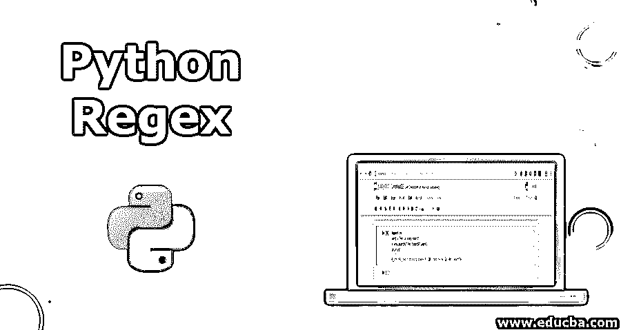

# Python 正则表达式

> 原文：<https://www.educba.com/python-regex/>




## Python 正则表达式简介

下面的文章提供了 Python 正则表达式的概要。正则表达式是一种高度专门化的语言，通过 re 模块可以在 Python 内部使用。使用这种语言，您可以指定一组规则来获取特定的组，并根据该规则验证字符串。这个集合可能包含电子邮件地址、电话号码或您想要匹配的任何特定模式，称为正则表达式、正则表达式模式或 REs，您可以指定或询问类似“这个字符串是否具有相同的模式”或任何类似的问题，或者您可以从一个大字符串中获取各种组。

**语法:**

<small>网页开发、编程语言、软件测试&其他</small>

我们将通过一个例子来看语法。为此，我们可以搜索一个字符串，看它是否以“He”开头，以“smart”结尾。

```
import reword = "He is very smart"
x =re.search("^He.*smart$",word)
print(x)
```

如果看语法，很简单；您只需要首先导入 regex 包，这是 re，然后根据您的要求使用任何导入的包函数。如果我们在 Jupyter 中运行上面的示例代码，我们会得到下面的结果。

### Python 中的正则表达式函数

有许多正则表达式函数可以帮助我们搜索一个匹配的字符串。在此之前，我们将首先了解正则表达式函数中常见的字符。

| **[]** | 它代表一组字符。 |
| **。** | 它代表除换行符以外的任何字符。 |
| ***** | 它表示零次或多次出现。 |
| **+** | 它代表一个或多个事件。 |
| **^** | 它代表起始字符。 |
| **$** | 它代表结束字符。 |
| **&#124;** | 它代表非此即彼。 |
| **()** | 它代表捕获和分组。 |
| **\** | 它通常用于转义特殊字符。 |

Regex 还有一些特殊的序列，了解它们会很有用，例如:

| **\w** | 如果字符串包含[0-9]、a-z 或 A-Z 和下划线中的任意一组单词字符，则显示匹配。 |
| **\W** | 如果字符串中没有单词字符，它将返回一个匹配项。 |
| **\d** | 当字符串中有数字时，这些返回匹配。 |
| **\D** | 它与前一个相反，因为如果字符串中没有数字，它将返回一个匹配。 |
| **\s** | 它用于检查字符串中的空白字符。如果存在空白字符，它将返回一个匹配项。 |
| **\S** | 当字符串中没有空格时，它返回一个匹配。 |

### 用于正则表达式操作的函数

让我们看看在 python 中可以用于正则表达式操作的 re 模块的各种函数。

#### 1.findall()函数

该功能存在于 re 模块中。它返回字符串中所有匹配的列表。它从左到右遍历字符串。匹配项也以完全相同的搜索顺序返回。我们将看一个这样的例子。假设我们想找出一个字符串中的所有数字。为此，我们将使用 findall()函数，在该函数中我们将找到字符串中出现的所有数字。现在让我们看看代码:

**代码:**

```
import re
word = "Raju is 22 years old and his mobile number last three-digit is 789"
rgex ='\d+'
x =re.findall(rgex,word)
print(x)
```

如果我们仔细阅读代码，我们基本上是用一个包含数字的字符串给变量 word 赋值，然后在 findall()函数中将适当的数字正则表达式符号和变量 word 一起作为参数传递。

**输出:**


如你所见，我们得到了一个数字列表。

#### 2.search()函数

search 函数用于搜索字符串中的模式，如果找到匹配，它将返回对象。这里，我们必须记住的一件事是，如果有多个匹配，那么它只返回第一个匹配。如果没有找到匹配，则返回 none。如果我们想找到以特定单词开头的字符串，我们将看到一个例子。我们将测试阳性和阴性匹配案例。让我们看看同样的代码。

**代码:**

```
import re
word = "Raju is 22 years old"
rgex ='^Raju'
x =re.search(rgex,word)
print(x)
regex1= '^Mohan'
x1 = re.search(regex1,word)
print(x1)
```

在这里，变量“regex”用于肯定场景，变量“regex1”用于否定场景。

**输出:**


在第一种情况下，我们返回 match 对象，而在第二种情况下，我们返回' None'。

#### 3.Split()函数

这个函数在每次匹配后分割字符串，这意味着只要字符串中有匹配，这个函数就从那里分割字符串。所以，如果有三个匹配，那么就会有三个分裂。我们将看到一个例子。假设我们想在每个空格后拆分一个字符串。所以我们可以使用这个 [split 函数在那种情况下很好地使用](https://www.educba.com/split-function-in-python/)。

**代码:**

```
import re
word = "Raju is 22 years old"
rgex ='\s'
x =re.split(rgex,word)
print(x)
```

这里的模式代表空白字符。

**输出:**


正如您在输出中看到的，字符串在每个空格后被拆分。

#### 4.sub()函数

这个函数用用户选择的字符串或字符替换匹配项。它的基本意思是，如果字符串中有匹配，它会用你的字符串或字符替换那个匹配的字符或字符串，并返回修改后的字符串。它需要三个参数。例如，我们将在字符串中用' & '替换空白。

**代码:**

```
import re
word = "Raju is 22 years old"
rgex ='\s'
x =re.sub(rgex,'&',word)
print(x)
```

**输出:**


正如你所看到的，所有的空格都被替换成了“&”。

### 结论

在本文中，我们讨论了 regex 模块及其各种 [Python 内置函数](https://www.educba.com/python-built-in-functions/)。Regex 非常重要，广泛应用于各种编程语言中。

### 推荐文章

这是 Python 正则表达式的指南。这里我们讨论 python 正则表达式的介绍和一些重要的正则表达式函数，以及一个例子。您也可以浏览我们推荐的其他文章，了解更多信息——

1.  [Python 中的 While 循环](https://www.educba.com/while-loop-in-python/)
2.  [Python 中的反数](https://www.educba.com/reverse-number-in-python/)
3.  [Python 关键词](https://www.educba.com/python-keywords/)
4.  [PowerShell 中的 Regex](https://www.educba.com/regex-in-powershell/)