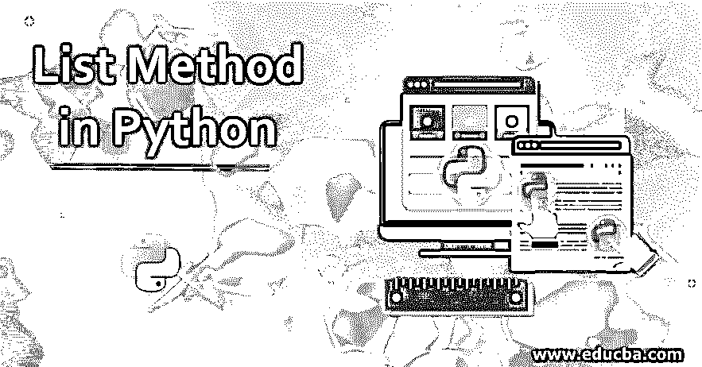

# Python 中的列表方法

> 原文：<https://www.educba.com/list-method-in-python/>




## Python 中的 List 方法简介

python 中的 List 方法可以定义为用于存储单个或一组元素/变量的数据类型，这些数据可以是整数、字符或浮点数。list 方法可以与许多运算符一起使用，如 sort()、copy()、append()、clear()、reverse()、remove()、pop()、insert()、count()、extend()和 index()。这些功能用于插入、编辑、删除、重新排列等。元素列表中的数据。

### Python 中的列表是如何工作的？

存储在列表中的每个值都有其地址或索引位置。通过索引位置，我们可以从列表中获取任何特定的值。所有索引值都从 0 开始。默认情况下，Python 从左到右读取列表。每个列表都用方括号括起来。我们可以读取列表元素，但是我们不能指定一个不存在于列表中的索引，这会导致错误。

<small>网页开发、编程语言、软件测试&其他</small>

我们还可以使用(-)负索引值从后向访问列表中的元素。负数从-1 开始。如果我们指定-1，它将返回列表的最后一个元素，依此类推。

列表非常有用，因为它用于将同类数据存储在一起。例如，在一个列表中显示所有学生的姓名或学号。 [Python list 也支持](https://www.educba.com/python-list/)嵌套，所以我们可以在另一个 list 里面创建一个 list。

```
names = ["Sanjay", "Ramesh", "Suresh", "Ravi"]
```

如果我们想得到任何名字，我们必须用变量名指定索引位置。

```
names[0] = sanjay
names[2] = Suresh
```

如果我们想重新分配列表中的任何值，那么我们可以简单地用索引位置给列表变量分配一个新值。

```
names[2] = "Akshay"
names = ["Sanjay", "Ramesh", "Akshay", "Ravi"]
```

### Python 列表函数中可用的方法

下面是 list python 中可用的一些重要方法，如下所示:

#### 1.追加()

此函数用于向现有列表添加值。只需使用 append 关键字并添加名称。新值将被添加到列表的末尾。如果我们在 append 函数中传递另一个列表，它将添加一个列表作为值。

```
names.append("John")
names = ["Sanjay", "Ramesh", "Akshay", "Ravi", "John"]
nums = [1,2,3]
names.append(nums)
["Sanjay", "Ramesh", "Akshay", "Ravi", "John",[1,2,3]]
```

#### 2.排序()

该函数用于按字母顺序升序或降序排列数据。默认情况下，它按升序排序。如果我们需要按降序排序，我们需要反转关键字。

```
names.sort()
["Akshay","John","Ramesh","Ravi","Sanjay"]
names.sort(reverse=True)
["Sanjay","Ravi","Ramesh","John","Akshay"] 
```

#### 3.复制()

如果我们想要创建一个列表的副本，我们可以将它赋给一个新的变量，但是在 Python 的情况下，可能会创建一个副本，但是问题是如果我们改变了原始列表中的任何值，那么新列表的值也会改变。他们只是共享原始变量的引用。

所以为了避免这种情况，我们可以使用 copy()函数。

```
new_names = names.copy()
print(new_names)
["Sanjay","Ravi","Ramesh","John","Akshay"]
names.append(1)
print(names)
["Sanjay","Ravi","Ramesh","John","Akshay",1]
print(new_names)
["Sanjay","Ravi","Ramesh","John","Akshay"]
```

#### 4.清除()

这个函数用于删除列表中的所有值，并返回一个带方括号的空列表。

```
names.clear()
print(names)
[ ]
```

#### 5.反向()

此功能用于反转列表中的项目。它将从右向左读取元素并修改当前列表。

```
["Sanjay","Ravi","Ramesh","John","Akshay"]
names.reverse()
["Akshay","John","Ramesh","Ravi","Sanjay"]
```

#### 6.移除()

如果我们想从列表中删除任何值，并且不知道该值的索引位置，那么我们可以使用 remove()函数。我们必须传递想要从列表中移除的值，它将从索引位置 0 开始从左到右搜索该元素，无论哪个匹配的元素先出现，都将被移除。

```
["Sanjay","Ravi","Ramesh","John","Akshay"]
names.remove("Ravi")
print(names)
["Sanjay","Ramesh","John","Akshay"]
```

#### 7.流行()

这个函数也类似于 remove()函数，但是在这个函数中，我们可以基于索引而不是值从列表中删除值。我们必须知道值在列表中的索引位置才能移除它。

```
["Sanjay","Ravi","Ramesh","John","Akshay"]
names.pop[2]
print(names)
["Sanjay","Ravi","John","Akshay"]
```

#### 8.插入()

这个函数也用于将值插入到列表中，但是我们可以使用这个函数在特定的索引位置插入值。特别是，存在的元素将转移到下一个索引，这意味着该索引之后的所有元素都将递增 1。

```
["Sanjay","Ravi","John","Akshay"]
names.insert(1,"David")
print(names)
["Sanjay","David","Ravi","John","Akshay"]
```

#### 9.计数()

这个函数用来查找哪个元素在列表中存在了多少次。它将根据函数内部传递的值来计算总数。

```
["Sanjay","Ravi","John","Akshay","John"]
names.count("David")
1
names.count("John")
2
```

#### 10.扩展()

这个函数类似于 append()函数，唯一的区别是，如果我们在另一个列表中添加一个列表，append()函数将使它成为一个嵌套列表，但是在这个函数中，如果我们添加另一个列表，它将在那个列表中添加项目，而不是使它嵌套。

```
names.append(nums)
print(names)
["Sanjay", "Ramesh", "Akshay", "Ravi", "John",1,2,3]
```

#### 11.索引()

这个函数用于查找列表中任何元素的索引。我们需要传递值的名称。值区分大小写。

```
["Sanjay","Ravi","John","Akshay","John"]
names.index("Ravi")
1
```

### 结论

列表是最基本的数据集合或序列。列表是用方括号括起来的 Python 的数据结构。列表是可变的，所以它们的值可以改变。Python 为列表提供了许多内置函数。使用这些函数，我们可以对列表执行各种操作。

### 推荐文章

这是 Python 中 List 方法的指南。在这里，我们讨论 python 中的基本概念、工作和 11 大列表方法及其示例和代码实现。你也可以看看下面的文章来了解更多-

1.  [Python 魔法](https://www.educba.com/python-magic-method/)
2.  [Python 熊猫数据帧](https://www.educba.com/python-pandas-dataframe/)
3.  [Python 中的数组](https://www.educba.com/arrays-in-python/)
4.  [Python 正则表达式](https://www.educba.com/python-regex/)