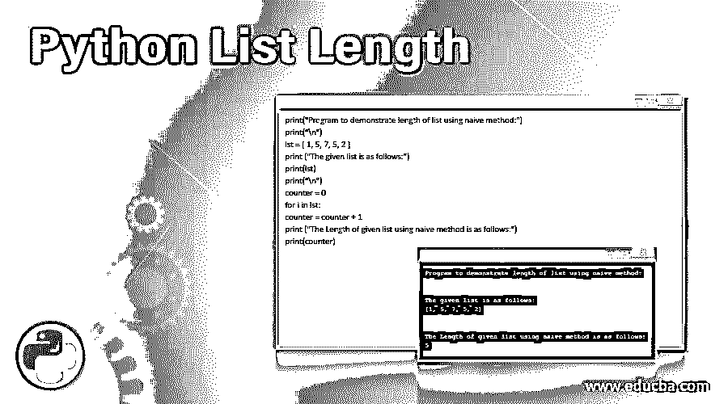
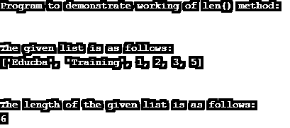
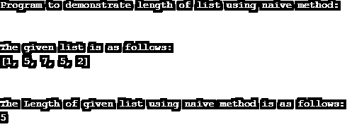

# Python 列表长度

> 原文：<https://www.educba.com/python-list-length/>




## Python 列表长度简介

在本文中，我们讨论的是 Python 中链表的长度函数。在 Python 中，列表是不同数据类型的元素的集合。在本文中，我们希望找到列表中元素的数量。在 Python 中这样做提供了一个称为 length 的内置函数，用 len()表示。Python 中的 len()方法查找列表的大小，返回给定列表中元素的数量。这个 len()方法接受 iterable 作为参数来计算给定列表中的项数。在 Python 中，有不同的方法来查找列表的长度。让我们在下一节中详细了解一下。

### Python 列表长度是如何工作的？

本节将会看到在 Python 中查找列表长度的不同方法。列表的长度意味着找到给定列表中元素的长度或数量的大小。让我们看看查找列表长度的不同方法有:

<small>网页开发、编程语言、软件测试&其他</small>

#### 1.使用 len()方法

这个 len()方法是 Python 中的内置函数，用于查找列表或任何其他可迭代对象的长度。该方法将任何 iterable 作为参数，并且它只返回传递给该方法的 iterable 中的元素数量。这个方法是查找列表长度的最常用和最简单的方法。

**语法:**

`len(listname)`

**listname:** 这是任何 iterable 的名称，用于查找给定 iterable 的长度或大小。

**代码:**

```
print("Program to demonstrate working of len() method:")
print("\n")
lst = ["Educba", "Training", 1, 2, 3, 5]
print("The given list is as follows:")
print(lst)
print("\n")
print("The length of the given list is as follows: ")
print(len(lst)) 
```

**输出:**




在上面的程序中，我们可以看到我们声明了一个名为“lst”的列表，我们使用 len()方法打印这个列表的大小，该方法用作 len(last)，它返回输出“6”，因为列表“lst”中有 6 个元素。

#### 2.通过使用简单的方法

这是查找列表长度的另一个基本方法。此方法运行一个循环，计数器递增，直到找到列表的最后一个元素。当其他技术无效时，这是最基本的方法。

**代码:**

```
print("Program to demonstrate length of list using naive method:")
print("\n")
lst = [ 1, 5, 7, 5, 2 ]
print ("The given list is as follows:")
print(lst)
print("\n")
counter = 0
for i in lst:
       counter = counter + 1
print ("The Length of given list using naive method is as follows:")
print(counter) 
```

**输出:**




在上面的程序中，我们看到了查找列表的长度，我们遍历列表并对元素进行计数，然后计数存储在打印列表长度的计数器中。这种方法也称为使用“for”循环，就像我们使用 for 循环来查找给定列表的长度一样。

#### 3.通过使用 length_hint()方法

这是查找列表长度的另一种方法。这种方法不如上面两种方法受欢迎。这个方法是在 operator 类中定义的，它有助于找到当前列表中元素的数量。这是另一个计算列表中元素数量的内置函数，这个方法也可以应用于任何可迭代的对象，比如列表、元组、字典等。让我们看看下面演示 length_hint()方法的例子。

**语法:**

`length_hint(iterable)`

**Iterable:** 可以是 list、tuple、dict 等任何 Iterable。，它作为参数传递以查找元素的数量。

**代码:**

```
from operator import length_hint
print("Program to demonstrate the length of the list using length_hint() method:")
print("\n")
lst = ['Educba','Training','1','4', 'Python','Courses']
print("The given list is as follows:")
print(lst)
print("\n")
length_lst = length_hint(lst)
print("Length of the given list is as follows:")
print(length_lst) 
```

**输出:**


**说明:**在上面的程序中，我们可以看到我们已经声明了一个名为“lst”的列表，并且我们已经打印了列表的内容。然后，我们通过将“lst”传递给这个方法来应用 length_hint()方法，结果存储在另一个名为“length_lst”的变量中，该变量给出的输出为 6。这个程序的输出可以在上面的截图中看到。

在所有上述 3 种方法中，通过例子可以清楚地看到列表的长度。但是大多数程序员更喜欢使用 len()方法而不是其他两种方法，因为这个 len()方法在计算列表中的元素时比其他两种方法更快。让我们通过得出执行这些方法的时间来看所有三种方法的性能，我们可以发现 len()方法比其他两种方法更好使用。

### 实现 Python 列表长度的示例

下面是提到的例子:

**代码:**

```
print("Program to demonstrate length of list by all three methods with their Performances:")
print("\n")
from operator import length_hint
import time
lst = [ 1, 3, 5, 7, 9, 11 ]
print ("The given list is as follows: ")
print(lst)
print("\n")
start_time_naive = time.time()
counter = 0
for i in lst:
        counter = counter + 1
end_time_naive = str(time.time() - start_time_naive)
start_time_len = time.time()
list_len = len(lst)
end_time_len = str(time.time() - start_time_len)
start_time_hint = time.time()
list_len_hint = length_hint(lst)
end_time_hint = str(time.time() - start_time_hint)
print ("Time taken by using naive method is : " + end_time_naive)
print ("Time taken by using len() method is : " + end_time_len)
print ("Time taken by using length_hint() method is : " + end_time_hint) 
```

**输出:**


在上面的程序中，我们可以看到每个方法计算给定列表中元素个数的时间。

### 结论

在本文中，我们得出结论，在 Python 中查找列表的长度非常容易，并且有不同的方法来查找给定列表的长度或大小。在本文中，我们看到最常见和最简单的方法是 len()方法，这是 Python 中的一个内置函数，用于查找列表的长度。第二种方法是使用“for”循环或使用 nave 方法，最后一种方法是 length_hint()方法，用于查找当前列表中的项目数。最后，我们还看到了在 Python 中使用哪种方法来查找列表长度更好。

### 推荐文章

这是 Python 列表长度的指南。这里我们讨论 Python 列表长度的介绍，包括语法、工作和编程示例。您也可以浏览我们的其他相关文章，了解更多信息——

1.  [Python 列表删除()](https://www.educba.com/python-list-remove/)
2.  [Python 列表](https://www.educba.com/python-list/)
3.  [Python 列表计数](https://www.educba.com/python-list-count/)
4.  [Python 列表函数](https://www.educba.com/python-list-functions/)