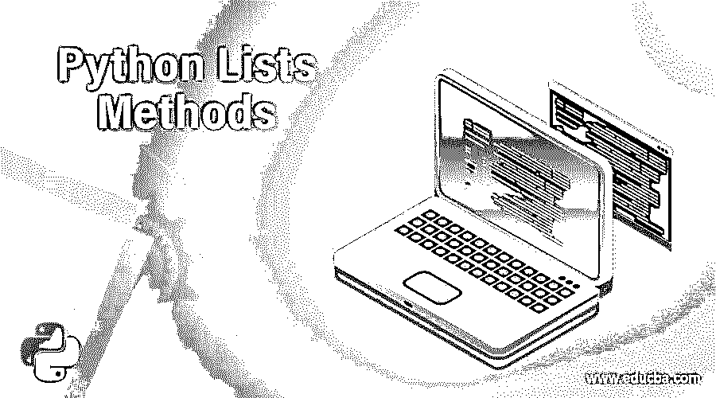

# Python 列出了方法

> 原文：<https://www.educba.com/python-lists-methods/>




## Python 列表方法的定义

Python 列表包含方括号中的值的集合的数据结构，可以使用 python 编程语言中预定义的各种方法来方便地对其进行静音，其中一些方法包括各种操作，从向列表添加值、移除或删除值、从列表中分割特定值、对列表中的值进行排序或重新排列，到对列表执行数值操作，例如最小值、最大值、求和等。在本主题中，我们将学习 python 列表方法。

### Python 列表方法的类型

python 为列表提供的一些内置特性或方法有:

<small>网页开发、编程语言、软件测试&其他</small>

*   附加
*   插入
*   扩展
*   数值方法(总和、计数、指数、最小值和最大值)
*   长度
*   分类
*   反面的
*   流行音乐
*   删除/移除

我们将通过例子讨论所有这些类型，以便清楚地理解 python 中的这些内置方法。

#### 1.附加

Python list append 允许我们向现有列表中添加元素或值。

```
list.append (value)
```

**代码:**

```
lis1=["Horse","Shoe","Turtle",179, 200, 544]
lis1.append('snail')
print(lis1)
```

**输出:**


在本例中，我们创建了一个包含数字和字符串的列表 lis1，并为该列表追加了一个新的字符串值，结果输出是列表中包含了追加的元素。

#### 2.插入

Python list insert 允许我们在列表中的特定位置插入一个值。

```
List.insert(position,value)
```

**代号:**

```
lis1=["Horse","Shoe","Turtle",179, 200, 544]
lis1.insert(3,'snail')
print(lis1)
```

**输出:**


在本例中，我们使用了 lis1 在值“Turtle”旁边的现有 lis1 的第 3 个<sup>和第 1 个</sup>位置插入了一个新字符串，并打印了结果输出。**T3】**

#### 3.扩展

Python list extends 方法允许我们将一个或多个列表加入到一个新列表中，该列表是给定两个列表的扩展版本。

```
List.extend(List)
```

**代号:**

```
lis1=["Horse","Shoe","Turtle"]
lis2=[179, 200, 544]
lis1.extend(lis2)
print(lis1)
lis2.extend(lis1)
print(lis2)
```

**输出:**


两个列表 lis1 和 lis2 以任意一种方式扩展，并输出两个列表的连接结果。

#### 4.总和

当我们在处理数值时，可以用 list sum 方法得到列表中所有元素的总和。

```
sum(list)
```

**代号:**

```
lis2=[179, 200, 544]
sum(lis2)
```

**输出:****T3】**


#### 5.数数

python 中的 count 方法给出了给定值在列表中出现的总次数。

```
List.count(value)
```

**代号:**

```
lis=["Horse","Shoe","Turtle",179, 200, 544,"Shoe"]
lis.count('Shoe')
```

**输出:****T3】**


元素“Shoe”在给定的列表中出现了两次，因此 count 函数识别出确切的元素，并计算出元素“Shoe”出现的次数，然后返回输出。

#### 6.索引

Python 列表索引方法有助于确定列表中元素的索引位置。当我们想要缩小在列表中搜索的元素或值的范围时，可以用 start 和 end 参数给出它。

```
List.index(value,([start,end])
```

**代号:**

```
lis=["Horse","Shoe","Turtle",179, 200, 544,"Shoe"]
print(lis.index("Turtle"))
print(lis.index(179,2,5))
```

**输出:****T3】**


在这个例子中，我们在包含字符串和数值的列表中找到两个元素的索引值。在第 1 条<sup>第 1 条</sup>打印语句中，我们找到了字符串“Turtle”的索引，它位于列表中的第 2 条<sup>第 2 条</sup>位置，在第 2 条<sup>第 2 条</sup>打印语句中，我们找到了数字 179 的索引值，我们给出了从 2 到 5 的开始和结束索引参数，结果输出给出了值 3，这是值 179 的位置。如果我们在列表边界之外给出开始和结束参数，那么编译器会抛出一个错误。

#### 7.最小和最大

Min 和 Max 方法允许我们识别列表中最小值元素和最大值元素。

```
min(List)
```

```
max(List)
```

**代码:**

```
lis=[179, 200, 544, 11, 18, 2000]
print(min(lis))
print(max(lis))
```

**输出:**


上面的例子给出了数字元素列表中可用的最小值和最大值。

#### 8.长度

python 列表中的 length 方法给出了列表的总长度或总字符数。它包括列表元素之间的所有字符串、数字、特殊字符和空格。

**代号:**

```
lis1=[179, 200, 544, 11, 18, 2000]
lis2="Dostoevsky is a legendary writer"
print(len(lis1))
print(len(lis2))
```

**输出:**


在这个例子中，我们声明了两个列表，一个是数字值，另一个是包含所有字符串值的语句。在 1 <sup>st</sup> 列表中，length 函数计算列表中的元素总数，为 6，而在 2 <sup>nd</sup> 列表中，我们有所有的字符串值，所以所有的字母和空格都被认为是字符，我们得到的总长度为 32。

#### 9.分类

python 列表和元组中都可以使用 Sort 方法；它的功能是按升序排列列表或元组。因此，sort 方法按升序排列列表中的元素。

```
List.sort()
```

**代号:**

```
lis1=[179, 200, 544, 11, 18, 2000]
print(sorted(lis1))
```

**输出:**


我们给出的列表按照值的升序排序。

#### 10.反面的

给出一个反向标志，以降序重新排列列表中的值。

```
List.sort(reverse_Flag=True)
```

**代码:**

```
lis1=[179, 200, 544, 11, 18, 2000]
lis1.sort(reverse=True)
lis1
```

**输出:**


当反向标志为真时，反向排序开始。

#### 11.流行音乐

python 列表中的 pop 方法用于提取列表中的特定元素。如果没有给定 index 参数，那么默认情况下，pop 函数将获取列表中的最后一个元素。

**代码:**

```
lis1=[179, 200, 544, 11, 18, 2000]
print(lis1.pop())
print(lis1.pop(2))
```

**输出:****T3】**


第 1 个 <sup>st</sup> print 语句打印列表中的最后一个元素，因为我们还没有声明 index 参数。在第 2 个<sup>和第 2 个</sup>打印语句中，我们声明了索引 2，输出弹出列表中的第 2 个<sup>和第 2 个</sup>位置。

#### 12.删除/移除

此方法删除或移除列表中的特定元素，delete 和 remove 函数在声明时执行类似的操作。

**代码:**

```
lis1=[179, 200, 544, 11, 18, 2000]
del lis1[1]
print(lis1)
lis1.remove(11)
print(lis1)
```

**输出:**


delete 方法删除了索引 1 中的给定元素，remove 方法删除了列表中给定的特定值 11。

### 结论

在本文中，我们使用各种示例详细讨论了 python 列表方法。此外，我们已经提到了不同方法的定义，这些方法的例子也被打印出来。使用列表时，python 中的 list 方法对于执行各种操作非常有用。

### 推荐文章

这是 Python 列表方法的指南。在这里，我们讨论不同类型的 Python 列表方法以及示例和它们的代码实现。您也可以阅读以下文章，了解更多信息——

1.  [Python 列表索引](https://www.educba.com/python-list-index/)
2.  [字符串长度 Python](https://www.educba.com/string-length-python/)
3.  [Python 唯一列表](https://www.educba.com/python-unique-list/)
4.  [Python 排序列表](https://www.educba.com/python-sort-list/)