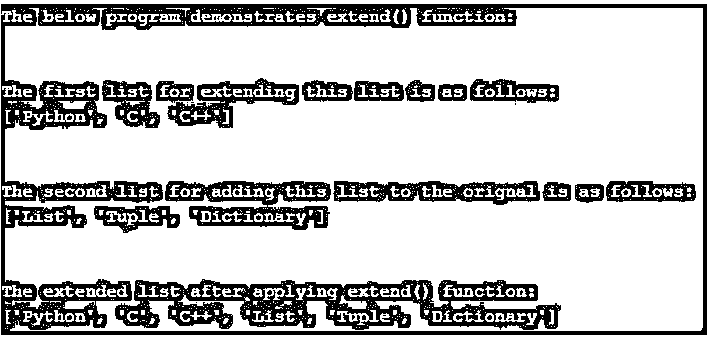
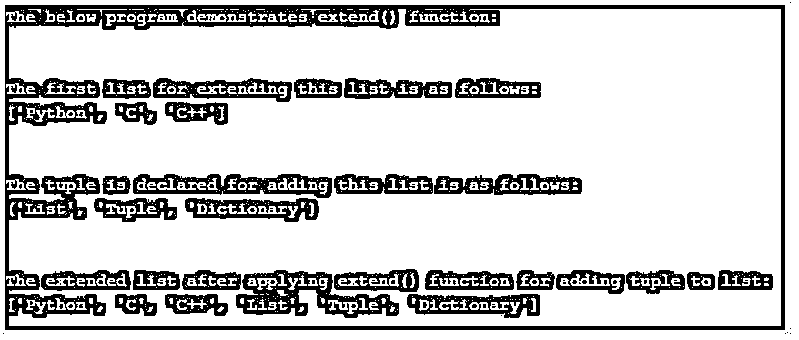

# Python 列表扩展

> 原文：<https://www.educba.com/python-list-extend/>


## Python 列表扩展简介

以下文章提供了 Python List extend 的概要。这里，我们看到了列表中的另一个方法，比如 extend()方法。在 Python 中，列表是一种数据结构，其中所有元素或项目都是有序序列。有许多方法可以在列表中应用，这也是列表中的一个。当给定的列表需要扩展时，我们使用这个叫做 extend()的方法。extend()方法是将列表附加到先前的原始列表的另一种方式。该方法将所有元素添加到给定的原始列表中。还有其他方法来扩展列表，通过使用 append()函数或使用“+”操作符，甚至通过使用切片方法，我们也可以扩展给定的列表。

### 列表中 extend()方法的使用示例

extend()方法专门用于列表，它主要用于通过将新列表的给定新元素添加到先前列表来扩展给定列表。新列表被添加到先前列表或需要扩展的列表的末尾。

<small>网页开发、编程语言、软件测试&其他</small>

现在让我们通过一个例子来看看 extend()方法的语法。

**语法:**

list 的 extend()方法的语法如下:

```
List.extend(any_iterable)
```

**参数:**

*   **Any_iterable:** iterable 表示任何数据结构都可以作为参数传递，如元组、集合、列表等。

所以这个方法的返回值是 nothing，它不返回任何东西，而是通过添加作为参数传递的列表元素来修改给定的原始列表。因此，现有列表通过添加在方法的参数中传递的元素来增加元素的数量。

**举例:**

现在让我们看一下应用于列表的 extend()方法的简单例子。

**代码:**

```
print("The below program demonstrates extend() function:")
print("\n")
programs = ['Python', 'C', 'C++']
print("The first list for extending this list is as follows:")
print(programs)
print("\n")
Topics = ['List', 'Tuple', 'Dictionary']
print("The second list for adding this list to the orignal is as follows:")
print(Topics)
print("\n")
programs.extend(Topics)
print("The extended list after applying extend() function:")
print(programs)
```

**输出:**




在上面的程序中，我们可以看到我们已经声明了一个名为“programs”的列表，其中有三个元素，需要添加到第一个列表中的第二个列表被声明为名为“Topics”，其中也有三个元素。然后我们使用 extend()函数，通过添加第二个列表“主题”来扩展第一个列表“程序”。因此，这是通过语句“programs.extend (Topics)”来完成的。这个程序产生了修改后的第一个列表，它现在包含六个元素，我们可以看到第二个列表的所有元素都被添加到了第一个列表的末尾。结果可以从上面的截图中看到。

所以这个方法的工作原理类似于将列表合并到给定的列表中。该方法还有助于将元组添加到列表中，从而获得一个单一列表。

让我们用上面的例子来看看这是如何做到的。

**举例:**

**代码:**

```
print("The below program demonstrates extend() function:")
print("\n")
programs = ['Python', 'C', 'C++']
print("The first list for extending this list is as follows:")
print(programs)
print("\n")
Topics = ('List', 'Tuple', 'Dictionary')
print("The tuple is declared for adding this list is as follows:")
print(Topics)
print("\n")
programs.extend(Topics)
print("The extended list after applying extend() function for adding tuple to list:")
print(programs)
```

**输出:**




在上面的程序中，我们可以看到我们已经声明了一个列表和一个元组。列表名为“programs ”,元组名为“Topics”。然后，我们应用 extend()函数，这是通过语句“programs.extend(Topics)”完成的，该语句将元组“Topics”添加到列表“programs”中以获得单个列表，结果可以在上面的屏幕截图中看到。在这里，我们可以看到这个方法只帮助扩展列表，并可以通过使用 extend()函数将 iterable 添加到列表中。

类似地，我们也可以通过上面两个例子中的 save as 将集合的元素添加到列表中。我们还可以通过添加集合中的元素来扩展列表。但是结果也将是相同的，这将输出包含列表和集合的所有元素的单个列表。

由于 extend()函数将任何 iterable 转换为 list，因此当我们试图添加一个 iterable 的元素(如 tuple、sets 等)时，当我们使用 extend()函数时，将首先转换为 list，然后它将 iterable 的所有元素添加到给定的 list 中以获得单个 list。

在 Python 中，extend()方法和 append()方法的工作原理是相同的。但是在 Python 中使用这些方法几乎没有区别。这两种方法的主要区别在于 append()函数将作为参数传递的列表中的所有元素作为单个元素添加到给定列表的末尾，而 extend()函数遍历传递给它的参数，将每个元素添加到给定列表中。

### 结论

在本文中，我们得出结论，Python 中 list 的 extend()函数用于扩展 list，方法是将 list 的所有元素添加到给定的 list 中，以获得单个 list。在本文中，我们看到了一个关于 extend()函数的简单示例，它将一个列表中的元素添加到另一个列表中。然后我们看到了另一个例子，将元组的所有元素添加到另一个给定的列表中。因此，这可以通过将集合的元素添加到列表中来完成。因此，所有的方法都是通过使用 extend()函数获得一个列表，在 Python 中，append()函数的工作方式与 extend()函数相似，我们已经在本文中提到了这些函数之间的区别。

### 推荐文章

这是一个 Python 列表扩展的指南。这里我们结合实例讨论 list 的 extend()方法的介绍和工作原理。您也可以看看以下文章，了解更多信息–

1.  [Python 操作系统模块](https://www.educba.com/python-os-module/)
2.  [字符串长度 Python](https://www.educba.com/string-length-python/)
3.  [Python 事件循环](https://www.educba.com/python-event-loop/)
4.  [Python 写 CSV 文件](https://www.educba.com/python-write-csv-file/)