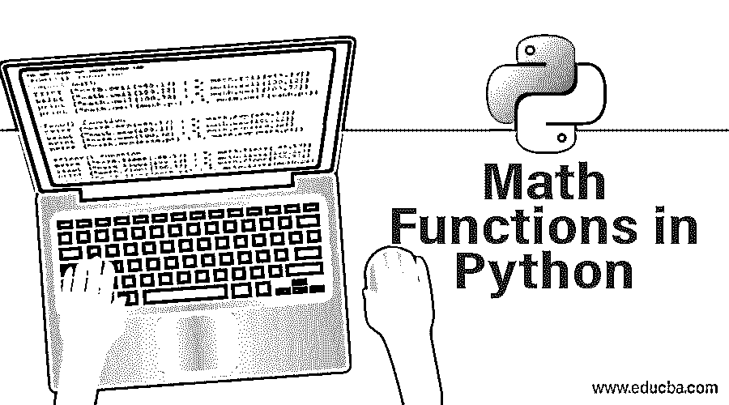
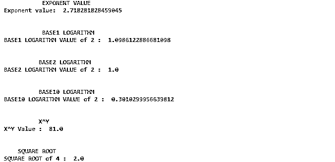
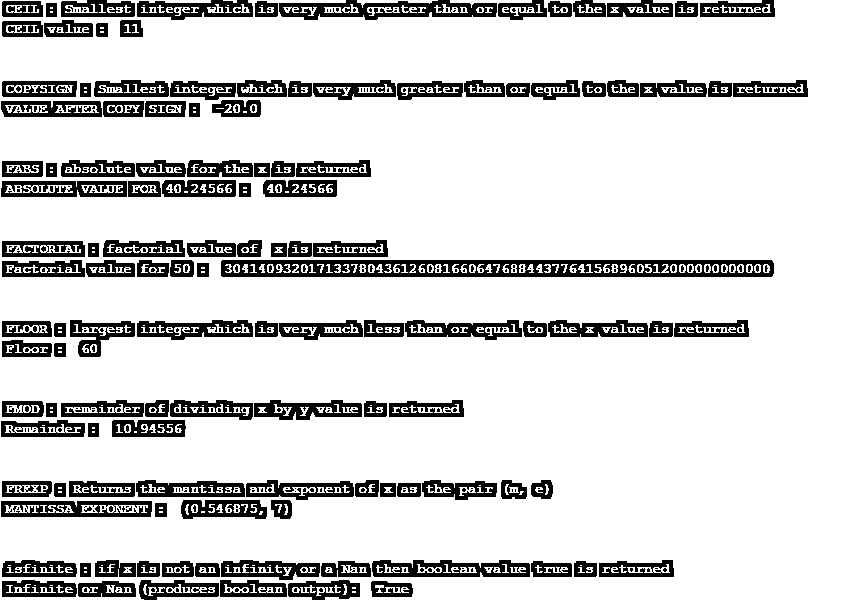

# Python 中的数学函数

> 原文：<https://www.educba.com/math-functions-in-python/>




## Python 中数学函数的介绍

在 Python 中，数学函数是带有通用隐式值的预定义数学动作的集合，这些隐式值可以直接用于程序中的数学运算。python 中有几个这样的数学函数，比如常数(pi 表示返回值 3.141592，E 表示返回值 0.718282，nan 表示非数字，inf 表示无穷大)，对数函数(exp(x)返回 e**x)，expm1(x)返回 e**x-1，log2(x)返回 x 的对数值，sqrt(x)返回 x 的平方根值)，数值函数(factorial(x)，isinf(x)，remainder(x，y)返回用于除法的余数的值

### Python 中不同的数学函数

所有关键的数学函数将在下面详细描述，

<small>网页开发、编程语言、软件测试&其他</small>

#### 1.常数

在数学常数的情况下，该常数的值由明确的定义表示；在某些情况下，这些定义是用任何特殊符号或许多著名数学家的名字或任何其他流行的方式来表示的。常数出现在[数学](https://en.wikipedia.org/wiki/Mathematics)的众多领域中，如π和 e 等常数出现在数论、几何和微积分等各种环境中。

常数的意义“自然地”出现，并使常数“有趣”是在适当的时候需要的材料，一些数学常数更突出的时间理由，而不是他们的基本数学兴趣。更受欢迎的常数一直被研究，并计算到许多小数位。

| **常数** | **描述** |
| 圆周率 | 返回 3.141592 |
| 英语字母表中第五个字母 | 返回 0.718282 |
| 圆盘烤饼 | 不是数字 |
| 中程核力量 | 无限的；无边的 |

**举例:**

```
import math
print( "       CONSTANTS IN PYTHON       ")
print(" PI value : " , math.pi)
print(" E value : " , math.e)
print(" nan value : " , math.nan)
print(" E value : " , math.inf) 
```

**输出:**


#### 2.对数函数

取幂的倒数叫做对数。对于任何给定的数 x，为了确定其各自的对数值，计算另一个以 b 为底的固定数的指数。在更直接的情况下，对数计算或计数重复乘法中相同因子的数字出现次数；

例:1000 = 10 × 10 × 10 = 103，那么 1000 的“以 10 为底的对数”就是 3。x 以 b 为底的对数表示为 logb (x)。

另一方面，数字的指数意味着该数字在乘法因子中使用的次数。

例如:82 = 8 × 8 = 64

换句话说，82 的表示可以称为“8 的 2 次方”,或者简称为“8 的平方”。另一方面，一个数的指数意味着该数在乘法因子中使用的次数。

| **功能** | **描述** |
| exp(x) | 返回 e**x |
| expm1(x) | 返回 e * * x–1 |
| log(x[，base]) | 返回以 x 为底的对数 |
| log1p(x) | 返回 x 值的以 1 为底的对数 |
| 对数 2(x) | 返回 x 值的以 2 为底的对数 |
| log10(x) | 返回 x 值的以 10 为底的对数 |
| 功率(x，y) | 返回 x 的 y 次幂 |
| sqrt(x) | 返回 x 的平方根值 |

**举例:**

```
import math

#variable declaration and assignation

Number_1 = 1
Number_2 = 2 
Number_3 = 3
Number_4 = 4

# Applying exp() function
print("            EXPONENT VALUE                     ")
print(" Exponent value: " , math.exp(Number_1))
print(" \n ")

# Applying Base1 logarithm function
print("            BASE1 LOGARITHM  " )
print(" BASE1 LOGARITHM VALUE of 2 : ", math.log1p(Number_2))
print(" \n " )

# Applying Base2 logarithm function
print("           BASE2 LOGARITHM  " )
print(" BASE2 LOGARITHM VALUE of 2 : ", math.log2(Number_2))
print(" \n " )

# Applying Base10 logarithm function
print("           BASE10 LOGARITHM  " )
print(" BASE10 LOGARITHM VALUE of 2 : ", math.log10(Number_2))
print(" \n " )

# Applying x to power of Y
print("           X^Y" )
print(" X^Y Value : ", math.pow(Number_3,Number_4))
print(" \n " )

# Applying square root determination
print("     SQUARE ROOT " )
print(" SQUARE ROOT of 4 : ", math.sqrt(Number_4))
print(" \n " ) 
```

**输出:**




#### 3.数字函数

数字函数允许计算所有的数学概念。

| **常数** | **描述** |
| 上限(x) | 返回远大于或等于 x 值的最小整数 |
| 复制符号(x，y) | 使用 y 的符号，返回 x 的值 |
| 晶圆厂(十) | 返回 x 的绝对值 |
| 阶乘 | 返回 x 的阶乘值 |
| 楼层(x) | 返回比 x 值小得多的最大整数 |
| fmod(x, y) | 返回 x 除以 y 值的余数 |
| frexp(x) | 返回 x 的尾数和指数对(m，e) |
| fsum(可迭代) | 返回 iterable 中值的精确浮点和 |
| isfinite(x) | 如果 x 不是无穷大或 Nan，则返回布尔值 true |
| isinf(x) | 如果 x 包含正无穷大或负无穷大，则返回 true |
| isnan(x) | 如果 x 是 NaN，则返回 True |
| gcd(x，y) | 对于 x 和 y 值，返回最大公约数 |
| 余数(x，y) | 求 x 除以 y 后的余数。 |

**举例:**

```
import math

#variable declaration and assignation

Number_1 = 10.5
Number_2 = 20
Number_3 = -30
Number_4 = -40.24566
Number_5 = 50
Number_6 = 60.94556
Number_7 = 70
Number_8 = 80

# Applying Ceil() function
print( " CEIL : Smallest integer which is very much greater than or equal to the x value is returned  ")
print( " CEIL value : " , math.ceil(Number_1))
print( " \n " )

# Applying Copysign() function
print( " COPYSIGN : Smallest integer which is very much greater than or equal to the x value is returned  ")
Temp_var1 = math.copysign(Number_2,Number_3)
print(" VALUE AFTER COPY SIGN : ", Temp_var1)
print(" \n ")

# Applying fabs() function
print( " FABS : absolute value for the x is returned  ")
print(" ABSOLUTE VALUE FOR 40.24566 : ", math.fabs(Number_4))
print(" \n ")

# Applying Factorial() function
print(" FACTORIAL : factorial value of  x is returned  ")
print(" Factorial value for 50 : ", math.factorial(Number_5))
print(" \n ")

# Applying Floor() function
print(" FLOOR : largest integer which is very much less than or equal to the x value is returned " )
print(" Floor : ", math.floor(Number_6))
print(" \n ")

# Applying Fmod() function
print(" FMOD : remainder of divinding x by y value is returned ")
print(" Remainder : ", math.fmod(Number_6,Number_5))
print(" \n ")

# Applying Frexp() function
print( " FREXP : Returns the mantissa and exponent of x as the pair (m, e) " )
print(" MANTISSA EXPONENT : ", math.frexp(Number_7))
print( " \n " )

# Applying isfinite() function
print(" isfinite : if x is not an infinity or a Nan then boolean value true is returned ")
print(" Infinite or Nan (produces boolean output): ", math.isfinite(Number_8))
print(" \n ")

# Applying gcd() function
print(" GCD : for x and y value the most greates common divisor value is returned ")
print(" Greatest Common divisor value : ", math.gcd(Number_8,Number_7))
print(" \n ") 
```

**输出:**




#### 4.三角函数

在数学中，[三角函数](https://www.educba.com/trigonometric-functions-in-python/)用来叙述直角三角形两个边长的一个观点。它们在与几何相关的科学中有大量的应用；这包括固体力学，天体力学，航海，还有很多其他的。这些被认为是简单的周期函数，并因代表从[傅立叶分析](https://en.wikipedia.org/wiki/Fourier_analysis)开始到结束的周期现象而广为人知。

| **功能** | **描述** |
| 罪恶(x) | 确定 x 的正弦值，单位为弧度 |
| cos(x) | 需要确定以弧度表示的 x 的余弦值 |
| 谭(x) | 需要确定以弧度表示的 x 的正切值 |
| 度(x) | 弧度到度数的转换 |
| 弧度(x) | 弧度转换的度数 |

**举例:**

```
import math
print(" \n ")
print("   TRIGNOMETRIC FUNCTION USAGE                        " )
print(" \n ")
print(' The value of Sin(90 degree) : ' + str(math.sin(math.radians(90))))
print(' The value of cos(90 degree) : ' + str(math.cos(math.radians(90))))
print(' The value of tan(pi) : ' + str(math.tan(math.pi)))
print(" \n ")
```

**输出:**


### 结论–Python 中的数学函数

像许多其他编程语言一样，python 也提供了一组非常多样化的数学函数，这使它成为编程领域中一种强有力的高级编程语言。

### 推荐文章

这是 Python 中数学函数的指南。这里我们用例子讨论 Python 中不同的数学函数。您还可以浏览我们推荐的其他文章——

1.  [Python 中的字符串数组](https://www.educba.com/string-array-in-python/)
2.  [Python 文件操作](https://www.educba.com/python-file-operations/)
3.  [c#中的数学函数](https://www.educba.com/math-functions-in-c-sharp/)
4.  [C 语言中的数学函数](https://www.educba.com/math-functions-in-c/)


