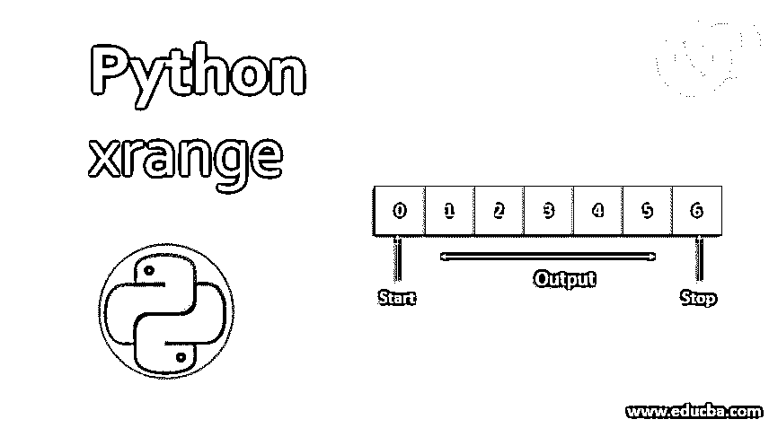

# Python xrange

> 原文：<https://www.educba.com/python-xrange/>




## Python xrange 简介

Python xrange 函数是 python 2 的内置函数。它在 python 3 中不再可用。它是 python 中 range 的重复函数。range 函数返回列表，而 xrange 函数返回对象而不是列表。XRange 函数的工作方式与 Range 函数非常相似。它返回与 range 函数语法相同的值列表。如果我们想要生成数字列表，那么我们可以使用 xrange 函数并使用 for 循环打印这些值。

### Python xrange 是如何工作的？

Xrange 函数比 range 函数最小，因为它以懒惰的执行方式工作。假设我们有一个大范围的值，如果我们正在执行 range 函数，那么它将生成一个巨大的数字列表，它将被保存到内存中，虽然我们可能不会使用列表中的所有值，但在 xrange 函数的情况下，它只会在被调用时生成值。数据仅按需生成；这就是为什么它也被称为懒惰的评价方式。与 xrange 函数相比，range 函数消耗的内存更多，因为它返回 xrange 对象。

<small>网页开发、编程语言、软件测试&其他</small>

与 range 函数相比，使用 xrange 函数有一个缺点，因为它不返回列表类型。所以我们不能对它执行列表类型的操作，但是我们可以在 range 函数上执行。

**语法:**

```
a = xrange(start, stop, step)
```

XRange 函数生成输出不可变的数字序列，通常用于循环的情况。我们传递给范围构造函数的参数必须是整数类型。它可以构建在实现 __index__ special 方法的“int”或对象中。XRange 函数执行除串联和重复之外的所有序列操作。

如果我们不传递 step 方法，它将 1 作为增量值的默认值，如果我们不传递 start 参数，那么它将 0 作为默认值。

**代码:**

```
a = range(10)
x = xrange(10)
print(type(a))
print(type(x))
```

**输出:**


如您所见，我们有 range 函数和 xrange 函数，在这两个函数中，我们只传递了一个参数。如果我们检查两个函数的类型，range 函数返回一个列表，xrange 返回 xrange 对象。

**代码:**

```
a = range(10)
x = xrange(10)
print(a)
print(x)
```

**输出:**


如果我们尝试打印这两个函数，正如你所看到的，你会得到 range 函数的结果，但是 xrange 只返回对象，而不是值。我们只能在循环内部使用 xrange。

### Python xrange 的示例

python xrange 的示例如下:

#### 示例#1

**代码:**

```
for i in xrange(7):
    print(i)
```

**输出:**


在上面的程序中，我们在循环内部创建了一个 xrange。我们没有指定任何起始值，所以它将把 0 作为默认的起始值，增量值默认为 1，因为我们也没有指定步长。所以 7 会被当作一个索引。从输出列表中我们可以看到，从 0 开始，到 6 结束。值仅是索引位置 7。所以最终值是-1。步骤参数不能采用 0 或任何浮点值。0，1，2，…，end–1 = > 0，1，2，3，4

#### 实施例 2

**代码:**

```
for i in xrange(2,8):
 print(i)
```

**输出:**


在上面的程序中，我们在 xrange 函数中传递了起始值和索引参数。所以执行会从 2 值开始，到索引位置 8 结束。我们没有传递任何步长值，所以默认情况下，步长默认被认为是 1。

开始，开始+1，开始+2，…。，end-1 = >

#### 实施例 3

**代码:**

```
for i in xrange(2,10,2):
 print(i)
```

**输出:**


在上面的程序中，我们有 xrange 函数，我们已经传递了所有三个参数，即开始步骤和索引参数。2 是起始值，因此该值将从 2 开始打印。10 是索引值，因此根据索引位置，9 出现在第 10 个位置，但是 9 不会被打印，因为我们有一个步骤 2，它只打印从 2 开始的偶数。

##### 在范围函数中使用浮点值

**代码:**

```
for i in xrange(1,10.5,2):
 print(i)
```

**输出:**


我们在上面的程序中定义了 1 作为起始值，10 作为索引，2.5 作为步长值。如您所见，如果我们在该范围内定义了浮点值，即 2.5，python 返回了浮点对象错误，因为 python 需要一个整数值，但它未能将浮点值解释为整数值。

##### 倒车范围功能

**代码:**

```
for i in xrange(4,-10,-2):
  print(i)
```

**输出:**


在上面的程序中，我们使用 4 作为开始，结束值为-10。因此范围函数只会迭代到值 10，步长为-2。所以会像 0，0 (+) -2，0 + (2)*-2，0 + (2)*-3 …

### 结论

xrange 是一个非常有用的函数；它以 3 个值作为参数，开始、结束和步进。步长不能为零；否则会生成 python 错误，参数应该是整数值；浮点数是不行的。XRange 函数输出 XRange 对象，只能在循环内部使用。

### 推荐文章

这是 Python xrange 的指南。这里我们讨论 python xrange 的简介和工作原理，以及不同的例子和代码实现。您也可以阅读以下文章，了解更多信息——

1.  [Python Web 开发](https://www.educba.com/python-web-development/)
2.  [Python 内置函数](https://www.educba.com/python-built-in-functions/)
3.  [巨蟒屈服](https://www.educba.com/python-yield/)
4.  [Python 线程池](https://www.educba.com/python-threadpool/)


