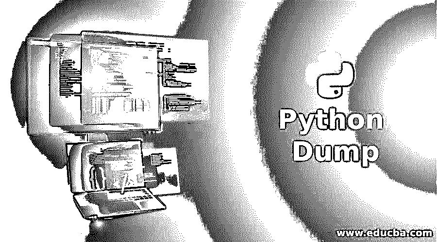
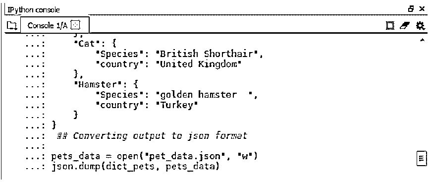
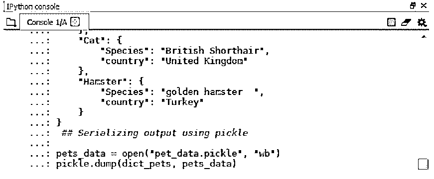
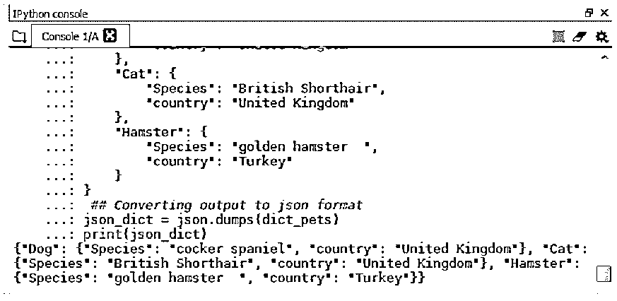
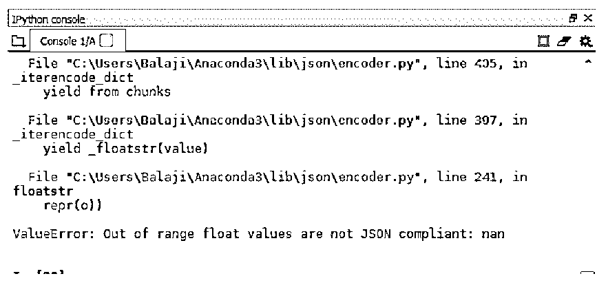
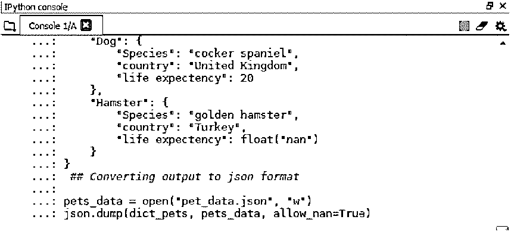

# Python 转储

> 原文：<https://www.educba.com/python-dump/>




## Python 转储的定义

Python 支持 json 包，该包内置用于执行脚本文件，该脚本文件包含可用于传输和存储数据的文本编程代码。可以通过调用 python 中的 json 包来实现。json 中的 dump 函数支持以键-值对编写的代码，类似于花括号中的 python 字典。dumps 函数主要用于存储和传输 python 对象，json 包允许我们高效地执行操作。

### 句法

python 转储函数通过在 python 中导入 json 和 pickle 等包来使用，这两个函数的基本语法是，

<small>网页开发、编程语言、软件测试&其他</small>

```
json.dump(object, skipkeys=False, ensure_ascii=True, indent=None, allow_nan=True, number_mode = None, datetime_mode = None, separators=None)
```

```
pickle.dump(Object, Destination, pickle_protocol=None, )
```

*   json.dump 表示将 python 对象值编码并存储到 json 值中的函数。
*   对象是输入数据的文件名或我们通过转储函数传递的值。
*   skipkeys 是一个参数，我们将在其中声明布尔值，无论我们是否希望跳过无效的字典键。
*   这是一个参数，我们将在其中声明布尔值，以确保输出中是否包含 ascii 值。
*   indent 是一个参数，json 代码以整齐的缩进打印。
*   allow_nan 也是一个布尔参数，用于允许空值。
*   number_mode & datetime_mode 允许我们处理我们在函数中处理的行为类型，datetime 模式允许处理数据和时间实例的格式。
*   分隔符有两个用途，我们可以向参数声明一个或两个值。我们首先给出的值表示一个键值对与其他键值对的分离。我们给出的第二个值表示将键与其值分开的符号。

`For pickle package,`

*   对象是我们创建来进行酸洗的 python 对象
*   目的地是写入 pickled python 对象的文件或数据
*   Pickle_protocol 是指默认情况下它分配给 python 版本的 Pickle 协议的版本。

### Python 转储函数是如何工作的？

让我们讨论一个基本的例子来理解 json 转储函数是如何工作的。

#### 示例#1

**代码:**

```
import json

# python dictionary

dict_pets ={
    "Dog": {
        "Species": "cocker spaniel",
        "country": "United Kingdom"
    },
    "Cat": {
        "Species": "British Shorthair",
        "country": "United Kingdom"
    },
    "Hamster": {
        "Species": "golden hamster  ",
        "country": "Turkey"
    }        
}
 ## Converting output to json format

pets_data = open("pet_data.json", "w")    
json.dump(dict_pets, pets_data)
```

**输出:**




在本例中，我们创建了一个包含三个键值对的 python 字典，并使用 json 包将 python 字典转换为 json 文件格式。然后在 json 转储函数中声明字典变量，以获得 json 格式的输出。这里，当我们使用 json.dump 函数时，我们需要两个位置参数(dict_pets 和 pets_data ),因为 dict_pets 表示我们想要序列化的 python 对象，而 pets_data 是存储或写入 json 输出的文件。

#### 实施例 2

在这个例子中，我们将讨论 python 中名为 pickle 的包，它帮助我们序列化 python 对象。

**代码:**

```
import pickle

# python dictionary

dict_pets ={
    "Dog": {
        "Species": "cocker spaniel",
        "country": "United Kingdom"
    },
    "Cat": {
        "Species": "British Shorthair",
        "country": "United Kingdom"
    },
    "Hamster": {
        "Species": "golden hamster  ",
        "country": "Turkey"
    }        
}
  ## Serializing output using pickle

pets_data = open("pet_data.pickle", "wb")    
pickle.dump(dict_pets, pets_data)
```

**输出:**




与 json 类似，我们已经使用 pickle 包转储了 python 对象，pickle 包是 python 中一个非常特殊的库，我们可以使用 pickle.dump()函数序列化 python 对象。我们已经声明了三个 python 字典，并尝试以 pickle 格式转储字典对象。该方法主要用于用 python 代码编写的对象，其他语言的代码不能使用 pickle 函数序列化或转储。“wb”是我们在 pickle 函数中使用的参数，该函数对写入模式和二进制模式开放。

#### 实施例 3

让我们讨论另一个例子，我们使用 json dumps()函数，它类似于 dump()函数，但是 dumps()函数允许我们将 python 字典对象转换成 json 格式的字符串文件。

**代码:**

```
import json

import json

# python dictionary

dict_pets ={
    "Dog": {
        "Species": "cocker spaniel",
        "country": "United Kingdom"
    },
    "Cat": {
        "Species": "British Shorthair",
        "country": "United Kingdom"
    },
    "Hamster": {
        "Species": "golden hamster  ",
        "country": "Turkey"
    }        
}
 ## Converting output to json format
json_dict = json.dumps(dict_pets)
print(json_dict)
```

**输出:**




与第一个示例类似，我们用相同的三个键值对创建了 python 字典，这里我们在 dumps()函数中只传递了一个位置参数，而 json.dump()需要两个位置参数。由于我们要将 python 对象转换成 json 字符串格式，所以我们只需要 object 变量。

#### 实施例 4

在本例中，我们使用了 allow_nan 参数，这是我们之前讨论过的参数之一，因此我们将尝试使用具有 nan 值的 python 字典来实现该参数。

**代码:**

```
import json

import json

# python dictionary

dict_pets ={
    "Dog": {
        "Species": "cocker spaniel",
        "country": "United Kingdom"
    },
    "Cat": {
        "Species": "British Shorthair",
        "country": "United Kingdom"
    },
    "Hamster": {
        "Species": "golden hamster  ",
        "country": "Turkey"
    }        
}
 ## Converting output to json format
json_dict = json.dumps(dict_pets)
print(json_dict)
```

**输出:**




当我们将 allow_nan 参数声明为 True 时

```
import json

# python dictionary which should be dumped

dict_pets ={
    "Dog": {
        "Species": "cocker spaniel",
        "country": "United Kingdom",
        "life expectency": 20
    },
    "Hamster": {
        "Species": "golden hamster",
        "country": "Turkey",
        "life expectency": float("nan")
    }        
}
 ## Converting output to json format

pets_data = open("pet_data.json", "w")    
json.dump(dict_pets, pets_data, allow_nan=True)
```

**输出:**




我们可以从两个代码中看到，当我们将 allow_nan 参数设置为 True 时，当我们的对象有 nan 值时，我们可以将对象转储到 json 输出，而不会有任何问题。

### 结论

在本文中，我们使用各种示例详细讨论了 python dump 函数，以便对 json dump 函数及其用途有一个清晰的理解。我们还在示例中讨论了 pickle 包和 dumps()函数，并在示例中讨论了 allow_nan 参数的用法。希望这篇文章有所帮助。

### 推荐文章

这是 Python 转储的指南。在这里，我们还将讨论 python dump 函数的定义和工作方式，以及不同的示例和代码实现。您也可以看看以下文章，了解更多信息–

1.  [Python 名称错误](https://www.educba.com/python-nameerror/)
2.  [Python Unicode Error](https://www.educba.com/python-unicode-error/)
3.  [Python 操作系统模块](https://www.educba.com/python-os-module/)
4.  [字符串长度 Python](https://www.educba.com/string-length-python/)


