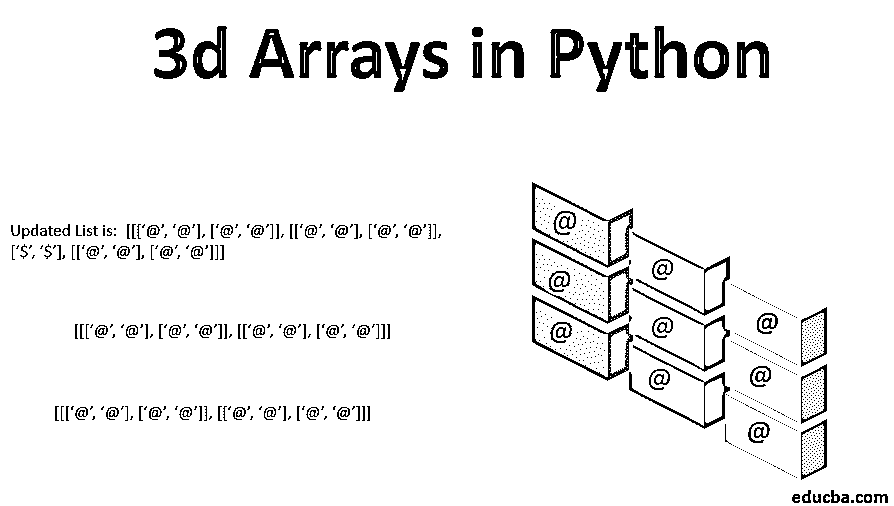

# Python 中的 3d 数组

> 原文：<https://www.educba.com/3d-arrays-in-python/>




## Python 中的 3D 数组简介

在开始 3d 数组之前，有一件事要清楚，数组存在于每一种编程语言中，在 python 中也有一些作用。每一种编程语言都有自己的行为，就像在编译器中编写的一样。很多人都有一个疑问:我们是否需要使用 3d 数组形式的列表，或者我们有 Numpy。答案是我们可以用列表来实现简单的 3d 数组。但是对于一些复杂的结构，我们有一个简单的方法，通过包含 [Numpy](https://www.educba.com/what-is-numpy/) 来实现。不建议用哪种方式。如何实现特定的功能取决于项目和需求。

### 图书馆是什么意思？

Python 有一组库定义来简化这项任务。出于高效使用 array 的同样原因，并且考虑到当今的需求，Python 有一个名为 Numpy 的库。Numpy 处理数组。Numpy 在机器学习中也很有用。当我们在 python 中遇到多维数组时，被包含在内是件好事。众所周知，数组将同质的数据项存储在单个变量中。Python 中的数组就是列表。请看下面的代码片段。这里，我们有一个命名颜色的列表。我们正在印刷颜色。这是一个我们可以说的简单的一维列表。

<small>网页开发、编程语言、软件测试&其他</small>

**例子**

```
colors = ["red", "blue", "orange"]
print(colors)
```

**输出:**


同样，[多维数组](https://www.educba.com/multidimensional-array-in-python/)或列表有行和列要定义。我们可以说多维数组是一组列表。

下面是一个二维数组或列表的例子。

**例子**

```
rows = int(input("Enter the no.of rows you want: "))
cols = int(input("Enter the number of cols you want: "))
myList = [[0 for c in range(cols)] for r in range(rows)]
for r in range(rows):
  for c in range(cols):
   myList[r][c]= r*c
print(myList)
```

**输出:**


在上面的例子中，我们只是从最终用户那里获取行数和列数的输入。之后，我们将各自的值存储在一个名为 rows 和 cols 的变量中。此外，我们创建了一个嵌套循环，并将其分配给一个名为 my list 的变量。在这里，我们只是将项目作为数字上的一个循环，我们以行和列的形式从最终用户那里获取这些数字。

之后，我们在行和列上循环。最后，我们根据最终用户提供的数字生成列表。

试试这个程序。如果您不知道 python 中的 for 循环是如何工作的，那么首先检查一下这个概念，然后再回到这里。你会更好地理解这一点。

### 在 Python 中是如何定义的？

假设我们有一个 1*3*3 的矩阵。我们需要以列表的形式定义它，那么它将是 3 项，3 行，3 列。

**T2】**


 **在上图中，每个集合中只有一个@,即每个集合中有一个元素。分别为 3 列和 3 行。

那我们怎么定义呢？在 python 中，借助于列表，我们可以定义这个三维数组。三维数组是数组的数组。嵌套时没有限制。

### 如何在 Python 中创建 3D 数组？

我们正在创建一个将被嵌套的列表。试试下面这个小例子。如果你熟悉 python for 循环，那么你会很容易理解下面的例子。

```
symbol = [[ ['@' for col in range(2)] for col in range(2)] for row in range(3)]
print(symbol)
```

**输出:**


如果你仔细观察上面的例子，我们有一个 list 类型的变量。有了方括号，我们在 python 中定义了一个列表。在列表中，我们已经借助 [range](https://www.educba.com/python-range-function/) 函数给出了 for 循环。它只是在一个集合中定义了两个元素。每个子列表将有两个这样的集合。我们在列表上总共有 3 个元素。

### 如何在 Python 中插入 3D 数组的元素？

Python 给了我们可能需要的所有解决方案。Python 中有许多预定义的方法。这些方法帮助我们向给定的列表中添加元素。Python 不完全支持数组。此时，为了简化数组，我们需要使用函数 insert。

请看看下面的程序。

**举例:**

```
mylist = [[['@', '@'], ['@', '@']], [['@', '@'], ['@', '@']], [['@', '@'], ['@', '@']]]
# number tuple
addition = ['$','$']
# inserting $ symbol in the existing list
mylist.insert(2, addition)
print('Updated List is: ', mylist)
```

**输出:**


在上面的程序中，我们在 python 提供的 insert 方法的帮助下插入了一个新的数组元素。在上面的程序中，我们有一个叫做 my list 的三维列表。

insert 方法有两个参数。一个是位置，即只有索引号。第二个是要插入到现有数组或列表中的实际元素。在这里，我们将元素放入一个我们想要插入的变量中。我们在我的列表上应用插入方法。

试着执行这个程序。尝试不同组合的输出。在上面的程序中，我们给的位置是 2。我们都知道数组索引从零(0)开始。这意味着在第 3 个<sup>和第 1 个</sup>位置添加了一个新元素，正如您在输出中看到的。

### Python 中如何移除 3D 数组的元素？

如果我们想删除一个列表/数组中的最后一个元素，我们使用一个 pop 方法。看下面的例子。这里我们移除了数组中的最后一个元素。我们有一个 pop()方法。此方法移除列表中的最后一个元素。我们在 3d 列表/数组中使用了 pop()方法，它给出了一个只有两个列表元素的结果。尝试下面的例子。

**例子**

```
symbol = [[ ['@' for col in range(2)] for col in range(2)] for row in range(3)]
symbol.pop()
print(symbol)
```

**输出:**


### Numpy

在这里，我们将看看 Numpy。我们已经知道，Numpy 是一个 python 包，用来处理 python 中的[数组](https://www.educba.com/arrays-in-python/)。让我们开始了解它是如何工作的。为了使用这个包，我们需要首先在我们的机器上安装它。要在 MAC 或 Linux 上安装它，请使用以下命令。

#### Pip 安装数量

我们来讨论一下如何在 NumPy 中安装 pip。

*   在 windows 上忘记了，需要通过 Numpy 的安装程序来安装。我们没有进入太多，因为我们用 numpy 运行的每个程序在我们的系统中都需要一个 Numpy。
*   Numpy 有一个预定义的函数，可以很容易地操作数组。数组通常类似于固定大小的数组。增加或减少数组的大小非常重要。Numpy 克服了这个问题，并为您提供了处理这个问题的良好功能。
*   要在您的机器上成功安装 Numpy 之后开始使用它，我们需要将它导入到我们的程序中。导入后，我们正在使用它的一个对象。
*   使用 Numpy 有一些新的流行词，就像每个软件包一样。如果你想了解更多关于 Numpy 的信息，请访问链接:[https://docs.scipy.org/doc/](https://docs.scipy.org/doc/)。
*   在这里你会找到最准确的数据和 Numpy 的当前更新版本。

### 结论

Python 是一种脚本语言，主要用于编写小型自动化脚本。如果我们仔细看看我们应该知道的需求，那么就是如何使用多维数组。使用 Python，我们可以用更少的代码编写一个大的脚本。许多新兴技术需要这方面的工作。ML，AI，大数据，Hadoop，自动化需要 python 在更少的时间内做更多的事情。像 Numpy 这样的包将是这方面的额外优势。

### 推荐文章

这是 Python 中 3d 数组的指南。这里我们讨论如何在 Python 中定义 3D 数组，以及在 Python 中创建、插入和删除 3D 数组的元素。您也可以阅读以下文章，了解更多信息——

1.  [Python 中的构造函数](https://www.educba.com/constructor-in-python/)
2.  [Python 中的布尔运算符](https://www.educba.com/boolean-operators-in-python/)
3.  [C 中的 3D 数组](https://www.educba.com/3d-arrays-in-c/)
4.  [Java 中的 3D 数组](https://www.educba.com/3d-arrays-in-java/)


**