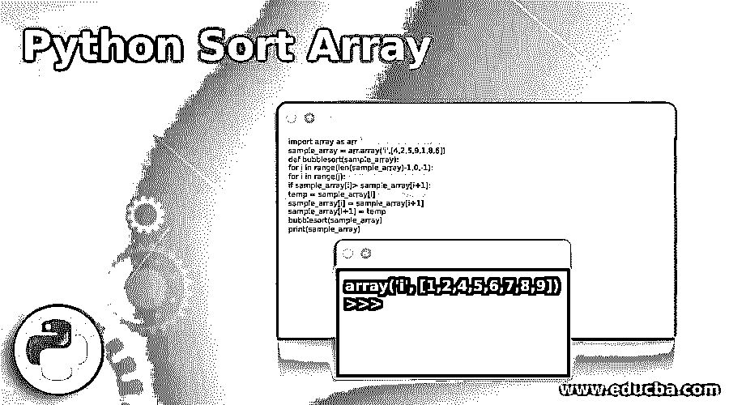

# Python 排序数组

> 原文：<https://www.educba.com/python-sort-array/>




## Python 排序数组简介

下面的文章提供了 Python 排序数组的概要。python 中的数组是一组类似于列表和元组的元素，但唯一的区别是数组可以有相同类型的值，而列表和元组也可以有其他类型的值。python 中数组的大小是不固定的；可以随时增减。如果要对数组元素进行升序或降序排序，就要做一个函数排序函数。我们必须先导入数组包来制作数组。

### Python 中排序数组是如何工作的？

与列表相比，python 中没有直接的方法可以对数组进行排序。在这种情况下，我们首先必须导入数组包，创建我们的数组类型。然后我们必须定制一个排序函数来对数组进行排序。有许多数据结构算法可用于排序。

<small>网页开发、编程语言、软件测试&其他</small>

例如，冒泡排序、选择排序和插入排序。

我们将对数组使用三种排序算法。

**让我们创建一个数组:**

*   将数组作为 arr 导入
*   sample_array = arr.array('I '，[4，2，5，9，1，8，6])

### Python 排序数组的示例

以下是 Python 排序数组的示例:

#### 示例 1–冒泡排序

**代码:**

```
import array as arr
sample_array = arr.array('i',[4,2,5,9,1,8,6])
def bubblesort(sample_array):
for j in range(len(sample_array)-1,0,-1):
for i in range(j):
if sample_array[i]> sample_array[i+1]:
temp = sample_array[i]
sample_array[i] = sample_array[i+1]
sample_array[i+1] = temp
bubblesort(sample_array)
print(sample_array)
```

**输出**:


**说明:**

*   上面的程序是冒泡排序。我们创建了一个整数类型的 sample_array 数组。我们知道，数组里面的每个值都是索引的，索引是从 0 开始的。排序时使用交换；我们已经创建了一个临时变量 temp，它将存储每次循环迭代的中间值。
*   在冒泡排序中，索引 I 与索引 i+1 进行比较；如果 index i > index i+1，我们使用 temp 变量交换这两个值。对索引+ 1 和索引+2 位置进行比较，直到最后一个索引。在这个内部循环完成之后，数组的最高值，即 9，现在是数组的最后一个元素。
*   现在，外部循环再次运行，内部循环针对所有值，直到所有值都已排序。len '函数计算数组的长度，数组将运行的次数，len–1 用作从 0 开始的数组。0 表示从(len–1)到 0 值，而-1 表示按降序排列。

#### 示例 2–选择排序

**代码:**

```
import array as arr
sample_array = arr.array('i',[4,2,5,9,1,8,6])
def selectionsort(sample_array):
for i in range(len(sample_array)):
min_val = i
for j in range( i +1, len(sample_array)):
if sample_array[min_val] > sample_array[j]:
min_val = j
sample_array[i], sample_array[min_val] = sample_array[min_val], sample_array[i]
sample_array = arr.array('i',[4,2,5,9,1,8,6])
selectionsort(sample_array)
print(sample_array)
```

**输出:**


**说明:**

*   在选择排序中，我们通过查找最小值对数组进行排序。首先，我们从整个数组中找到最小值，并将这个值与数组的第一个元素交换。然后忽略第一个值，从数组的其余部分中找到最小值；这样，我们就找到了第二个最小值，而这些值将被这个数组的第二个值交换。
*   现在我们从数组的第三个值中找到最小值，并继续交换；在这个数组中。在这种情况下，我们还必须使用一个临时变量来存储每次迭代的最小值。
*   在上面的程序中，我们运行了两个循环。对于内部循环，我们找到最小值，并将其赋给“I”变量。内循环运行 1 个值，外循环运行每个值。' min_val '存储数组的最小值，迭代时忽略它。

#### 示例 3–插入排序

**代码:**

```
import array as arr
sample_array = arr.array('i',[4,2,5,9,1,8,6])
def insertion_sort(sample_array):
for i in range(1, len(sample_array)):
j = i-1
temp = sample_array[i]
while (sample_array[j] > temp) and (j >= 0):
sample_array[j+1] = sample_array[j]
j=j-1
sample_array[j+1] = temp
sample_array = arr.array('i',[4,2,5,9,1,8,6])
insertion_sort(sample_array )
print(sample_array )
```

**输出:**


**说明:**

*   在插入排序中，我们考虑要排序的数组的第一个元素。现在我们挑选数组的第二个元素，并将其与第一个元素进行比较；如果第二个值大于第一个值，则将其放在第一个元素之后。现在第一个和第二个元素是 sort。现在我们挑选第三个元素与第一个元素进行比较；如果第三个元素小于第一个元素，则它被放置在第一个位置，并且第一个和第二个位置的元素向前移动。
*   如果第三个元素大于第一个元素，则将其与第二个元素进行比较。如果小则放置在第二个位置，第二个位置元素移动到第三个。如果元素更大，那么它被放置在第三个位置。现在，前三个元素已经排序。
*   这样，迭代一直持续到最后一个元素。第一个循环“1，len”表示元素从索引位置运行到数组的长度。temp 变量存储当前元素。j 正在存储一个索引位置。现在我们比较第一个元素的 index+1；如果为真，那么我们将 index + 1 元素放置到第二个位置。

### 结论

Python 数组是单一数据类型，我们没有任何特定的排序方法，所以我们编写自定义排序方法。有许多算法可用。你可以随便挑一个，这样比较快。走出那个泡泡，排序是最简单、最快速、最广泛使用的算法。

### 推荐文章

这是一个 Python 排序数组的指南。这里我们讨论一下入门，Python 中排序数组是如何工作的？并附有示例。您也可以看看以下文章，了解更多信息–

1.  [Python 中的归并排序](https://www.educba.com/merge-sort-in-python/)
2.  [在 Python 中断言](https://www.educba.com/assert-in-python/)
3.  [Python 私有变量](https://www.educba.com/python-private-variables/)
4.  [Python 中的数组](https://www.educba.com/arrays-in-python/)


