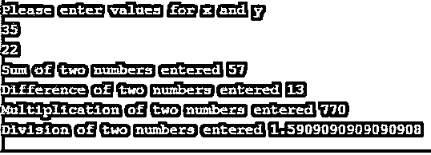
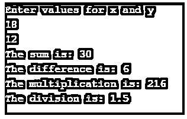
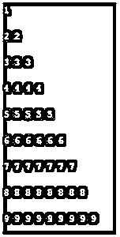

# Python 中的静态方法

> 原文：<https://www.educba.com/static-method-in-python/>


## Python 中静态方法的介绍

下面的文章提供了 Python 中静态方法的概要。静态方法是绑定到类而不是该类的对象的方法。但是与类方法不同，静态方法不能访问或修改类的状态。静态方法是在类内部定义的，但它不应被视为类方法。类方法将“cls”作为它的第一个参数，而静态方法不需要特定的参数。类方法可以访问和修改类状态，而静态方法不能访问或修改它。静态方法对类状态一无所知。使用@classmethod decorator 创建类方法，而使用@staticmethod decorator 创建静态方法。

**语法:**

<small>网页开发、编程语言、软件测试&其他</small>

在 python 中，静态方法可以用两种方式定义:

**1。使用 staticmethod()**

`Staticmethod(class_name.method())`

**2。通过使用@staticmethod 装饰器**

`class  class_name:
@staticmethod
def static_method_name():
// code to be executed`

方法(2)是 python 中创建静态方法的最常见方式。

### Python 中静态方法的示例

下面是一些例子:

#### 示例#1

基本计算器程序。

使用类和静态方法的基本计算器。

定义静态方法时使用了@staticmethod decorator。

**代码:**

```
class Calculator:
 @staticmethod
 def add(a,b):
   return (a+b)
@staticmethod
def sub(a,b):
  return(a-b)
@staticmethod
def mul(a,b):
  return (a*b)
@staticmethod
def div(a,b):
  return(a/b)
# Prompting user to enter two values
print("Please enter values for x and y")
x = int(input())
y = int(input())
# static method are called using class_name.method()
print("Sum of two numbers entered" , Calculator.add(x, y) )
print("Difference of two numbers entered", Calculator.sub(x, y))
print("Multiplication of two numbers entered", Calculator.mul(x, y))
print("Division of two numbers entered",
Calculator.div(x, y))
```

**说明:**

*   创建了一个“计算器”类。在这四个静态方法中，add()、sub()、mul()和 div()被定义为执行四个基本的算术运算。
*   @staticmethod decorator 用于标识下面定义的方法是静态方法。
*   然后提示用户输入两个变量的值，然后在调用静态方法时传递这两个变量。静态方法被称为 class_name.static_method()。

**输出:**

所有方法的输出都打印在各自的打印语句中，如下面的输出所示。




这个程序可以使用 staticmethod()来实现。

**代码:**

```
class Calculator:
# no self parameter
or cls paramter is used as these are for instance and class methods
def add(a, b):
return (a + b)
def sub(a, b):
return (a-b)
def mul(a, b):
return (a * b)
def div(a, b):
return (a / b)
print("Enter values for x and y")
x = int(input())
y = int(input())
# create add static method
Calculator.add = staticmethod(Calculator.add)
print('The sum is:', Calculator.add(x, y))
# create sub static method
Calculator.sub = staticmethod(Calculator.sub)
print('The difference is:', Calculator.sub(x, y))
# create mul static method
Calculator.mul = staticmethod(Calculator.mul)
print('The multiplication is:', Calculator.mul(x, y))
# create div static method
Calculator.div = staticmethod(Calculator.div)
print('The division is:', Calculator.div(x, y))
```

**输出:**




#### 实施例 2

格式化日期的程序。

**代码:**

```
 # Program to format date
class Format:
# declaring static method to format input date
@staticmethod
def date_format(indate):
format_date = indate.replace('/','-')
return format_date
inp_date = '2019/12/19'
print("Formatted date :", Format.date_format(inp_date)) 
```

**输出:**


#### 实施例 3

程序分类人类和检查投票资格。

**代码:**

```
# Program to categories a human age and check his eligibility to vote
class Classifier:
# method to classify a person's age
@staticmethod
def ageClassfier(age):
if age > 0 and age <= 12 : return "Child" elif age > 12 and age <= 18 : return 'Adolescence' elif age >
18 and age <=59 : return 'Adult' else : return "Senior adult" # method to check voting eligibility @staticmethod def eligibility(age): if age > 18 :
return "Eligible to vote"
else :
return "Not eligible to vote"
# Prompting user to enter his age
print("Enter age")
inp_age = int(input())
print("You are a/an", Classifier.ageClassfier(inp_age),'and you are',Classifier.eligibility(inp_age))
```

**输出:**


**说明:**

*   创建类分类器。
*   定义了两个静态方法。第一个是 ageClassfier()，它将一个人的年龄和类别分为四类。第二种方法是 eligibility()，它将决定这个人是否有资格投票。
*   然后提示用户输入他的年龄。
*   然后打印结果(人员年龄类别及其资格)。

#### 实施例 4

打印数字模式的程序(直到数字 10)。

**代码:**

```
 # Program to print a number pattern
class Pattern:
@staticmethod
def pattern():
for num in range(10):
for i in range(num):
print(num, end=" ") # print number
# new line after each row to display pattern correctly
print("\n")
Pattern.pattern() 
```

**输出:**




### 结论

尽管有类和实例方法来实现面向对象范例。静态方法有不同的用例。当我们需要实现一些非 w.r.t 类或对象的功能时，我们创建静态方法。这对于创建实用程序方法很有用，因为它们不依赖于对象生命周期。

### 推荐文章

这是 Python 中静态方法的指南。这里我们讨论 python 中静态方法的介绍和例子。您也可以看看以下文章，了解更多信息–

1.  [c#中的静态关键字](https://www.educba.com/static-keyword-in-c-sharp/)
2.  [Python getattr](https://www.educba.com/python-getattr/)
3.  [JavaScript 静态方法](https://www.educba.com/javascript-static-method/)
4.  [PHP 中的静态方法](https://www.educba.com/static-method-in-php/)


