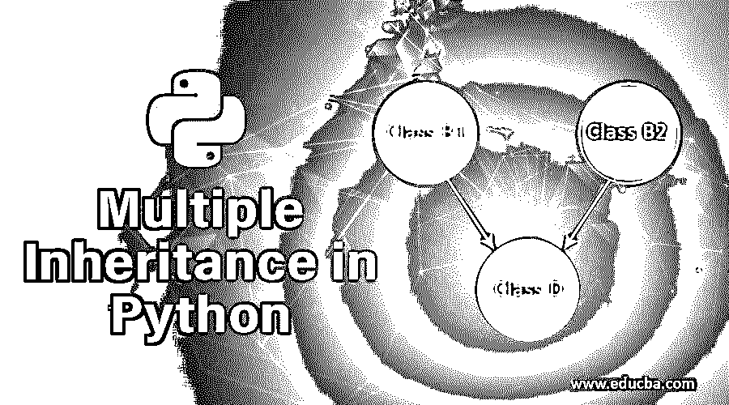

# Python 中的多重继承

> 原文：<https://www.educba.com/multiple-inheritance-in-python/>




## Python 中多重继承的介绍

python 中的多重继承是一个众所周知的特性，所有主要的面向对象编程语言都支持它。它可以被描述为一个过程，其中子类或对象从一个或多个父类继承方法和属性。这是一个层次化的过程，导致代码的可重用性、更高的性能和灵活性。它也有自己的缺点，比如增加的复杂性、更多的模糊性和更深层次的编码知识。

****语法#1:****

<small>网页开发、编程语言、软件测试&其他</small>

涉及两个基类和一个派生类的多重继承的语法如下所示。

```
class Base_1:
	pass
class Base_2:
	pass
class DerivedClass(Base_1, Base_2):
	pass
```

****语法#2:****

涉及三个基类和一个派生类的多重继承的语法如下所示。

```
class Base_1:
	pass
class Base_2:
	pass
class Base_3:
	pass 
class DerivedClass(Base_1, Base_2, Base_3) 
	pass
```

### Python 中多重继承的例子

让我们来看一下 Python 中的以下程序代码，它实现了多重继承的概念。

#### 示例#1

我们将从一个简单的例子开始，以便理解这个概念的工作原理。

****代号:****

```
class A:
    def A(self):
        print('This is class A.')        
class B:
    def B(self):
        print('This is class B.')        
class C(A,B):
    def C(self):
        print('This is class C which inherits features of both classes A and B.')
o = C()
o.A()
o.B()
o.C()
```

浏览 python 编程代码，如上所示，有三个类，即。A 类、B 类和 C 类。C 类是继承 A 类和 B 类功能的派生类。因此，A 类和 B 类充当基类。最后，我们有一个变量 o，我们把它赋给了派生类 c。这个变量操作所有的类。程序代码不执行任何复杂的任务；但是，它可以让我们熟悉这个概念。

****输出:****


这三个类中的每一个都有打印语句，当程序代码被执行时，这些语句被打印出来。

我们将把这个例子扩展成一种更符合逻辑的形式。让我们假设我们想求一个矩形的面积。在这种情况下，需要两个输入，即矩形的长度和宽度。利用[多重继承](https://www.educba.com/multiple-inheritance-in-php/)的概念，可以计算出矩形的面积。这里需要三个类，其中两个作为基类，一个作为派生类。两个基类分别用于长度和宽度，派生类将用于计算矩形的面积。这个类将从各自的基类中获得长度和宽度输入。

#### 实施例 2

实现上述概念的程序代码如下。仔细阅读代码，以便正确理解每个组件。

****代号:****

```
class length:
    l = 0
    def length(self):  
        return self.l
class breadth:
    b = 0
    def breadth(self):
        return self.b
class rect_area(length, breadth):
    def r_area(self):
        print("The area of rectangle with length "+str(self.l)+" units and breadth "+ 
              str(self.b)+" units is "+str(self.l * self.b)+" sq. units.")
o = rect_area()
o.l = int(input("Enter the required length for rectangle: "))
o.b = int(input("Enter the required breadth for rectangle: "))
o.r_area()
```

让我们一步一步地检查程序代码。首先，我们有一个课时长度。在这个类中，有一个变量 l，最初，我们将这个变量的值设置为零。然后我们有一个例程 length()，它返回变量 l 的值。类似地，我们有另一个类宽度，它有一个变量 b，最初赋值为零。routine width()返回变量 b 的值。最后，我们有第三个类 rect_area，它从两个基类派生值。它有一个例程 r_area()，根据来自两个基类的长度和宽度值给出矩形区域。

最后，我们创建一个变量 o，并将其赋给类 rect_area。这个变量充当一个操作符，我们进一步对基类中的变量进行操作。因此，当派生类操作基类的变量时，赋值就发生了。我们可以看到变量 l 和 b 是通过输入框赋值的。默认情况下，它们是字符串类型，所以我们使用 int()函数将它们转换成数字。函数的作用是:给出面积。

****输出:****


我们通过一系列输入来检查上述程序。当程序执行时，要求用户输入变量 l 和 b，如下所示。

*   首先，要求用户在文本中输入矩形的长度。
*   当传递长度的必要值时，需要传递宽度值。
*   正如我们所看到的，我们传递了两个整数值，并得到了格式良好的输出。

上面实现的程序只适用于整数值。如果用户试图传递十进制值，他可能会出错。为了克服这一点，我们需要将字符串输入值转换为 float(或任何十进制类型)。

#### 实施例 3

除了用于类型转换的函数之外，程序代码将保持不变。程序代码如下所示。

****代号:****

```
class length:
    l = 0    
    def length(self):  
        return self.l    
class breadth:
    b = 0    
    def breadth(self):
        return self.b     
class rect_area(length, breadth):
    def r_area(self):
        print("The area of rectangle with length "+str(self.l)+" units and breadth "+ 
              str(self.b)+" units is "+str(self.l * self.b)+" sq. units.")
o = rect_area()
o.l = float(input("Enter the required length for rectangle: "))
o.b = float(input("Enter the required breadth for rectangle: "))
o.r_area()
```

****输出:****


### 结论

在各种类型的继承中，[多重继承是 python 支持的一种类型](https://www.educba.com/multiple-inheritance-in-c-plus-plus/)。在这种情况下，Python 提供了一种易于实现的方法。这个概念在涉及许多相互关联的变量的情况下非常有用，并且其中的关系需要被适当地调节。

### 推荐文章

这是 Python 中多重继承的指南。这里我们讨论 python 中多重继承的介绍和例子，以及代码实现。您也可以阅读以下文章，了解更多信息——

1.  [PyTorch 版本](https://www.educba.com/pytorch-versions/)
2.  [Python 全局变量](https://www.educba.com/python-global-variable/)
3.  [Python 子串](https://www.educba.com/python-substring/)
4.  [Python Web 开发](https://www.educba.com/python-web-development/)


