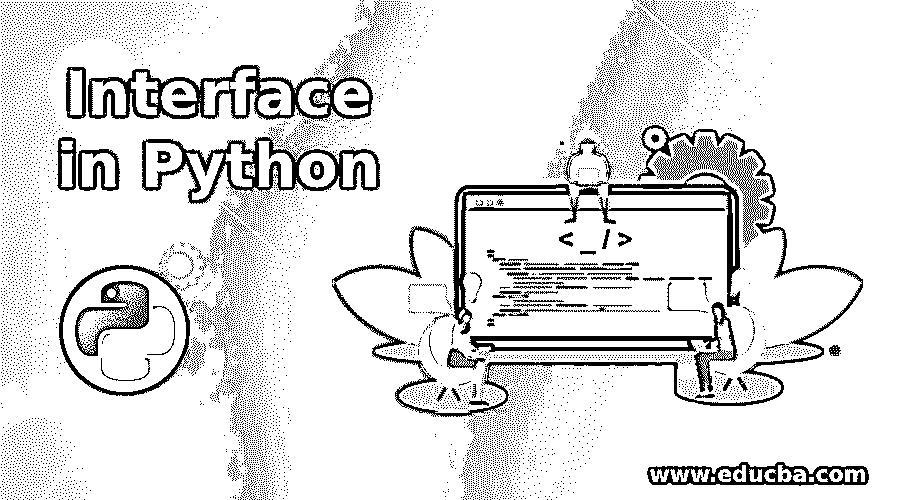

# Python 中的接口

> 原文：<https://www.educba.com/interface-in-python/>




## Python 中的接口介绍

接口充当设计类的模板。接口也像类一样定义方法，但是是抽象方法，而类包含非抽象方法。抽象方法是那些没有实现或者没有主体的方法。所以接口只是定义了抽象方法，没有实现。这些抽象方法的实现是由实现接口的类定义的。在这个主题中，我们将学习 Python 中的接口。

Python 界面设计不同于其他[编程语言](https://www.educba.com/what-is-a-programming-language/)像 C++、Java、C#和 Go；一个区别是，所有这些语言都使用关键字“接口”，而 Python 不使用它。另一个区别是 Python 不要求实现接口的类为接口的所有抽象方法提供定义。

<small>网页开发、编程语言、软件测试&其他</small>

### 如何用 Python 创建接口？

python 中有两种创建和实现接口的方法，它们是

*   非正式界面
*   正式接口

#### 1.非正式界面

python 非正式接口也是一个定义方法的类，这些方法可以被覆盖，但不强制执行。一个非正式的接口，也称为协议或鸭类型。鸭子类型化实际上是我们在对象上执行一个方法，正如我们期望一个对象拥有的那样，而不是检查一个对象的类型。如果它的海狸和我们预期的一样，那么我们会很好，走得更远，否则，事情可能会出错，为了安全起见，我们使用一个尝试..except block 或 hasattr 来处理异常，以检查对象是否有特定的方法。

python 中的非正式接口被称为协议，因为它是非正式的，不能正式实施。它主要由模板定义或在文档中演示。考虑一下我们平时使用的一些方法——_ _ len _ _，__iter__，__contains__ and all，用来执行一些操作或者一组协议。

##### 例子

让我们来看一个 python 代码示例，它实现了用于用户定义类实例或对象的–_ _ len _ _，__iter__，__contains__ 方法，如下面给出的代码所示

**代码:**

```
class Fruits :
    def __init__( self, ele) :
        self.__ele = ele
    def __contains__( self, ele) :
        return ele in self.__ele
    def __len__( self ):
        return len( self.__ele)
Fruits_list = Fruits([ "Apple", "Banana", "Orange" ])
print(len(Fruits_list))
print("Apple" in Fruits_list)
print("Mango" in Fruits_list)
print("Orange" not in Fruits_list)
```

**输出:**


在上面的示例代码中，水果类实现了 __len__，而 __contains__ 方法，因此在水果类的实例上，我们可以直接使用 len 函数来获取大小，并可以通过使用 in 运算符来检查成员资格。在上面的代码中，没有实现 __iter__ 方法(iterable 协议),所以我们不会迭代水果的实例。因此，非正式接口不能被正式实施。

#### 2.正式接口

正式接口是正式实施的接口。在某些情况下，协议或鸭子类型会造成混淆，例如我们有两个类 FourWheelVehicle 和 TwoWheelVehicle，它们都有一个方法 SpeedUp()，因此这两个类的对象都可以加速，但是即使两个类实现了相同的接口，这两个对象也是不同的。所以为了解决这个困惑，我们可以使用正式接口。要创建一个正式的接口，我们需要使用 ABCs(抽象基类)。

ABC 是简单的接口或基类，本质上定义为抽象类，抽象类包含一些抽象的方法。接下来，如果任何类或对象实现或驱动这些基类，那么这些基类将强制实现所有这些方法。注意，接口不能被实例化，这意味着我们不能创建接口的对象。所以我们用一个基类来创建一个对象，可以说这个对象实现了一个接口。我们将使用类型函数来确认对象是否实现了特定的接口。

##### 例子

让我们看一个 python 代码的例子来理解一般例子的形式接口，我们试图创建一个抽象类的对象，如下面给出的代码所示

**代码:**

```
import abc
class Myinterface( abc.ABC ) :
    @abc.abstractclassmethod
    def disp():
        pass
class Myclass( Myinterface ) :
    pass
o1 = Myclass( )
```

**输出:**


在上面的代码中，Myclass 类继承了抽象类 Myinterface，但没有提供 disp()抽象方法的实现。类 Myclass 也变成了抽象类，因此不能被实例化。

### Python 中的接口示例

下面举几个例子

#### 示例#1

派生类的 python 代码示例定义了一个抽象方法。

**代码:**

```
import abc
class Myinterface( abc.ABC ):
    @abc.abstractclassmethod
    def disp( ):
        pass
#print(" Hello from Myclass ")
class Myclass(Myinterface):
    def disp( ):
        pass
o1=Myclass()
```

#### 实施例 2

派生类的 python 代码示例，使用正确的定义定义了一个抽象方法

**代码:**

```
import abc
class Myinterface( abc.ABC ):
    @abc.abstractclassmethod
    def disp( ):
        pass
#print(" Hello from Myclass ")
class Myclass(Myinterface):
    def disp(s):
        print(" Hello from Myclass ")
o1=Myclass()
o1.disp()
```

**输出:**


#### 实施例 3

理解对象类型的 python 代码示例–

**代码:**

```
import abc
class FourWheelVehicle (abc.ABC):
    @abc.abstractmethod
    def SpeedUp( self ):
        pass
class Car(FourWheelVehicle) :
    def SpeedUp(self):
        print(" Running! ")
s = Car()
print( isinstance(s, FourWheelVehicle))
```

**输出:**


#### 实施例 4

由多个派生类实现的 python 代码抽象类示例——

**代码:**

```
import abc
class FourWheelVehicle (abc.ABC):
    @abc.abstractmethod
    def SpeedUp( self ):
        pass
class Car(FourWheelVehicle) :
    def SpeedUp(self):
        print(" Running! ")
class TwoWheelVehicle (abc.ABC) :
    @abc.abstractmethod
    def SpeedUp(self):
        pass
class Bike(TwoWheelVehicle) :
    def SpeedUp(self) :
        print(" Running!.. ")
a = Bike ()
s = Car()
print( isinstance(s, FourWheelVehicle))
print( isinstance(s, TwoWheelVehicle))
print( isinstance(a, FourWheelVehicle))
print( isinstance(a, TwoWheelVehicle))
```

**输出:**


### 结论

接口是一个有趣的概念，它充当了设计类的蓝图。用 python 创建和实现接口的方法不同于其他编程语言。要创建一个正式的接口，我们需要使用 ABCs 类，正如我们在上面的例子中看到的。

### 推荐文章

这是 Python 中的接口指南。在这里，我们讨论 python 中创建和实现接口的两种方法，并给出例子。您也可以看看以下文章，了解更多信息–

1.  [Python 地图功能](https://www.educba.com/python-map-function/)
2.  [Python 中的正则表达式](https://www.educba.com/regular-expression-in-python/)
3.  [Python 中的 if else 语句](https://www.educba.com/if-else-statement-in-python/)
4.  [Python 中的集合模块](https://www.educba.com/collection-module-in-python/)


