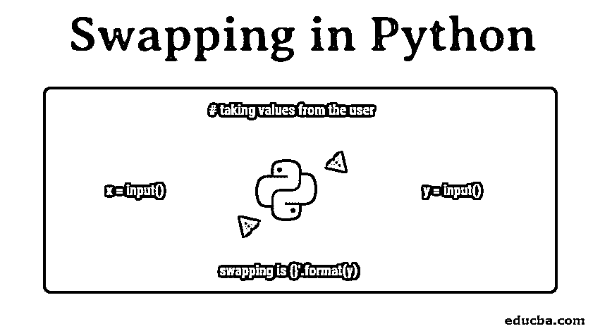

# 在 Python 中交换

> 原文：<https://www.educba.com/swapping-in-python/>




## Python 中交换的概述

几种编程语言帮助我们应用逻辑和开发应用程序。Python 是这些编程语言中的一种，也是最受欢迎的编程语言之一，因为它内置了大量的函数。尽管它为几乎所有的复杂逻辑都提供了预定义的功能，但是用户可以定义自己的功能来开发定制的应用程序。在这一节中，我们将看到如何使用 python 编程语言交换两个变量。

### Python 中如何交换两个数？

为了交换两个变量，我们需要使用一个临时变量来临时存储值。为了交换这些值，我们首先需要这些值。有两种方法将值放入变量中。当程序运行时，我们既可以赋值，也可以从用户那里取值。要赋值，我们可以简单地定义一个变量并初始化它。但是如果我们需要接受用户的输入，我们就需要使用名为 input 的函数。input 函数让我们从用户那里获取值，以便用于进一步的处理。下面是交换两个值的程序。此外，我们还附上了输出图像，以便您可以真正了解下面给出的代码运行时的输出。

<small>网页开发、编程语言、软件测试&其他</small>

```
# taking values from the user
x = input()
y = input()

print('The value of x is {}'.format(x))
print('The value of y is {}'.format(y))

# swapping the values
temp_var = x
x = y
y = temp_var

print('The value of x after swapping is {}'.format(x))
print('The value of y after swapping is {}'.format(y)) 
```

在上面的例子中，我们使用了[注释](https://www.educba.com/comments-in-python/)来让你意识到特定代码集背后的原因。散列(#)用于注释该行。编译程序时，编译器会忽略散列到行尾后写入的任何内容；接下来的两行用于从用户那里获取输入，以便在交换中使用这些值。在此之后，打印功能被使用，它的目的是打印或回显屏幕上的任何内容。后来，应用了交换值的逻辑，最终，应用了交换的值。在开始时，我们已经指定了 x 和 y 的赋值，这样就可以看到用户给了什么值，并确保预期变量包含预期值。一旦值的交换完成，我们也在输出中显示，以确保值已经被交换。

### Python 中三个数如何互换？

这段代码类似于前面的代码部分，它旨在交换两个数字。这段代码将展示如何使用临时变量交换三个数字。从用户处获取值的方法类似于前面的代码，即使用输入函数。随后，使用打印功能显示这些值。

用户已经交换了值。它可以是任何数据类型，因为 python 可以通过分析用户的输入动态地将数据类型分配给变量。在其他编程语言中，开发人员应该将数据类型赋给变量，变量被绑定为只保存特定数据类型的值，但在 python 的[案例中并非如此。这些是 python 提供的一些优点，使使用它变得容易。](https://www.educba.com/patterns-in-python/)

```
# taking values from the user
x = input()
y = input()
z = input()

print('The value of x is {}'.format(x))
print('The value of y is {}'.format(y))
print('The value of z is {}'.format(z))

# swapping the values
temp_var = x
x = y
y = z
z = temp_var

print('The value of x after swapping is {}'.format(x))
print('The value of y after swapping is {}'.format(y))
print('The value of z after swapping is {}'.format(z)) 
```

在这个程序中，我们接受了用户的输入。用户必须提供三个输入，这三个输入将被赋予三个变量 x、y 和 z。这些值稍后将用于在变量之间进行交换。在交换逻辑中，首先，x 的值被临时存储在名为 temp_var 的变量中。然后将 y 的值赋给 x，将 z 的值赋给 y，最后将具有 x 值的 temp_var 的值赋给 z，这样，三个值都交换了。

当程序运行时，它将显示所有已分配给不同变量的值，以便我们可以确认已分配给变量的值。在应用交换逻辑后，一旦交换完成，我们已经在输出屏幕中显示，以确保值已经被交换。在下图中，运行了上面提到的代码，以查看编译该代码时的实际输出。写在输出屏幕开头的数字 1、2 和 3 实际上是用户接受的输入，一旦接收到输入，就执行逻辑来交换这些值。

### 结论–Python 中的交换

Python 为我们提供了几个内置函数，这些函数可以简单地接受用户的输入并给出想要的输出。但是，当涉及到利用 python 为任何组织开发实际应用程序时，总是倾向于以定制的方式编写代码，这就是为什么开发与逻辑相关的技能很重要。本节将向您介绍如何交换这两个值。使用相同的程序，您还可以交换其他值。例如，可以在应用程序中需要的地方交换任何用户的名字和姓氏。

### 推荐文章

这是 Python 中交换的指南。这里我们详细讨论如何使用两个变量来交换 python 编程语言的使用。您也可以阅读以下文章，了解更多信息——

1.  [Python 中的 If Else 语句](https://www.educba.com/if-else-statement-in-python/)
2.  [Python 的优势](https://www.educba.com/advantages-of-python/)
3.  [Python 中的构造函数](https://www.educba.com/constructor-in-python/)
4.  [Python 排序函数](https://www.educba.com/python-sorted-function/)


