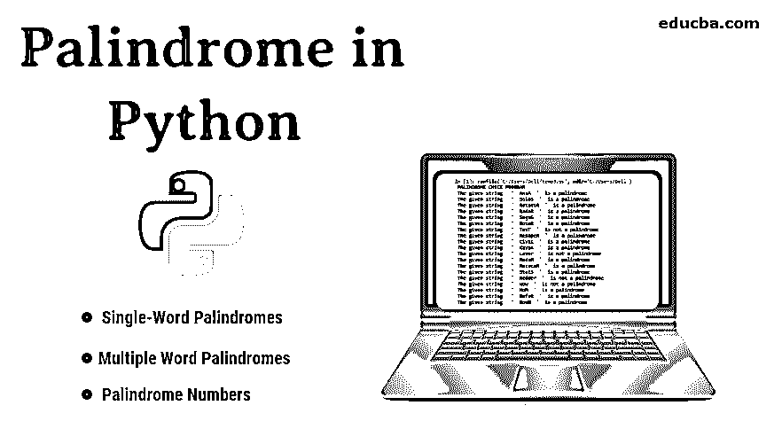
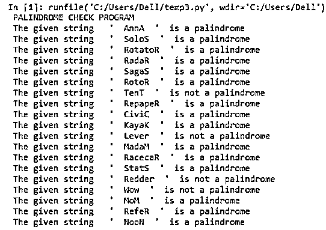

# Python 中的回文

> 原文：<https://www.educba.com/palindrome-in-python/>




## 回文中的 Python 介绍

回文是一系列字母，如一个单词，或一系列数字，当向前和向后阅读时，都表示同一个单词。Python 回文允许在回文单词中使用符号、字符、标点甚至空格。它的功能是在实际单词和导致精确匹配的反向单词之间进行比较，从而导致匹配值为真。在 Python 中，回文方法有三种不同的类型:单个单词回文、多个单词回文和数字回文。

下面列出了一些单词回文，

<small>网页开发、编程语言、软件测试&其他</small>

### Python 在回文中的类型和技巧

下面提到的是 Python 回文的类型。

**1。单字回文:**安娜、Solos、Rotator、Radar、Sagas、Rotor、Tenet、Repaper、Civic、Kayak、Level、Madam、Racecar、Stats、Redder、Wow、Mom、Refer、Noon

**2。多词回文:**不要点头，我有，有吗？，我的健身房

**3。回文数字:** 11，66，77，767，454，36763

#### 回文程序(技术 1)

```
# This program performs palindrome check for a string #
# function which return reverse of a string 

def isPalindrome(s): 
    # Calling reverse function 
   if len(s) <= 1 :
      return True
   if s[0] == s[len(s) - 1] :
      return isPalindrome(s[1:len(s) - 1])
   else :
      return False

# Driver code 
Palindrome_input_Variable = [ ' AnnA ' , ' SoloS ' , ' RotatoR ' , ' RadaR ' , ' SagaS ' , ' RotoR ' , ' TenT ' , ' RepapeR ' , ' CiviC ' , ' KayaK ' , ' Lever ' , ' MadaM ' , ' RacecaR ' , ' StatS ' , ' Redder ' , ' Wow ' , ' MoM ' , ' RefeR ' , ' NooN ']

print( " PALINDROME CHECK PROGRAM " )
for i in Palindrome_input_Variable:
   ans = isPalindrome(i) 
   if ans == 1: 
    print( " The given string  ", "'" , i , "' ","is a palindrome") 
   else: 
    print( " The given string  " , "'" , i , "' ","is not a palindrome") 
```

**输出:**




**解释:**这个程序隐含检查给定的字符串是否是回文。由于输入是一个字符串，这个检查是通过 [python 的反向函数](https://www.educba.com/python-frameworks/)来实现的。ispalindrome 功能的流程如下:

### Python 在回文中的作用

**1)** 函数自变量的倒数被确定并存储在一个单独的变量中。这里使用长度技术来确定相反的情况。确定变量的长度，并在长度之上应用手动反转。

**2)** 然后，将反转存储的变量与实际变量进行比较，检查它们是否保持相同的值。

**3)** 如果两者都匹配，那么函数返回值 true。如果两个值都不匹配，那么将值 false 返回给函数。

**4)** 因此，当值为真时，则显示“给定字符串是回文”的消息，而不是当值为假时，则显示“给定字符串不是回文”的消息

#### 回文程序(技术 2)

**代码:**

```
# This program performs palindrome check for a number #
# Entering the input
Number = input('Enter the number to be verified : ')
# Try  block 
try:
#Casting of the entered input is also achieved here by implying         #variable casting process into place
   val = int(Number)
    #checking for a palindrome in the given string
    if Number == str(Number)[::-1]:
        print('The given number is PALINDROME')
    else:
        print('The given number is NOT a PALINDROME')
except ValueError:
    print("! ! ! A valid numeric input is not entered ! ! !") 
```

**输出:<u>T2</u>T4】**


**解释:**如同对[字符串的验证一样，回文](https://www.educba.com/palindrome-in-javascript/)也可以对数值进行检查。一个回文中的数值也意味着这个值和它的反序是一样的。这里，基于键入的数字，从模式“str(Number)[::-1]，”生成数字的倒数。并将该生成的输出与实际值进行比较。当生成的值与给定的字符串完全相反时，输出将显示为“‘给定的数字是回文’”。在另一种情况下，输出显示为“‘给定的数字不是回文’”。

#### 回文程序(技术 3)

**代码:**

```
# This program performs palindrome check for a number #
# Entering the input
# Casting of the entered input is also achieved here by implying       #variable casting process into place.
num = int( input ( " ENTER THE NUMBER: " ) )

temporary = num
rev = 0

# looping the given input and reversing the value  
while temporary != 0:
	rev = ( rev * 10 ) + ( temporary % 10 )
	temporary = temporary // 10

if num == rev:
	print( " number is palindrome " )
else:
	print( " number is not palindrome " ) 
```

**输出:**


**解释:**这也是一个对给出的数值进行回文检查的程序。这种技术包括使用数学公式来反转给定的数字，公式如下:

`rev = (rev * 10) + (temporary % 10)
temporary = temporary // 10`

将输入值传递给这个公式成功地对给定的整数求逆，并且将这个生成的输出与实际值进行比较。当生成的值与给定的字符串完全相反时，输出将显示为“‘数字是回文’”。在另一种情况下，输出被打印为“‘给定的数是‘数不是回文’”。

### 结论

这些程序意味着检查给定的字符串是否是回文。使用上面的程序，任何给定的字符串或数值都可以成功地计算，不管它们是否是回文。

### 推荐文章

这是 Python 中的回文指南。在这里，我们讨论 Python 回文的介绍及其不同的技术和类型，以及一个例子。您也可以浏览我们推荐的其他文章，了解更多信息——

1.  [C 程序中的回文](https://www.educba.com/palindrome-in-c-program/)
2.  [c++中的回文](https://www.educba.com/palindrome-in-c-plus-plus/)
3.  [PHP 中的回文](https://www.educba.com/palindrome-in-php/)
4.  [Java 中的回文](https://www.educba.com/palindrome-in-java/)


