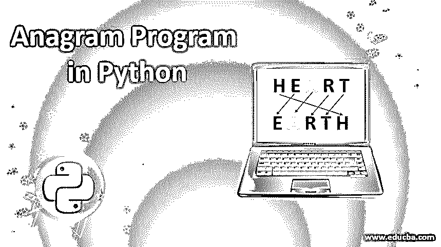

# Python 中的变位程序

> 原文：<https://www.educba.com/anagram-program-in-python/>




## Python 中的字谜程序简介

变位词是这样一种情况，在两个给定的字符串或数字中，其中一个是正在使用的另一个字符串或数字的重新排列形式，所以这意味着一个字符串或数字中的每个字符都将是另一个字符串的一部分，在这种情况下，尽管两个字符串都表示不同的主题，但它们可以重新排列和统一。

**举例:**

<small>网页开发、编程语言、软件测试&其他</small>

心

地球

在上面的例子中，单词 heart 可以由单词 earth 构成，或者单词 earth 也可以表述为 heart。

### Python 中的字谜程序示例

以下是 Python 中变位词程序的技巧和示例:

#### 1.计数器技术

计数器技术包括计算两个给定字符串中每个单词的计数。如果给定字符串中每个单词的计数与另一个字符串中每个单词的计数相匹配，则相应的单词集被声明为变位词。

**代码:**

```
from collections import Counter, defaultdict
def  anagram_check(keywords):
  anagrams = defaultdict(list)
  for i in keywords:
   histogram = tuple(Counter(i).items())
   anagrams[histogram].append(i)
  return list(anagrams.values())
keywords = ("hello","helol")
print(anagram_check(keywords))
```

**输出:**


**说明:**

在这个程序中，要检查字谜的单词是作为字符串值键入的。对于每一个配置或一段文字中的一个字符，使用计数器功能记录键入的等价计数。所确定的计数被附加在列表中并被跟踪。一旦对第一个字符串中的所有字符完成了计数计算的过程，则对文本字符串中的字符完成相同的过程。如果两个字符串中的字符数都匹配，则这两个字符串都被视为变位词。

#### 2.分类技术

在排序技术中，对两个不同的字符串进行排序，并验证在排序过程之后为这两个字符串生成的两个值是否彼此完全匹配。

**代码:**

```
def Anogram_check(string1, string2):
# Strings are sorted and verified
if(sorted(string1)== sorted(string2)):
   print("Both strings form a Anogram.")
else:
   print("Both strings do not form as a Anogram.")
# driver code
string1 ="EARTH"
string2 ="HEART"
print( "String value1 : ", string1 )
print( "String value2 : ", string2 )
Anogram_check(string1, string2)
```

**输出:**


**说明:**

排序是实现变位检查的最简单的技术；这里，两个不同的字符串作为参数传递给变位检查函数。在变位词函数中，两个字符串都按特定顺序排序。所以一旦两个字符串都被排序了，就可以互相比较了。如果字符串之间的比较匹配，那么给定的字符串被声明为变位词；否则，它们被通知为非变位词。如前所述，这种确定字谜的技术既有效又简单。它在很大程度上降低了代码的复杂性。

#### 3.位置验证技术

在这种技术中，对字谜进行位置水平比较。这里，字谜检查是通过将一个字符串中的位置字符与另一个字符串中的每个位置字符进行验证来实现的。如果从一个字符串的每个位置得到的评估在另一个字符串中有等价的匹配，则它被声明为变位词。

**代码:**

```
def anagram_check(string1,string2):
  check_variable = True
  if len(string1) != len(string2):
     check_variable = False
  alist = list(string2)
  position_string1 = 0
  while position_string1 < len(string1) and check_variable:
    position_string2 = 0
    found = False
    while position_string2 < len(alist) and not found:
     if string1[position_string1] == alist[position_string2]:
        found = True
   else:
     position_string2 = position_string2 + 1
if found:
   alist[position_string2] = None
else:
  check_variable = False
 position_string1 = position_string1 + 1
return check_variable
string1 = "abc"
string2 = "cba"
print("String value1 : " , string1)
print("String value2 : " , string2)
Boolean_out = anagram_check('abcd','dcba')
if Boolean_out:
   print( "Both words are Alogram " )
else:
   print( "Both words are not Alogram " )
```

**输出:**


**说明:**

这是验证两个给定字符串值之间的变位词的另一种有效技术；这里再次考虑两个不同的字符串值进行比较。根据已经被传递到验证过程的两个循环中的字符串值，这些循环以嵌套的方式被设置用于执行。其中一个循环是用来处理其中一个字符串的，而另一个循环是用来处理另一个字符串的。从主字符串中选择一个字符，并将其建立在第二个字符串中出现的每个字符的旁边，并且对第一个字符串中的每个字母进行该过程。这里，每一个被选中的字符都被验证是否存在于第二个字符串中。如果第一个字符串中的所有字符都在第二个字符串中占据一个位置，那么这两个单词都被视为变位词。如果任何字符在第二个字符串中找不到比较匹配，那么这两个字符串都被认为不是变位词。通过这种技术验证变位词是一个非常稳定的过程，因为在任何时候，不管涉及的单词有多复杂，都可以通过使用这种算法策略非常精确地判断变位词因素。

#### 4.反向变位检查

这里的变位词就是以这种方式实现的。

**代码:**

```
words = ["race", "ecar", "meet", "em"]
anagrams = {}
for word in words:
   reverse_word=word[::-1]
   if reverse_word in words:
       anagrams[word] = (words.pop(words.index(reverse_word)))
print(anagrams)
```

**输出:**


**说明:**

这是一种很少使用的技术；这用于比较颠倒字符串之间的变位词。这里再次键入了两个不同的字符串。与这里的回文非常相似，字符串中的一个被反转并用另一个字符串验证。两个字符串都匹配；如果形成匹配，则字符串被声明为变位词；如果没有形成匹配，它们被通知为不是字谜。

### 结论

在编码领域，单词和整数之间的变位检查过程可以通过多种方式实现，一些主要的技术在上面通过简单灵活的编码标准进行了介绍。

### 推荐文章

这是一个用 Python 编写的字谜程序的指南。在这里，我们讨论 Python 中的变位词程序的技术及其示例和代码实现。您也可以浏览我们推荐的其他文章，了解更多信息——

1.  [Python 范围函数](https://www.educba.com/python-range-function/)
2.  [Python 设置函数](https://www.educba.com/python-set-function/)
3.  [C 语言中的字谜程序](https://www.educba.com/anagram-program-in-c/)
4.  [Java 中的字谜程序](https://www.educba.com/anagram-program-in-java/)


