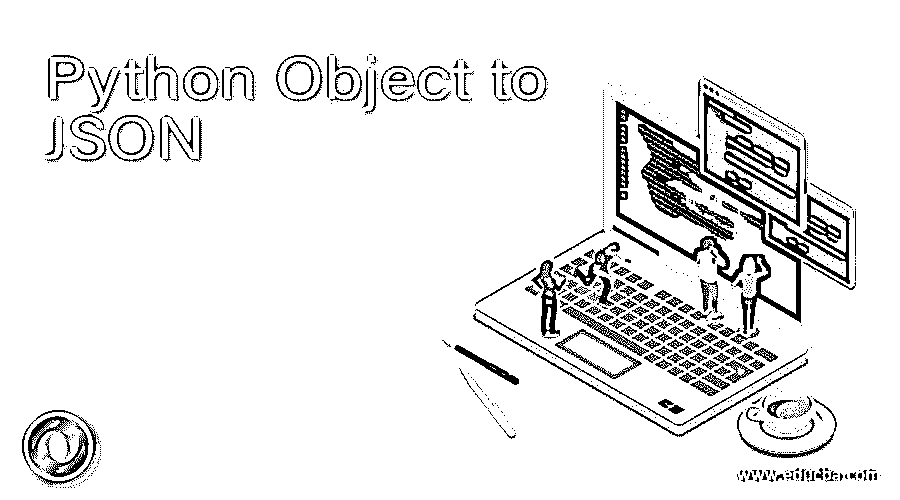
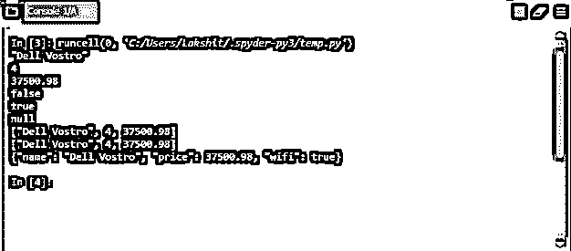
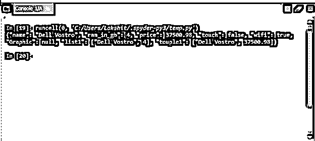
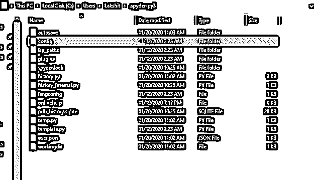
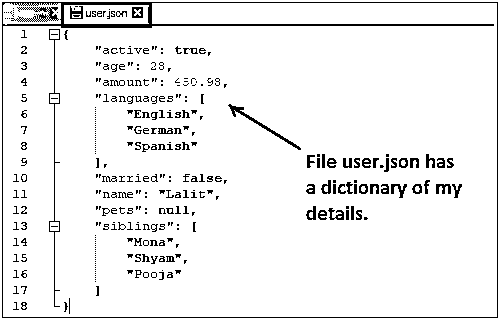

# JSON 的 Python 对象

> 原文：<https://www.educba.com/python-object-to-json/>




## JSON 的 Python 对象定义

Python Object to JSON 是一种将 Python 类对象序列化为 JSON (JavaScript Object Notation)字符串对象的方法。这个方法帮助我们将 python 类对象转换成 JSON，这是一种比 python 对象更紧凑的格式。在这个方法中，我们使用“JSON”包，它是 python 编程语言本身的一部分(内置)，并使用 JSON.dumps()方法将 python 类对象转换为平面 JSON 字符串对象。JSON 是一种轻量级数据格式，因此我们通过将 python 类对象转换为 JSON 字符串对象来节省空间(python 类对象比 JSON 对象占用更多空间)。

在本文中，我们将介绍如何将 python 类对象转换为 JSON 字符串对象，并提供带有输出的实际示例代码。

<small>网页开发、编程语言、软件测试&其他</small>

### 安装软件包

在开始将 python 对象转换成 json 对象之前，首先要做的是安装一个允许您这样做的包。我们在 python 中有一个“json”包来处理这种转换，它可以用下面提到的代码语法安装:

#安装 json 包

这个包有“json.dumps()”和“json。dump()"函数，它允许我们将 python 对象转换成 JSON 对象。但是，这两个过程有一个基本的区别，如下所述:

*   dumps()函数将 python 对象转换(序列化)为 JSON 格式的字符串。
*   另一方面，dump()函数比转换对象做了额外的工作；它允许您将格式化的更改写入文件。

你可以把不同类型的 python 对象转换成 JSON 字符串比如 int，string，list，tuple，dict，float，bol 等。上面讨论的函数将帮助您根据下表将 Python 对象转换为等效的 JSON 对象:

### Python 到 JSON 的转换表

| **要转换的 Python 对象** | **等价的 JSON 对象** |
| 潜艇用热中子反应堆（submarine thermal reactor 的缩写） | 线 |
| （同 Internationalorganizations）国际组织 | 数字 |
| 漂浮物 | 数字 |
| 真实的 | 真实的 |
| 错误的 | 错误的 |
| 目录 | 排列 |
| 元组 | 排列 |
| 词典 | 目标 |
| 没有人 | 空 |

### 例子

让我们看一个基本的例子，它涵盖了将上述所有数据类型转换成 python 中的 JSON 字符串。

#### 示例#1

**代码:**

```
import json
#Converting different python objects into an equivalent JSON string
name = "Dell Vostro" #Str
print(json.dumps(name))
ram_in_gb = 4 #Int
print(json.dumps(ram_in_gb))
price = 37500.98 #Float
print(json.dumps(price))
touch = False #Bool
print(json.dumps(touch))
wifi = True #Bool
print(json.dumps(wifi))
Graphic = None #None
print(json.dumps(Graphic))
list1 = ["Dell Vostro", 4, 37500.98] #List
print(json.dumps(list1))
touple1 = ("Dell Vostro", 4, 37500.98) #Touple
print(json.dumps(touple1))
dict1 = {"name" : "Dell Vostro", "price" : 37500.98, "wifi" : True} #Dict
print(json.dumps(dict1))
```

这里，我们将每种数据类型的对象包含在 json.dumps()函数中，以便将其转换为 json 字符串。下面是这段代码运行后的输出。




在这个例子中，与我的笔记本电脑相关的所有细节都被认为是不同的数据类型通常处理的。等效的 JSON 对象可以在上面的输出截图中看到。

有趣的是，我们可以用所有这些数据类型创建一个 python 对象，然后将其转换成 json 字符串。注意，最终输出将是一个 JSON 字符串的字典。查看与它相关联的代码，如下所示:

#### 实施例 2

**代码:**

```
import json
#Converting a python object into a JSON string
together = json.dumps(
{
"name" : "Dell Vostro",
"ram_in_gb" : 4,
"price" : 37500.98,
"touch" : False,
"wifi" : True,
"Graphic" : None,
"list1" : ["Dell Vostro", 4],
"touple1" : ("Dell Vostro", 37500.98)
})
print(together)
```

这里，我们创建了一个包含多种数据类型(string、int、bool 等)的 python 字典。)并且所有这些细节都作为输入提供给 json.dumps()函数。它被存储在一个名为 together 的变量中，以便我们以后打印它。最后，使用 json.dumps()函数将这个 python 对象(一个字典)转换成 json(输出将是一个包含 JSON 字符串数据类型的字典)。查看如下所示的输出:




如果您看到输出，关键字在 JSON 字符串字典中被保留为关键字，并且这些关键字的值被转换为等效的 JSON 数据类型。这里要注意的一点是，在结果 JSON 中，兄弟和语言都被转换成一个数组(以前分别是一个列表和一个元组)。

我们可以在上面的代码中使用很少的定制参数来定制 JSON 输出。见下图:

```
#Customizing the code with additional arguments
together = json.dumps(
{
"name" : "Dell Vostro",
"ram_in_gb" : 4,
"price" : 37500.98,
"touch" : False,
"wifi" : True,
"Graphic" : None,
"list1" : ["Dell Vostro", 4],
"touple1" : ("Dell Vostro", 37500.98)
}, sort_keys=True, indent = 4)
print(together)
```

在这段代码中，我们在 json.dumps()函数下使用了两个额外的参数(除了 object 参数之外)。第一个参数， **"sort_keys = True"** 允许系统以键按字母顺序排序的方式生成输出。第二个参数 **"indent = 4"** 指定在生成输出时应该使用多少缩进。

#### 实施例 3

让我们使用 json.dump()函数在 python 中创建一个 json 文件。

**代码:**

```
import json
#creating a file with name user.json in working directory
with open('user.json','w') as file:
json.dump({
"name" : "Lalit",
"age" : 28,
"active" : True,
"married" : False,
"pets" : None,
"amount": 450.98,
"siblings": ["Mona", "Shyam", "Pooja"],
"languages" : ("English", "German", "Spanish")
},
file, sort_keys= True, indent=4)
```

在这段代码中，我们使用 json.dump()函数和 open()函数在工作目录中创建一个名为 user.json 的 json 文件。当我们想要创建一个由原始 python 对象转换而来的 json 对象文件时，就会用到 json.dump()函数本身。让我们看看工作目录中的文件:




运行上面的代码后，工作目录中会创建一个 JSON 文件

如果我们试图在任何文本编辑器中打开这个文件，我们将得到与上面例子中相同的 JSON 字符串字典。以下是截图供您参考:




本文到此结束。然而，在结束之前，让我们记下几个结论点。

### 结论

*   python to Object to JSON 是一种将 python 对象转换成 JSON 字符串格式对象的方法。
*   我们有“json”包，允许我们将 python 对象转换成 JSON。
*   json.dumps()函数将 python 对象转换/序列化为等效的 json 字符串对象，并在控制台中返回输出。
*   json.dump()函数不返回控制台中的输出，而是允许您在工作目录中创建一个 json 文件。

### 推荐文章

这是一个关于 Python 对象到 JSON 的指南。在这里我们讨论定义和安装包和 Python 到 JSON 的转换表并举例说明。您也可以看看以下文章，了解更多信息–

1.  [Python 对象到字符串](https://www.educba.com/python-object-to-string/)
2.  [Python pip](https://www.educba.com/python-pip/)
3.  [Python 流](https://www.educba.com/python-stream/)
4.  [Python json.dumps](https://www.educba.com/python-json-dumps/)


