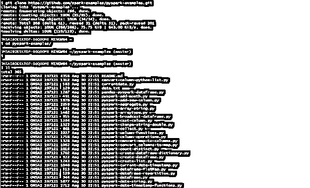
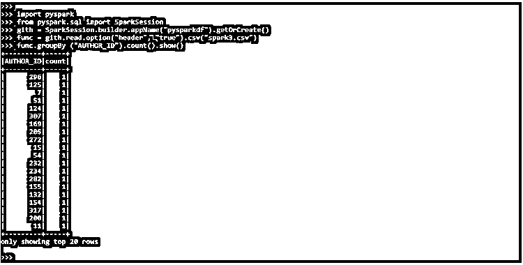

# PySpark GitHub

> 原文：<https://www.educba.com/pyspark-github/>


## PySpark GitHub 的定义

PySpark GitHub 是 PySpark 中的一个进程，我们在指定的时间内使用它。为了创建 PySpark GitHub，用户使用 apache 提交 Spark 应用程序。驱动模块用于 GitHub 项目，该项目从 spark 端获取应用程序。PySpark 驱动程序将从 Spark 端识别应用程序。按照程序驱动程序，它将识别应用程序中存在的转换。

### PySpark GitHub 是什么？

PySpark GitHub 的 Python 模块将包含 ETL 作业的 apache spark 定义，它实现了我们在生产中运行的 ETL 作业的最佳实践。我们可以通过使用 smart submit 命令使用 spark 集群来提交相同的内容，这个命令与我们在 spark 发行版的 bin 目录中找到的命令相同。zip 包将包含 ETL 作业所需的 python 模块。GitHub 在 executor 的每个进程和集群中的每个模式中都是可用的。

<small>网页开发、编程语言、软件测试&其他</small>

我们需要将配置文件发送到包含 json 对象的集群，该对象包含在 GitHub 上运行项目所需的所有配置参数。PySpark GitHub 项目的文件包含 Spark 的应用程序，该程序在 spark master 节点的驱动程序进程中执行。为了使用 PySpark GitHub，我们需要在系统中安装 git bash。我们可以通过从 g it 网站下载来安装它。我们还可以使用 py charm 来设置 GitHub 项目。

在进行 PySpark 项目时，我们需要将 PySpark 的模块导入到我们的项目中。我们可以使用 import 关键字导入 PySpark 模型。此外，我们需要导入 GitHub 项目所需的库。

### PySpark GitHub 项目

我们可以使用 git 命令下载 GitHub 项目。在下面的项目中，我们从 Kaggle 下载数据集，在那里我们可以下载事务的数据集。我们正在定义网上银行分析。在开发项目时，我们还需要下载数据集。下载完数据集后，我们需要清理数据。

**代码:**

```
git clone */pyspark-project.git
```

**输出:**


下载数据集后，我们将检查下载的项目文件，如下所示。我们还可以使用 PySpark 来执行我们已经下载的数据集中的新案例。基本上，PySpark 是一个用于处理大型数据集的框架，如下所示。

**代码:**

```
cd pyspark-project/
```

**输出:**


我们还可以检查项目文件的数据，我们检索数据文件如下。


PySpark 是执行分析和构建机器学习管道的好语言，它也用于创建数据平台 ETL。当有人在处理大数据时，PySpark 在任何地方都可以使用。它用于处理大量数据，然后分发数据以管理大规模任务，从而获得业务洞察力。

在克隆了下面例子中的项目后，我们通过对数据的操作来定义顺序。

**代码:**

```
import PySpark
from PySpark. Sql import Spark Session
gith = SparkSession.builder.appName("pysparkdf").getOrCreate()
func = gith.read.option ("header", "true").csv("spark2.csv")
func.orderBy ("AUTHOR_ID").show()
```

**输出:**


### PySpark GitHub 函数

PySpark GitHub 在 python 中有多个函数。我们用于数据帧的函数也是一样的。要使用 PySpark GitHub 函数，我们首先需要导入 PySpark 的包，如下所示。

**代码:**

```
import pyspark
from pyspark.sql import SparkSession
```

**输出:**


在下面的例子中，我们使用 show 函数显示 gitlab csv 文件中的数据，如下所示。

**代码:**

```
func = spark.read.option("header", "true").csv("spark1.csv")
func.show()
```

**输出:**


我们可以使用打印模式功能打印模式。在下面的示例中，我们可以看到它将显示如下两列。

**代码:**

```
func = spark.read.option("header", "true").csv("spark1.csv")
func.printSchema()
```

**输出:**


以下示例显示了 select 函数。select 函数帮助我们显示从所有数据框中选择的列，我们必须如下传递列名。

**代码:**

```
func = spark.read.option("header", "true").csv("spark1.csv")
func.select('AUTHOR_ID').show(10)
```

**输出:**


pyspark group by 函数用于从数据框中收集数据，并允许我们对已分组的数据执行聚合函数。这是 group by 子句中的常见操作。

**代码:**

```
func = spark.read.option("header", "true").csv("spark1.csv")
func.groupBy("AUTHOR_ID", "AUTHOR_NAME").count().show()
```

**输出:**


pyspark github 中的 order by 函数用于按照我们使用的列对所有数据帧进行排序。它将按照列的值对数据帧进行排序。

**代码:**

```
func = spark.read.option("header", "true").csv("spark1.csv")
func.orderBy ("AUTHOR_ID").show()
```

**输出:**


### 例子

在下面的例子中，我们正在克隆 PySpark 简单项目。我们使用 git clone 命令克隆项目。克隆项目后，我们可以看到项目的所有文件都被复制到指定的目录中。

**代码:**

```
git clone */pyspark-examples.git
cd pyspark-examples.git
```

**输出:**




在克隆了下面例子中的项目后，我们通过对数据的操作来定义顺序。

**代码:**

```
import pyspark
from pyspark.sql import SparkSession
gith = SparkSession.builder.appName("pysparkdf").getOrCreate()
func = gith.read.option ("header", "true").csv("spark3.csv")
func.orderBy ("AUTHOR_ID").show()
```

**输出:**


在下面的例子中，我们通过对数据的操作来定义分组。

**代码:**

```
import pyspark
from pyspark.sql import SparkSession
gith = SparkSession.builder.appName("pysparkdf").getOrCreate()
func = gith.read.option("header", "true").csv("spark3.csv")
func.groupBy ("AUTHOR_ID").count().show()
```

**输出:**




### 关键要点

*   GitHub 转换需要分区之间的数据洗牌和阶段边界的转换。调度程序将创建 PySpark GitHub 的执行盘。
*   基本上，GitHub 中有两种类型的转换可用。catalyst 正在定义 spark integral planner 的查询优化器。

### 常见问题解答

下面是提到的常见问题。

#### Q1。我们如何下载 PySpark GitHub 项目？

**答:**在使用 GitHub 项目时，我们可以从任何地方下载相同的项目，我们可以轻松地下载并运行相同的项目。

#### Q2。PySpark GitHub 中有多少种类型的转换？

**答:**py spark GitHub 中主要有两种类型的变换，宽变换和窄变换。宽变换在许多情况下被使用。

#### Q3。在运行 PySpark GitHub 项目时，我们需要使用哪个库？

**回答:**我们需要在运行 PySpark GitHub 项目的时候使用并导入 PySpark 库。

### 结论

在进行 PySpark 项目时，我们需要将 PySpark 的模块导入到我们的项目中。PySpark GitHub 是一个进程，我们通过它在指定的时间内使用 PySpark。为了创建 PySpark GitHub，用户需要使用 apache 提交 Spark 的应用程序。

### 推荐文章

这是 PySpark GitHub 的指南。在这里，我们讨论定义、什么是 PySpark GitHub、项目、功能、代码实现示例以及关键要点，以便更好地理解。您也可以看看以下文章，了解更多信息–

1.  [PySpark MLlib](https://www.educba.com/pyspark-mllib/)
2.  [PySpark 写 CSV](https://www.educba.com/pyspark-write-csv/)
3.  [PySpark Orderby](https://www.educba.com/pyspark-orderby/)
4.  [PySpark 将函数应用于列](https://www.educba.com/pyspark-apply-function-to-column/)


