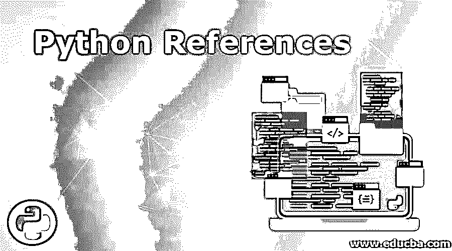

# Python 参考

> 原文：<https://www.educba.com/python-references/>




## Python 参考文献简介

python 中的引用意味着已经关联的内存位置的不同名称。这意味着分配了一些内存的实体将被引用或以不同于内存实际名称的名称引用。引用的概念扩展到所有的内存捕获元素，如变量、对象，甚至是项目。

### Python 中的引用是如何工作的？

当一个变量与一个值或对象相关联，并且该变量被重新分配给一个不同的变量时，python 中的引用过程以下面给出的方式起作用，然后改变主变量的引用不会对第二个声明的变量的引用有任何影响。这意味着第二次声明的变量将稳定地指向最初引用的值。这就是 python 中变量引用的工作方式。下面的例子完美地描述了它，

<small>网页开发、编程语言、软件测试&其他</small>

**举例:**

**代码:**

```
Primary_variable = 5
print("Value of Primary variable: ",Primary_variable)
Secondary_variable = Primary_variable
print("Value of Secondary variable: ",Secondary_variable)
Primary_variable = 10
print("Value of Primary_variable after rebinding: ",Primary_variable)
print("Value of Secondary variable after rebinding: ",Secondary_variable) 
```

**输出:**


**说明:**

在这个例子中，使用了两个变量:主要变量和次要变量；主变量最初与值 5 相关联。通过将主变量与第二变量相关联，主变量的引用被扩展到第二变量。接下来，主变量与不同的值或对象相关联。然后在控制台中打印这两个变量，显示主变量受到新对象值的影响，而对辅助变量没有影响，并且它仍然保存对它被赋给的初始值的引用。

### Python 引用的类型

以下是 Python 引用的类型:

#### 1.可变引用

因为 python 不包含任何变量声明，所以生成变量的过程是通过引用某个实体的名称来实现的。将名称与值相关联的过程称为调用绑定，也可以通过将变量名重置为不同的实体或不存在的值来撤销变量的绑定。使用' del '语句将获得对该特定变量的无界引用。在 python 中，重新获得无界连通性的过程被称为重新绑定。还有一个不同的过程，其中对象的所有引用都将被移除，这被称为垃圾收集。

sys 库的 getrefcount()方法可用于确定 python 中与对象相关联的引用数量。引用计数是通过使用对象在字节码和代码的所有前面部分中被使用的次数来计算的。

**举例:**

**代码:**

```
import sys
Primary_variable = 5
print("Value of Primary variable: ",id(Primary_variable))
Secondary_variable = Primary_variable
print("Value of Secondary variable: ",id(Secondary_variable))
Primary_variable = 10
print("Value of Primary_variable after rebinding: ",id(Primary_variable))
print("Value of Secondary variable after rebinding: ",id(Secondary_variable))
print("Reference count of primary variable:", sys.getrefcount(Primary_variable))
print("Reference count of Secondary variable:",sys.getrefcount(Secondary_variable)) 
```

**输出:**


**说明:**

在这个例子中，再次使用了这两个变量，即主要变量和次要变量；主变量最初与值 5 相关联。然后，通过将主要变量与辅助变量相关联，将主要变量的引用扩展到辅助变量。接下来，主变量与不同的值或对象相关联。但是这里与上面示例的不同之处在于，在控制台上打印时，我们使用 id()函数来表示与每个变量相关联的内存，此外，我们还使用 getrefcount()变量来表示正在使用的主变量和辅助变量的引用计数值。我们可以注意到，在整个程序中，与辅助变量相关联的引用或地址值从不改变。

#### 2.对象引用

更具体地说，属性和物品密切相关。属性与项目的不同之处在于它们被引用的方式。从对象的角度来看，它将用一个对象名来表示，后跟一个句点(。)然后以一个属性名继续。从 item 的角度来看，item 元素包含一个项目名，后面跟一个方括号[]，而方括号包含被引用的键。实际上在 python 中提到的每个元素都是一个特定类或类型的对象。

**例子**

**代码:**

```
import sys
print("Memeory Value of object: ",id(500))
print("References of the object: ",sys.getrefcount(500)) 
```

**输出:**


**说明:**

在本例中，使用了对象值“500”。值“500”将被认为是一个类整数的对象。引用计数和整数对象的内存值打印在控制台中，因此这解释了引用如何与对象实体相关联。

**访问不存在的引用:**

在 python 中，常见的问题是试图到达一个实际上没有关联的内存地址。一些常见的情况是，一个特定的变量名可能与其引用没有界限，或者一个特定的属性名也可能出现这种情况，或者一个超出其引用的项的索引可能被尝试用于每个对象。这种错误在编译过程中不会被捕获，因为编译过程在执行时不会考虑这些情况。所以这些不存在的引用的错误只能在执行时确定。因此，按照 python 的执行，访问不存在的变量、属性或项目的过程，就像任何其他语义错误一样，会引发异常。

### 结论

关联引用的过程是任何编程语言的主要内容，从 python 的角度来看，这在 python 中已经非常灵活地实现了。这个概念非常类似于 python perception 中的指针；通过引入大量面向 python 的函数或方法，降低了它的复杂性。如上所述，这些复杂的技术使 python 成为最灵活的编程语言。

### 推荐文章

这是一个 Python 参考指南。这里我们讨论 Python 引用和不同类型及其示例的简要概述，以及它的代码实现。您也可以浏览我们推荐的其他文章，了解更多信息——

1.  [Python eval()](https://www.educba.com/python-eval/)
2.  [Python 标识符](https://www.educba.com/python-identifiers/)
3.  [Python 排序数组](https://www.educba.com/python-sort-array/)
4.  [Python argparse](https://www.educba.com/python-argparse/)


