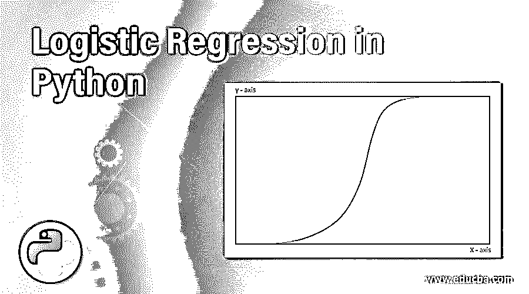
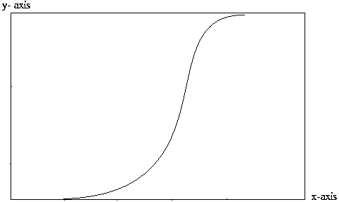

# Python 中的逻辑回归

> 原文：<https://www.educba.com/logistic-regression-in-python/>

## Python 中的逻辑回归简介

因为当今世界到处都充满了数据交换，例如发消息、打电话、浏览互联网等。，都涉及数据交换。因此，数据科学有 70%的问题在于对这些数据进行分类。在机器学习应用中有许多分类技术或算法。逻辑回归是解决诸如垃圾邮件检测、糖尿病或任何其他医学概念的预测等分类问题的回归方法之一。

逻辑回归是用于解决分类问题的最广泛使用的机器学习算法。在 Python 中，逻辑回归是预测分析技术之一。这种回归估计一个因变量和自变量之间的关系，并且输出变量是二分的，即它只有两个可能的类别。

<small>网页开发、编程语言、软件测试&其他</small>

### Python 中的逻辑回归

逻辑回归使用对数函数来预测事件发生的概率。逻辑回归有输出变量，也称为因变量，它是分类变量，是线性回归的特例。因此，线性回归方程可以表示为

**y = β0 + β1X1+β2X2+……+βnXn**

**其中**

*   **y:** 是因变量还是目标变量
*   **X 1 ，X 2 ……X n:** 自变量。
*   **β0:**y 轴截距。
*   **β1:T3】斜坡。**

sigmoid 函数由下式给出

*   p = 1 / 1+ e -y

将该 sigmoid 函数应用于线性回归方程

*   p = 1/1+e–β0+β1X1+β2 x2+……+βnXn

sigmoid 函数也称为逻辑函数，它给出的“S”形曲线可以映射 0 和 1 之间的实数值。在这条曲线中，如果 y 是正无穷大，预测的 y 是 1，如果是负无穷大，预测的 y 是 0。如果 sigmoid 函数值大于 0.5，其结果将为 1(是)，如果其值吹 0.5，则其结果为 0(否)。

在此逻辑回归中，因变量遵循伯努利分布，并通过最大似然法进行估计。最大生计是确定参数的最大化方法，这些参数可能产生可用于预测正态分布所需数据的观察数据。

### 逻辑回归技术

以下是一些技巧:

#### 1.二元逻辑回归

二元逻辑回归只有两种可能的输出，顾名思义。目标值只能是是或否、1 或 0、真或假等。让我们考虑一个例子，说一个学生根据他/她学习的小时数的结果。结果只能有两个值，要么通过，要么失败。这可以用 Python 实现，如下所示:

**举例:**

**1。**首先，收集我们想要确定多少学生通过的数据。所以对于这一点，我们有一个自变量作为学习的小时数，因变量在两个可能的值，通过或失败。

下表是要考虑的数据集。

| **学习时数(小时)** | **学生成绩(通过)** |
| Zero point five | Zero |
| Zero point seven five | Zero |
| One | Zero |
| One point two five | Zero |
| One point five | One |
| One point seven five | One |
| Two | One |

**2。**其次，导入 Python 程序中用于数据分析的库，如 pandas 创建 DataFrame，sklearn 构建逻辑回归模型，seaborn 以称为混淆矩阵的矩阵形式显示结果。

*   进口熊猫作为 pd
*   从 sklearn 导入指标
*   进口海鸟作为某人

**3。第三，建立数据框架，这可以通过给定的数据集表获得**

*   学生={ '小时':[0.5，0.75，1.00，1.25，1.5，1.75，2.0]，'结果':[0，0，0，0，1，1，1] }
*   df = pd。DataFrame(student，columns = [ 'Hours '，' Pass'])
*   打印(df)

现在创建逻辑回归为

*   X= df['小时']
*   Y = df['通过']

使用 Logistic regression()函数对数据集应用逻辑回归，并获得混淆矩阵，以打印准确度并预测有多少学生通过了考试。

#### 2.多项式逻辑回归

它有 3 个或更多不按顺序排列的输出值或目标值，例如分类为猫、狗、大象，预测素食、非素食、纯素食之间哪种食物更健康，等等。多项逻辑回归有 3 个以上的输出，这些输出没有数量意义。如果使用逻辑回归对多个任务进行分类，则称为多项逻辑回归。

**举例:**

**1。**首先，导入 Python 机器学习库，如

*   用于数据分析的熊猫
*   数值计算的数值
*   Sklearn，由线性模型、度量、训练测试分割等机器学习算法组成
*   Plotly 用于根据数据分析显示图。

**2。**其次，要么使用数据集，要么下载数据集，然后从给定的数据集创建标题作为列。打印加载的数据帧、列和标题名。

**3。**第三，我们需要理解给定的数据集，确定单个特征与所有目标类型之间的关系。然后应用 LogisticRegression()函数并获得值的准确性，这是使用度量方法计算的。

#### 3.有序逻辑回归

它也有 3 个或更多的目标值，但其名称本身表明输出值是有序的。在这里，目标值的类别是有序的，而不像多项式那样是无序的。我们可以将测试的目标值分为非常差、差、好、非常好，也可以给定为 0、1、2、3。

**举例:**

从 0 到 1 预测电影分级。首先我们需要导入包，通过导入 Pandas、sklearn、mord 包来导入 LogisticRegression 包，从而将数据保存在 DataFrame 中。

*   进口熊猫作为 pd
*   df = PD . read _ CSV(' https://archive . ics . UCI . edu/ml/movie _ rating . CSV '，sep = '；')
*   然后预测震级精度和类别预测并求其精度。

### 结论

逻辑回归(Logistic Regression)是一种分析数据并在给定数据中找到唯一数据的算法，以预测解决数据角力问题所需的数据。在这个主题中有不同的技术，如二元、多项式和有序逻辑回归。给出两个目标值的二元逻辑回归，给出 3 个或更多目标值的多项式回归，但不按序数排序。

### 推荐文章

这是 Python 中的逻辑回归指南。在这里，我们讨论的介绍，如何工作和技术的逻辑回归。您也可以浏览我们的其他相关文章，了解更多信息——

1.  [Python 是什么](https://www.educba.com/what-is-python/)
2.  [Python 中的 Max 函数](https://www.educba.com/max-function-in-python/)
3.  [R 平方回归](https://www.educba.com/r-squared-regression/)
4.  [R 中的简单线性回归](https://www.educba.com/simple-linear-regression-in-r/)

