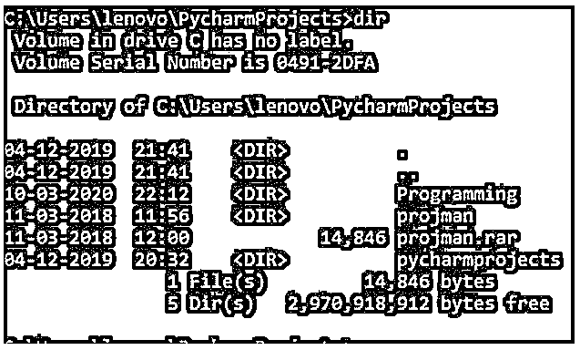
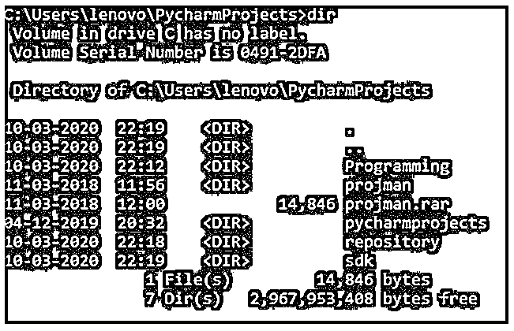
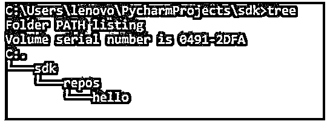

# Python 目录

> 原文：<https://www.educba.com/python-directories/>

## Python 目录介绍

Python 目录被定义为不同类型的文件夹、文件的列表，如目录内有子目录和子目录内有文件的树形结构，因为我们有太多的文件和目录，python 目录将在管理文件、目录和子目录时提供帮助，它被称为 python 目录。Python 有一个操作系统模块，可以帮助管理、创建、删除、读写目录、文件等。使用它，我们可以使用操作系统模块执行许多操作，如创建目录、获取目录的当前位置、重命名目录、更改目录等。

### 如何创建 Python 目录？

在 Python 中，可以使用操作系统模块及其函数 mkdir()创建 Python 目录，如下所示:

<small>网页开发、编程语言、软件测试&其他</small>

**语法:**

`os.mkdir(‘name of the directory’)`

目录名的名称是将在当前工作目录位置创建的目录名。

在下面的示例中，让我们在当前工作位置创建一个名为“repository”的目录，并在特定位置创建另一个名为“sdk”的目录。

**举例:**

**代码:**

`import os
os.mkdir('repository')
os.mkdir('C:/Users/lenovo/PycharmProjects/sdk')`

在上面的例子中，我们已经导入了 os 模块，并使用函数 mkdir()创建了目录“repository”。在另一个声明中，我们在位置“C:/Users/Lenovo/PycharmProjects”创建了一个目录“sdk”。在其他位置创建目录时，我们需要使用正斜杠“/”。

**输出:**

我们将看到当前工作目录中可用的目录列表如下:

现在，在示例中创建上述目录后，我们将看到当前工作目录中可用目录的输出，输出如下:

在上面的输出中，我们可以看到新的目录“repository”和“sdk”，这是我们在上面的例子中创建的。

### 如何列出 Python 目录？

在 python 中，可以使用 OS 模块列出任何给定位置的目录，该模块有许多函数，要列出的是 listdir()函数。

**语法:**

列出 python 目录的语法如下:

`os.listdir()`

或者

`os.listdir(‘path’)`

上述命令将列出当前工作目录中的所有目录，另一种语法将路径作为参数，并列出该路径中的所有目录。

**举例:**

让我们创建一个示例，列出当前工作目录中的所有目录，即

“C:/Users/Lenovo/PycharmProjects/proj man”并使用与当前工作目录相同的路径，如下所示:

**代码:**

`import os
os.listdir()
os.listdir(‘C:/Users/lenovo/PycharmProjects/projman’)`

在上面的例子中，我们导入了操作系统模块，并使用其函数 listdir()查看当前工作目录中的可用目录列表，而在另一个例子中，我们将路径“C:/Users/Lenovo/PycharmProjects/projman”传递给 listdir()函数，以便它列出该特定路径中的可用目录。

**输出:**

在上面的例子中，我们已经在当前工作目录中执行了 os.listdir()函数，目录列表为' Programming '，' projman '，' projman.rar '，' pycharmprojects '，' repository '，和' sdk '。

**输出:**

在上面的例子中，我们已经给出了 os.listdir()函数的路径，并将该路径中所有可用的目录列为。idea、Approach、build、Makefile、README.md 和 src。

### 如何创建临时 Python 目录？

在 python 中，我们可以使用 tempfile 模块和函数 temporary directory()创建临时目录，如下所示:

**语法:**

用 python 创建临时目录的语法如下:

`Import tempfile
tempfile.TemporaryDirectory()
or tempfile.TemporaryDirectory(dir=’path’)`

在上面的语法中，我们已经导入了模块 tempfile 并使用函数 TemporaryDirectory()在 temp 目录中创建了一个临时目录，我们可以在第二个语法中传递它需要创建临时目录的路径。

**举例:**

让我们创建一个示例，在临时位置创建一个临时目录，并通过给定如下位置创建另一个临时目录:

**代码:**

`Import tempfile
f = tempfile.TemporaryDirectory()
f.name`

**输出:**

在上面的例子中，我们导入了 tempfile 模块并使用 temporary directory()函数创建了一个临时目录，为了检查临时目录名，我们使用了 file 指针。“name”，它给出了文件名的位置，如上面的输出所示。

**代码:**

`import tempfile
tempfile.TemporaryDirectory(dir =‘C:/Users/Lenovo/PycharmProjects’)`

在上面的例子中，我们已经导入了 tempfile 模块，并明确给出了路径“C:/Users/Lenovo/PycharmProjects”来创建临时文件。

**输出:**

我们可以在上面输出中提供的 TemporaryDirectory()函数的位置或路径中观察到临时文件名。如果我们使用文件指针，那么我们需要使用 f.name 否则，默认情况下，它会显示创建后的临时文件位置。

### 如何编写自己的 Python 目录？

在 python 中，我们可以使用 OS 模块及其函数 makedirs()创建除最终目录之外的自己的目录，makedirs()将创建路径中提到的自己的目录。

**语法:**

创建自己的 python 目录的语法如下:

`Import os
os.makedirs(‘path’)`

在上面的语法中，我们已经导入了模块 OS，并使用它的函数 mkdirs()和一个路径，该路径将有一个自己创建的目录列表。

**举例:**

让我们创建一个示例，根据当前工作目录中给定的路径“sdk/repos/hello”创建自己的目录，如下所示:

**代码:**

`Import os
os.makedirs(“sdk/repos/hello”)`

在上面的例子中，我们已经导入了操作系统模块，并使用其函数 makedirs()根据路径“sdk/repos/hello”自行创建目录。除了创建“sdk”之外，它还将自行创建文件夹“repos”、“hello”。

**输出:**

在上面的输出中，我们可以看到在执行示例后自己创建的目录可以被看作是“sdk”、“repos”和“hello”。

### Python 目录的优势

下面是提到的优点:

*   通过使用 python 目录，我们可以轻松管理大量的文件和目录。
*   Python 模块 OS 和 tempfile 提供了应用于 python 目录的不同函数。
*   它们易于使用和理解。
*   它提供了一种在 python 中处理文件系统的有效方式。

### 结论

最后，概述了使用操作系统和临时文件模块的 python 目录。我们已经看到了如何创建目录、列出目录、创建临时目录、创建自己的 python 目录、它在使用内置模块的日常活动中的优势、它的功能及其语法，并通过示例进行了解释。

### 推荐文章

这是一个 Python 目录的指南。这里我们讨论一下入门，如何创建一个 python 目录？如何列出目录？如何创建临时目录？如何编写自己的目录？和优点。您也可以看看以下文章，了解更多信息–

1.  [Python 并发](https://www.educba.com/python-concurrency/)
2.  [Python 排序数组](https://www.educba.com/python-sort-array/)
3.  [Python 中的控制语句](https://www.educba.com/control-statements-in-python/)
4.  [Python 私有变量](https://www.educba.com/python-private-variables/)

