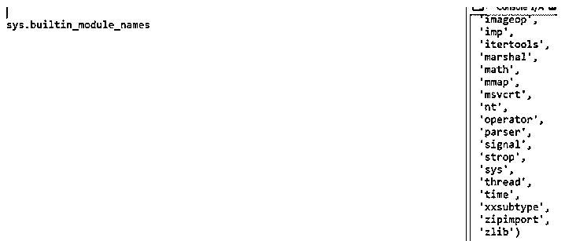

# Python 系统模块

> 原文：<https://www.educba.com/python-sys-module/>


## Python Sys 模块简介

Python 是目前非常流行和强大的脚本语言。从开发应用程序到开发网站，从制作分析产品到生产级代码，python 变得如此流行。背后的原因之一是它的灵活性，易于使用的模块。让我们看看 python 中广泛使用的一个模块“Sys”。“Sys”模块是为系统定义的。它基本上定义了环境。要导入系统模块，只需输入“导入系统”。

### Python Sys 模块的功能

下面给出了 Python Sys 模块的功能:

<small>网页开发、编程语言、软件测试&其他</small>

让我们在 IDE 中导入 sys 模块并检查 python 的版本。

#### 1.版本

它帮助您了解正在使用的 python 版本。

**代码:**

`import sys
sys.version`

**输出:**


#### 2.可执行的

它是一个字符串，告诉你你的文件系统或者你的 python 解释器在哪里。

**代码:**

`import sys
sys.executable`

**输出:**


#### 3.sys.builtin _ 模块名称

这有助于您理解 python 中可用的内置模块。不需要下载这些模块，因此可以在导入后直接在环境中使用。

**代码:**

`sys.builtin_module_names`

**输出:**




**如下图:**


然而，不属于 sys 的模块需要首先下载，然后导入 python 环境中。

**例子:**

dateutil、git 等。

#### 4.系统平台

这有助于您了解平台。每个人都希望自己的程序能够不受平台限制地运行。这也是这个命令最常用的地方。

**代码:**

`sys.platform`

**输出:**


如果需要让代码与平台保持一致，可以这么做。

**代码:**

```
if sys.platform.startswith('win'):
    # win-specific code ...
elif sys.platform.startswith('aix'):
    # AIX-specific code...
elif sys.platform.startswith('darwin'):
    # MAC-specific code ..    
elif sys.platform.startswith('linux'):
    # Linux-specific code .. 
```

#### 5.系统退出

在程序中出现任何异常的情况下，需要从程序中安全退出。Sys.exit 对此有所帮助。

**代码:**

```
def is_namevalid(name):
    if any(i.isdigit() for i in name):
        print("ERROR: Invalid feature set ")
        sys.exit()

    else:
        print("Correct name") 
```

**输出:**


#### 6 .消弱消弱消弱消弱消弱消弱消弱消弱消弱消弱消弱消弱消弱消弱消弱消弱消弱消弱消弱消弱消弱消弱消弱

这指的是 python 中的一个列表，它包含传递给脚本的参数(命令行)。如果有人键入 len(sys.argv ),它将获取参数的数量。使用命令行参数的人会使用 sys.argv. Sys.argv[0]是指脚本的名称。

**代码:**

`import sys
print(sys.argv[0])
print 'Number of arguments:', len(sys.argv), 'arguments.'
print 'Argument List:', str(sys.argv)`

假设这段 python 代码以“sys.py”的名称保存在某个位置。

现在我们转到命令行，键入“python sys.py”。

**输出:**


但是，如果输入“python sys.py arg1”。

**输出:**


这里要注意的是，第一个参数总是脚本名，它本身会被计入参数的数量。

#### 7 .系统退出基金

这是一个无参数的函数，用户可以使用它在程序退出时执行清除操作。这个函数在 python 3.x 中已经不存在了。但是，可以使用“atexit”来代替。

#### 8\. sys.stdin, sys.stdout, sys.stderr

这些函数指的是解释器用于标准输入、输出和错误的文件对象。

*   Stdin 用于交互式输入，就像我们使用 input()、raw_input()一样。输入是通过 stdin 获取的。
*   Stdout 用于类似 print()的输出，输出实际上是通过 stdout 打印的。
*   Stderr 是提示错误信息。

**代码:**

```
import sys
for j in (sys.stdin, sys.stdout, sys.stderr):
    print (j) 
```

**输出:**


可以注意到，stdin 以模式“r”打印，这意味着读取，而 stdout 和 stderr 是写入模式。

#### 9.sys.setrecursionlimit(limit)

这个函数可以帮助你限制 python 解释器的最大深度。它帮助你保持一个可能导致溢出的中途停留无限递归。然而，最高可能的限制取决于不同的平台。如果有人保持更高的限制，他/她应该意识到可能导致 python 崩溃的风险。

#### 10.sys.getdefaultencoding()

它返回默认的字符串编码。

我用 python 环境给你演示一下。

**代码:**

`print(sys.getdefaultencoding())`

**输出:**


#### 11\. sys.setdefaultencoding()

此函数帮助您在 python 环境中更改字符串的默认编码。

**举例:**

**代码:**

`import sys
sys.setdefaultencoding('UTF8')`

#### 12.sys.exc_clear()

此功能帮助您清除与当前或以前的例外相关的所有信息。当您需要释放已分配的资源并且必须完成对象终结时，这个函数非常有用。

### 结论

上面我们看到的都是 sys 模块中可用的重要功能集。Sys 模块帮助您了解您的工作环境，例如，您的代码在哪里运行，它在哪个平台上运行，使用哪个 python 版本和哪个解释器等。为了更好地掌握这些功能，人们需要浏览这些功能并开始使用它们。

### 推荐文章

这是一个 Python Sys 模块的指南。在这里，我们将分别讨论 Python Sys 模块的介绍以及前 12 个函数。您也可以看看以下文章，了解更多信息–

1.  [Python 并发](https://www.educba.com/python-concurrency/)
2.  [Python 中的控制语句](https://www.educba.com/control-statements-in-python/)
3.  [Python 排序数组](https://www.educba.com/python-sort-array/)
4.  [Python 中的函数重载](https://www.educba.com/function-overloading-in-python/)


