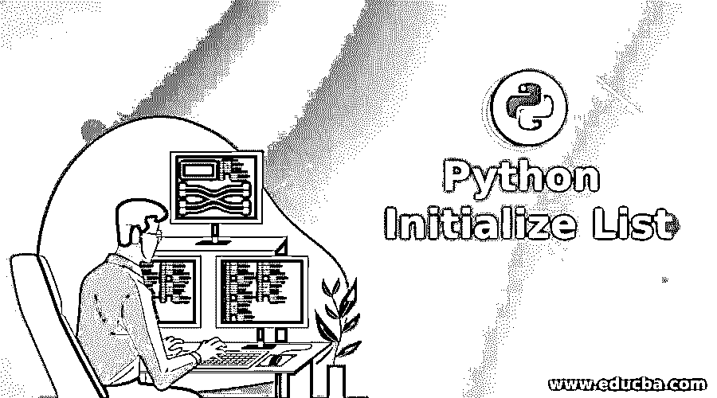

# Python 初始化列表

> 原文：<https://www.educba.com/python-initialize-list/>




## Python 初始化列表简介

在本文中，我们将看到 Python 中列表的初始化。正如我们所知，列表是可变的，在列表和 Python 中可以有零个或多个元素，初始化列表被定义为声明列表，创建一个可以存储列表的容器，然后将名称赋给声明的列表，这个过程称为列表初始化，将值赋给创建的列表称为赋值。在 Python 中有不同的初始化列表的方法，比如使用方括号、for 循环、while 循环等等。

### Python 中列表初始化的工作原理及示例

让我们看看初始化列表的各种方法，例如使用方括号、使用 for 循环、使用 while 循环、使用列表理解。

<small>网页开发、编程语言、软件测试&其他</small>

下面给出了这些方法的详细示例:

#### 1.使用方括号初始化列表

我们可以在声明列表时用空方括号[]初始化列表。

**举例:**

**代码:**

```
print("Program to demonstrate initialization of list using square brackets")
print("\n")
courses = []
print("The list initialized and the type of the declared variable is as follows:")
print(courses)
print(type(courses))
print("\n")
```

**输出:**


在上面的程序中，我们可以看到变量“courses”被声明并赋给空方括号，以初始化名为“courses”的列表，我们可以向该列表插入或追加任意数量的元素或项目。在上面的屏幕截图中，我们可以看到空列表与变量类型“list”一起打印。

要使用方括号创建和初始化空列表，我们还可以使用 for 循环和 list 的 append()方法在初始化的列表中添加或插入项目。

让我们在下面的例子中看看使用这两个循环的演示。

**举例:**

**代码:**

```
print("Program to demonstrate initialization of list using for loop")
print("\n")
courses = []
for n in range(3):
    courses.append('educba')
print("The list obtained after appending the value is as follows:")
print(courses)
print(type(courses))
```

**输出:**


在上面的程序中，我们试图用方括号初始化 list，并使用 for 循环添加元素。

#### 2.使用 list()方法初始化

使用 list()方法创建空列表还有另一种方法。这种方法也类似于上面的方法，但是最推荐使用方括号，而不是使用 list()方法。

**举例:**

**代码:**

```
print("Program to demonstrate initialization of list using list() method")
print("\n")
courses = list()
print("The list initialized and the type of the declared variable is as follows:")
print(courses)
print(type(courses))
print("\n")
```

**输出:**


在上面的程序中，我们可以看到我们声明了一个变量“courses ”,在这里我们使用 list()方法初始化 list。因此，我们可以在上面的屏幕截图中看到，它打印了空列表及其变量类型。

#### 3.使用列表理解方法初始化列表

在这个方法中，我们看到了用于创建和初始化列表的 for 循环中的 range 方法。此方法可用于使用现有的可迭代对象(如 range())创建任何可迭代的其他列表。

此方法要遵循的语法是:

```
variable_name = [ items iteration filter]
```

*   **items:** 这将保存列表或转换的元素。
*   **迭代:**这将考虑进行循环迭代。
*   **filter:** 这通常包含一个 if-else 语句。

**举例:**

**代码:**

```
print("Program to demonstrate initialization of list using list comprehension")
print("\n")
courses = [n for n in range(5)]
print("The list initialized and the items in the given list are as follows:")
print(courses)
print(type(courses))
print("\n")
```

**输出:**


在上面的程序中，我们可以看到我们声明了变量“courses ”,并使用带有 range()方法的 list comprehension 方法对其进行了初始化。在上面的截图中，我们可以看到我们试图打印从 0 到 4 的 n 个数字，也就是列表中的 5 个元素。为了在列表中得到相同的值，我们可以在开始写 n 的值，然后使用 for 循环，我们可以打印 n 值 5 次。

这个列表理解方法也可以与 repeat()方法一起使用，用于打印列表中的相同值，或者初始化和创建列表的列表。这个 repeat()方法可以从 Python 库中的 itertools 模块导入。

**举例:**

**代码:**

```
from itertools import repeat
print("Program to demonstrate initialization of list using list comprehension")
print("\n")
courses = ['educba' for x in repeat(None, 5)]
print("The list initialized and the items in the given list are as follows:")
print(courses)
print(type(courses))
print("\n")
```

**输出:**


在上面的程序中，我们可以看到我们使用了 repeat()方法，该方法返回指定次数的给定对象，在上面的程序中，我们将它指定为 5 次。该方法首先由 itertools 模块导入。然后，我们指定要打印的项目值与指定的次数相同，这里我们打印的项目值是“educba”。

#### 4.使用列表乘法初始化列表

在这种方法中，我们使用*运算符或列表乘法来初始化列表。这个方法是最快的方法之一。这种方法也类似于用 repeat()方法进行列表理解的方法。当我们想要初始化和创建一个列表，并在列表中重定义了特定数量的项目值时，也可以使用这个方法。

**举例:**

**代码:**

```
print("Program to demonstrate initialization of list using list multiplication")
print("\n")
courses = ['educba'] * 5
print("The list obtained after using * operator to print the same values is as follows:")
print(courses)
print(type(courses))
```

**输出:**


在上面的程序中，我们可以看到我们在初始化和创建“课程”列表时使用了*操作符。这个方法按照*运算符后面指定的次数打印项目值，如上面的屏幕截图所示。

### 结论

在本文中，我们看到了在 Python 编程语言中初始化列表的各种方法。在 Python 中，列表的初始化在处理列表时起着至关重要的作用。在本文中，我们看到了如何使用方括号初始化列表，这将初始化空列表，并且可以使用 for 循环和 append()方法添加项目。在本节中，我们还了解了如何使用 list()方法初始化列表，如何使用 range()和 repeat()方法理解列表，以及如何使用带*运算符的列表乘法来初始化列表。

### 推荐文章

这是一个 Python 初始化列表的指南。这里我们讨论 Python 初始化列表的介绍，以及初始化列表的工作和例子。您也可以看看以下文章，了解更多信息–

1.  [Python 断言错误](https://www.educba.com/python-assertionerror/)
2.  [Python 文件读取线](https://www.educba.com/python-file-readline/)
3.  [Python 数组函数](https://www.educba.com/python-array-functions/)
4.  [Python EOFError](https://www.educba.com/python-eoferror/)


